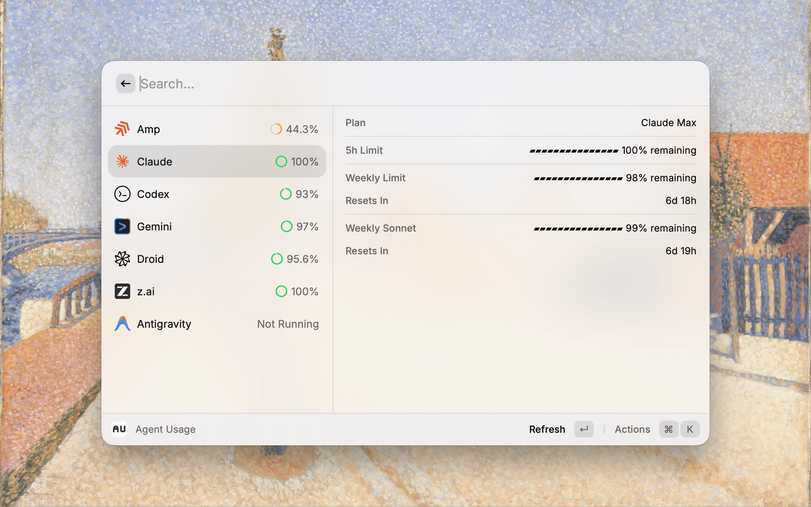
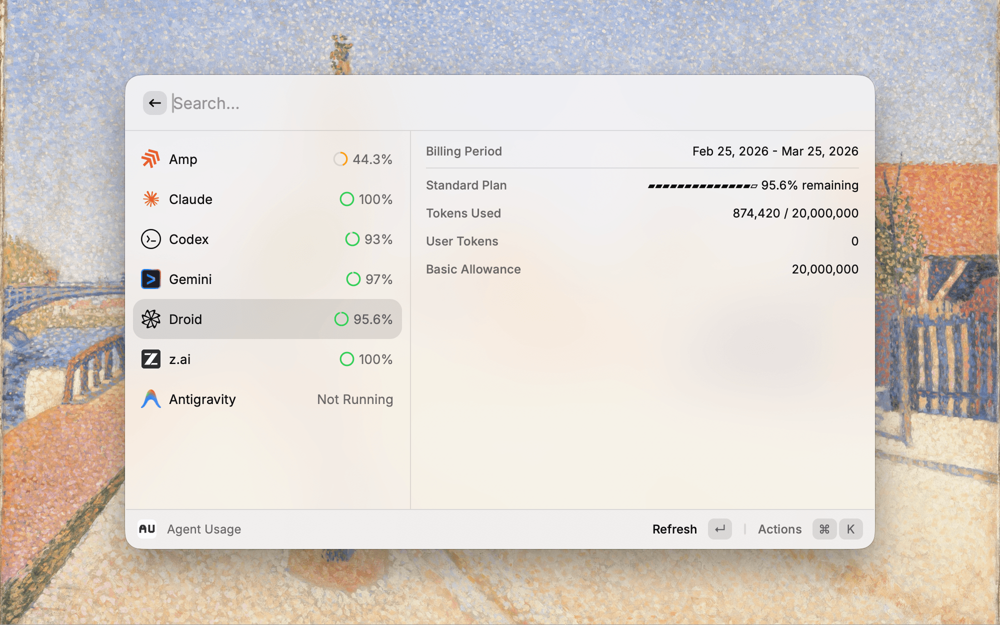

# Agent Usage

Track usage across your AI coding agents in one place.

## Features

- **Multi-Agent Support** - View usage for Amp, Claude, Codex, Droid, Gemini, Kimi, Antigravity, and z.ai(GLM)
- **Quick Overview** - See remaining quotas and usage at a glance with ASCII progress bars
- **Detailed Breakdown** - Expand each agent for full usage details
- **Menu Bar** - Quick overview from the menu bar with click-to-navigate
- **Zero Config** - Most agents are auto-detected from local credentials
- **Refresh & Copy** - Quickly refresh data or copy usage details to clipboard
- **Customizable** - Show/hide agents, reorder list, and configure display preferences

## Supported Agents

| Agent | Data Source | Setup Required |
|-------|-------------|----------------|
| **Amp** | Local SQLite database | None (auto-detected) |
| **Claude** | Anthropic OAuth Usage API | None (auto-detected after `claude` login) |
| **Codex** | OpenAI API | None (auto-detected after `codex login`) |
| **Droid** | Factory AI API | None (auto-detected after `droid` login) |
| **Gemini** | Local state file | None (auto-detected) |
| **Kimi** | Moonshot API | Authorization token |
| **Antigravity** | Local state file | None (auto-detected) |
| **z.ai (GLM)** | Zhipu API | None (auto-detected from `ZAI_API_KEY` / `GLM_API_KEY` env var) |

## Configuration

### Codex (Zero Config)

1. Run `codex login` in Terminal (if you are not already logged in)
2. Open Agent Usage in Raycast — Codex usage will be auto-detected from `~/.codex/auth.json`

Optional fallback:
- If auto-detection fails, you can still paste a token manually in extension preferences (`Codex Authorization Token`).

### Droid (Zero Config)

1. Run `droid` in Terminal (if you are not already logged in)
2. Open Agent Usage in Raycast — Droid usage will be auto-detected from `~/.factory/auth.*`

## Preferences

- **Visible Agents** - Toggle which agents to show in the list
- **Amp Display Mode** - Show remaining as amount or percentage
- **Agent Order** - Use `⌘⌥↑` / `⌘⌥↓` to reorder agents in the list

## Keyboard Shortcuts

| Shortcut | Action |
|----------|--------|
| `↵` | Refresh usage data |
| `⌘C` | Copy usage details |
| `⌘⌥↑` | Move agent up |
| `⌘⌥↓` | Move agent down |

## Roadmap

More agents coming soon.
