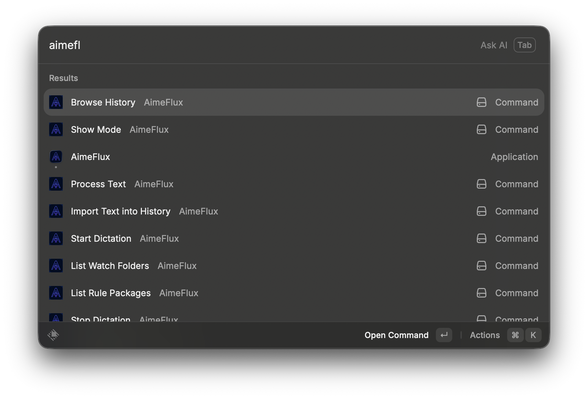
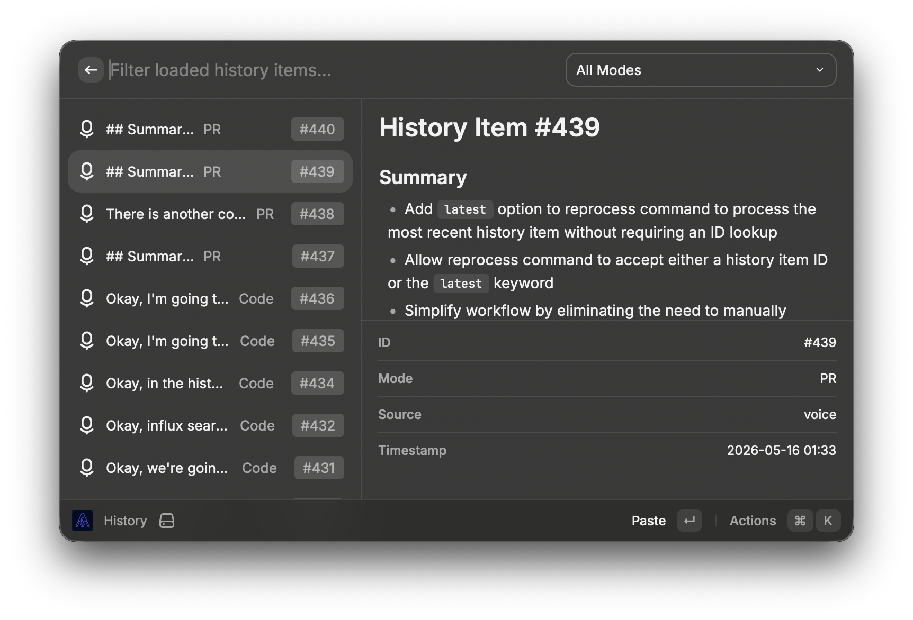

# AimeFlux for Raycast

Use AimeFlux from Raycast for the day-to-day workflows that fit a launcher well: dictation control, quick text processing, history access, mode inspection, replacement management, watch-folder inspection, and community package browsing.

This extension is intentionally focused on regular usage instead of setup or maintenance tasks.



## Requirements

- `aimeflux` must be installed and available on your shell `PATH`
- the extension assumes AimeFlux uses its default config path
- `AimeFlux.app` must be running for:
  - dictation
  - LLM-enabled text processing

## Commands

- `Start Dictation`
  Starts dictation with an optional mode and optional LLM cleanup. Closes Raycast on success.

- `Stop Dictation`
  Stops the active dictation session immediately. Closes Raycast on success.

- `Process Text`
  Processes inline text with an optional mode and optional LLM cleanup.

- `Browse History`
  Opens the latest 20 history items by default. Includes inline mode filtering, a dedicated filter form, paste and copy actions, and reprocessing for a selected item.

- `Copy Latest History Item`
  Fetches the latest history item and copies its text.

- `Paste Latest History Item`
  Fetches the latest history item and pastes its text into the frontmost application.

- `Import Text into History`
  Imports inline text into AimeFlux history, with an optional mode.

- `Show Mode`
  Shows mode prompt, vocabulary, replacements, and core metadata such as language and translation behavior.

- `Show Current Mode`
  Shows the active manual mode and lets you jump into changing it.

- `Set Current Mode`
  Changes the active manual mode by name or ID.

- `List Installed Models`
  Browses installed Whisper models and allows deletion for models that are not the current model and are not referenced by watch folders.

- `List Replacements`
  Browses configured replacements and supports in-context removal.

- `Add Replacement`
  Adds a global or mode-specific replacement.

- `List Watch Folders`
  Browses configured watch folders, shows folder settings, and lets you process a selected folder immediately.

- `List Rule Packages`
  Browses installed community rule packages and lets you enable or disable them.

- `List Mode Packages`
  Browses installed community mode packages and shows their prompts, metadata, and mode details.



## Notes

- The extension resolves `aimeflux` through your login shell instead of trusting Raycast's default `PATH`.
- History mode filtering from the search bar triggers a fresh CLI fetch and keeps the currently selected history filter state.
- `Import Text into History` handles transient SQLite lock cases. If AimeFlux reports `SQLITE_BUSY` but the item still lands in history, the extension treats that as success.
- Result screens focus on the actual output instead of the raw CLI command.

## Not Included

These flows are intentionally left out of the Raycast surface:

- licensing commands
- manual config repair and migration flows
- raw fallback command execution
- model download or install flows
- watch-folder creation flows

## Development

```bash
npm install
npm run dev
```

Production build:

```bash
npm run build
```
