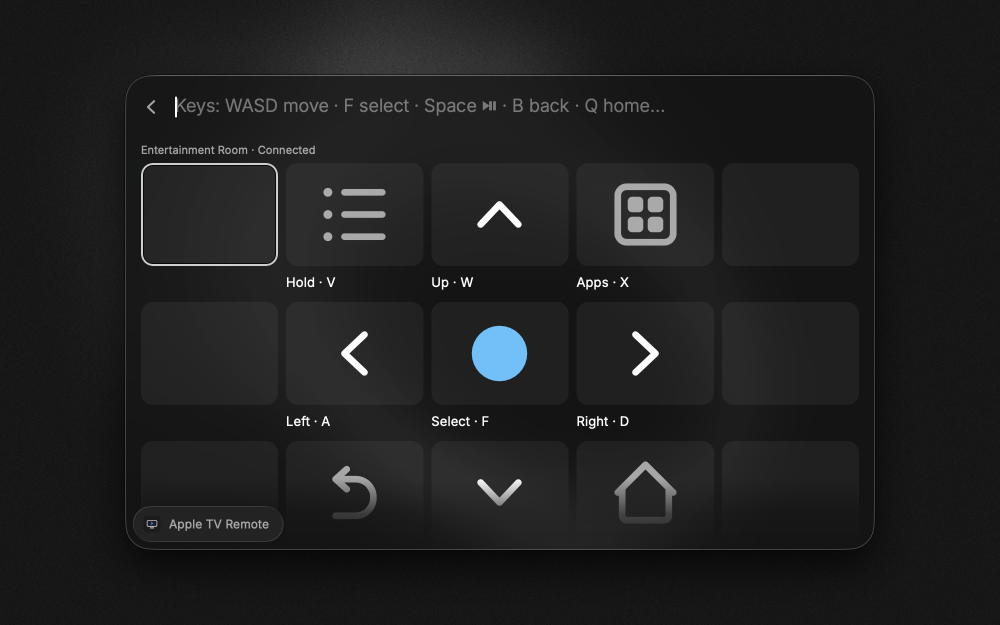
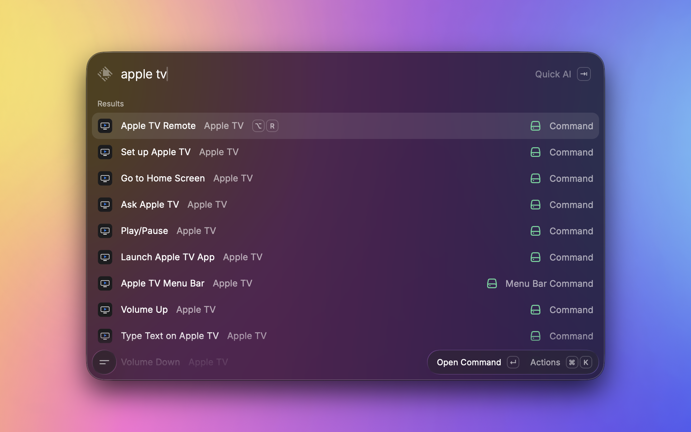

# Apple TV Remote

Control your Apple TV from Raycast. No Python, no helper apps, nothing to install beyond the extension. It talks to the Apple TV directly over Apple's Companion protocol in pure TypeScript.



## Features

- **Apple TV Remote.** A clickable on-screen remote that keeps one live connection open, so every press lands instantly. D-pad, select, back, home, hold-select context menu, app switcher, Control Center, playback, 10-second skip, and typing into TV search fields.
- **Launch Apple TV App.** A grid of the apps on your Apple TV. Open any of them, or save one as a hotkey-able Quicklink.
- **Ask Apple TV.** One-off natural language, like `pause`, `open netflix`, `play severance`, `type stranger things`, or `sleep`.
- **Menu bar.** Quick taps for play/pause, skip, navigation, opening apps, and sleep/wake, plus one click through to the full remote.
- **Per-key hotkey commands.** Every remote function is also its own command (most are off by default). Enable the ones you want and give them global hotkeys.
- **AI tools.** Drive it from Raycast AI, like `@apple-tv-remote pause` or `@apple-tv-remote play Rick and Morty on Netflix` (needs Raycast Pro).

| Every function, one search away | Remote in your menu bar        |
| ------------------------------- | ------------------------------ |
|  |  |

## Setup

1. Run **Set up Apple TV**.
2. Pick your Apple TV from the list, or add it by IP and port if discovery is blocked on your network.
3. Type the 4-digit PIN that appears on the TV.

Pairing is interactive because the Apple TV shows the PIN on screen, which is why setup is a command rather than an extension preference.

## The remote

Open **Apple TV Remote** and either click the buttons or use the keyboard.

| Control                    | Bare key                             | With ⌥              |
| -------------------------- | ------------------------------------ | ------------------- |
| Navigate                   | `W` `A` `S` `D` (or `H` `J` `K` `L`) | `⌥↑` `⌥↓` `⌥←` `⌥→` |
| Select                     | `F` (or `G`)                         | `⌥↩`                |
| Back                       | `B`                                  | `⌥⌫`                |
| Home                       | `Q`                                  |                     |
| Play/Pause                 | `Space`                              | `⌥P`                |
| Skip 10s                   | `,` / `.`                            |                     |
| Previous / Next            | `[` / `]`                            |                     |
| Context menu (hold select) | `V`                                  |                     |
| App switcher               | `X`                                  |                     |
| Control Center             | `C`                                  |                     |
| Type text on TV            | `T`                                  |                     |
| Screensaver                |                                      | `⌥S`                |

The bare keys work because the view treats your typing as button presses, so no modifiers are needed. Volume has optional hotkey commands (`Volume Up` and `Volume Down`), but they only do anything when the Apple TV controls volume over HDMI-CEC. Most TVs handle volume themselves.

## Playing a show

`play <title> [on <app>]` looks the title up on JustWatch and opens a real provider deep link where tvOS supports one (Apple TV+, Disney+, Max, YouTube, and others). It does not guess at app IDs. Netflix dropped tvOS deep links in late 2025, so for Netflix and for anything that does not resolve, the extension opens the Apple TV's universal Search and types the title for you, then you pick the result on screen. The **Search Automation** preference sets how far it goes.

## Preferences

- **Streaming Country.** Two-letter code for the where-to-watch lookup. Leave it blank to detect your Mac's region.
- **Search Automation.** What happens after a title is typed into Apple TV Search: stop there, open the top result (the default), or also press Play. Pressing Play can start the wrong app, since the title page usually lists several.
- **Connection Timeout.** How long a command waits to reach the Apple TV.

## How it works

The extension speaks Apple's Companion protocol, the same one the iOS Remote uses, straight from Raycast's Node runtime through [`@bharper/atv-js`](https://github.com/bsharper/atvjs), a pure-TypeScript port of [pyatv](https://pyatv.dev). Discovery is Bonjour, pairing is HAP SRP with the on-screen PIN, and the session is chacha20-poly1305 encrypted. App launching, app listing, sleep/wake, Control Center, hold-select, and 10-second skip are built on top of the library in this extension, ported from pyatv's reference implementation.

### Credential storage

Pairing produces machine-generated key material rather than a password you type, so it lives in Raycast's encrypted [LocalStorage](https://developers.raycast.com/api-reference/storage), scoped to this extension. The extension never touches the macOS Keychain, and it sends nothing off your local network. The only internet request is the optional JustWatch title lookup.

## Development

```bash
npm install
npm run dev      # ray develop, hot-reloads into Raycast
npm run lint     # ray lint
npm run build    # ray build
```

| Module                                 | Role                                                                                           |
| -------------------------------------- | ---------------------------------------------------------------------------------------------- |
| `src/lib/connection.ts`                | Persistent session for the remote view, plus per-command `withConnection()`                    |
| `src/lib/companion-extras.ts`          | Companion payloads ported from pyatv (launch app, app list, power, Control Center, hold, skip) |
| `src/lib/credentials.ts`, `devices.ts` | Pairing credentials and selected device in LocalStorage                                        |
| `src/lib/justwatch.ts`                 | Title to deep-link resolution (keyless GraphQL, cached)                                        |
| `src/lib/play-flow.ts`                 | Deep link, then universal-search typing, then app launch                                       |
| `src/lib/deep-links.ts`                | Curated app and bundle map, plus installed-app cache                                           |
| `src/lib/errors.ts`                    | Typed errors turned into actionable toasts                                                     |

## Credits

- [pyatv](https://pyatv.dev) by Pierre Ståhl (MIT). The reference implementation and protocol docs this extension is built on. The Companion payloads for app launching, app listing, power, and gestures are ported from it.
- [`@bharper/atv-js`](https://github.com/bsharper/atvjs) by Brian Harper (MIT). The TypeScript Companion-protocol port, itself derived from pyatv (© Pierre Ståhl).

See [NOTICE](NOTICE) for third-party license details.

## License

MIT
