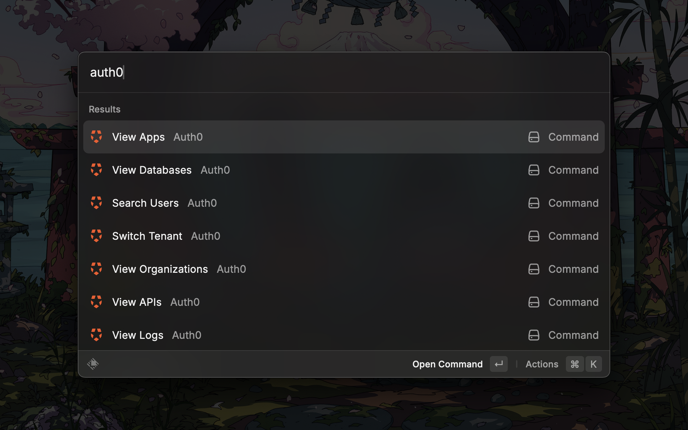
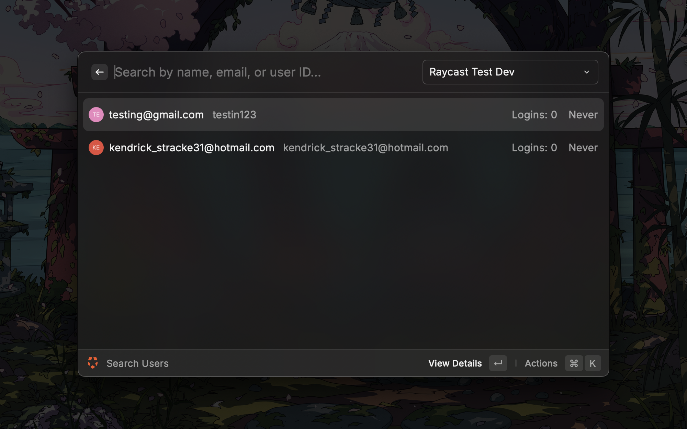
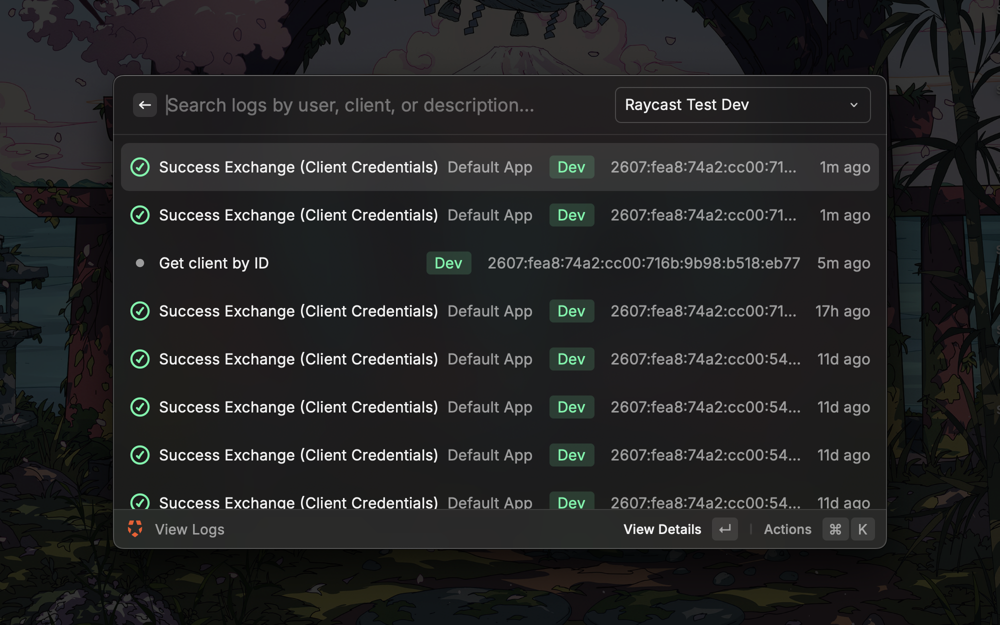

# Auth0 Management

Search and manage Auth0 users, organizations, applications, APIs, and logs across multiple tenants directly from Raycast.

## Demo

## Setup

### 1. Create a Machine-to-Machine Application

1. Open the [Auth0 Dashboard](https://manage.auth0.com/) and select your tenant
2. Go to **Applications** > **Applications** > **Create Application**
3. Choose **Machine to Machine Applications** and click **Create**
4. Select the **Auth0 Management API** and authorize the application
5. Grant the scopes listed below, then click **Authorize**

### 2. Required Scopes

Grant the following scopes on the **Auth0 Management API** for full functionality:

| Scope | Used By |
|-------|---------|
| `read:users` | Search Users, View Blocked Users |
| `create:users` | Create User |
| `update:users` | Unblock User |
| `read:user_idp_tokens` | User Detail |
| `read:logs` | View Logs, User Logs |
| `read:organizations` | View Organizations |
| `read:organization_members` | Organization Detail |
| `create:organization_members` | Assign User to Organization |
| `read:clients` | View Apps |
| `read:resource_servers` | View APIs |
| `update:resource_servers` | Manage API Permissions |
| `read:connections` | Create User (connection picker) |
| `read:grants` | Sessions & Grants |
| `delete:grants` | Revoke Grant |

You can start with just `read:users` and add more scopes as needed. The extension shows which scope is missing when a request is denied.

### 3. Add a Tenant in Raycast

1. Open Raycast and run the **Switch Tenant** command
2. Press `Cmd+N` to add a new tenant
3. Enter a name, select the environment (development, staging, or production), and fill in:
   - **Domain** - your Auth0 tenant domain (e.g. `my-app.us.auth0.com`)
   - **Client ID** - from the M2M application you created
   - **Client Secret** - from the M2M application you created

Repeat for each tenant you want to manage. Switch between tenants using the dropdown in any command.

## Commands

| Command | Description |
|---------|-------------|
| **Search Users** | Search users by name, email, or user ID. View profile details, sessions, grants, and user-specific logs. Create new users. |
| **Switch Tenant** | Add, edit, delete, and switch between Auth0 tenants (dev, staging, production). |
| **View Organizations** | Browse organizations, view members, and assign users. |
| **View Logs** | Browse tenant logs with text search, date pickers, and time presets (last hour, 24h, 7 days, 30 days, custom range). |
| **View Apps** | Browse Auth0 applications and their configuration (callbacks, origins, grant types, metadata). |
| **View APIs** | Browse Auth0 APIs (resource servers), view scopes, and add, or edit permissions. |

## Features

- **Multi-tenant** - manage development, staging, and production tenants from a single interface with color-coded environment badges
- **User management** - search, create, view details, view sessions and OAuth2 grants, revoke sessions, revoke grants, unblock users
- **Organization management** - browse organizations, view members, assign users
- **Log exploration** - full-text search with flexible date filtering: exact date, from/to range, presets, and custom time ranges
- **Application browser** - view app configuration, callbacks, allowed origins, grant types, and metadata
- **API permission management** - view, add, edit, and delete scopes on resource servers
- **Deep links** - open any user, organization, app, API, or log entry directly in the Auth0 Dashboard

## FAQ

**Q: I get a "Forbidden" error when using a command.**
A: The M2M application is missing the required scope. The error message tells you which scope to grant. Go to **Applications** > your M2M app > **APIs** > **Auth0 Management API** and enable the scope.

**Q: Search requires at least 3 characters?**
A: Auth0's search engine v3 requires wildcard terms to be at least 3 characters. Shorter terms return no results. With an empty search, the extension shows the 20 most recently created users.

**Q: Can I use this with multiple Auth0 tenants?**
A: Yes. Use the **Switch Tenant** command to add as many tenants as you need. Each command has a tenant dropdown to switch context without leaving the view.
