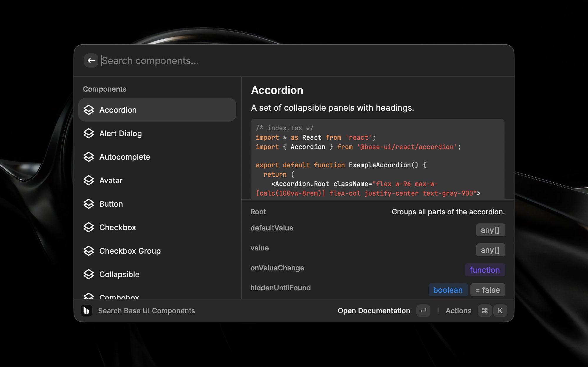

# Base UI Components

A Raycast extension to browse [Base UI](https://base-ui.com) component documentation.

## Features

- Search all Base UI components and utilities
- Preview code examples inline with syntax highlighting
- Browse component API reference with color-coded prop types
- Open documentation in the browser
- Copy the main example to your clipboard

## Actions

| Action             | Shortcut          |
| ------------------ | ----------------- |
| Open Documentation | `Enter`           |
| Copy Main Example  | `Cmd + Shift + C` |
| Copy URL           | `Cmd + Shift + .` |
