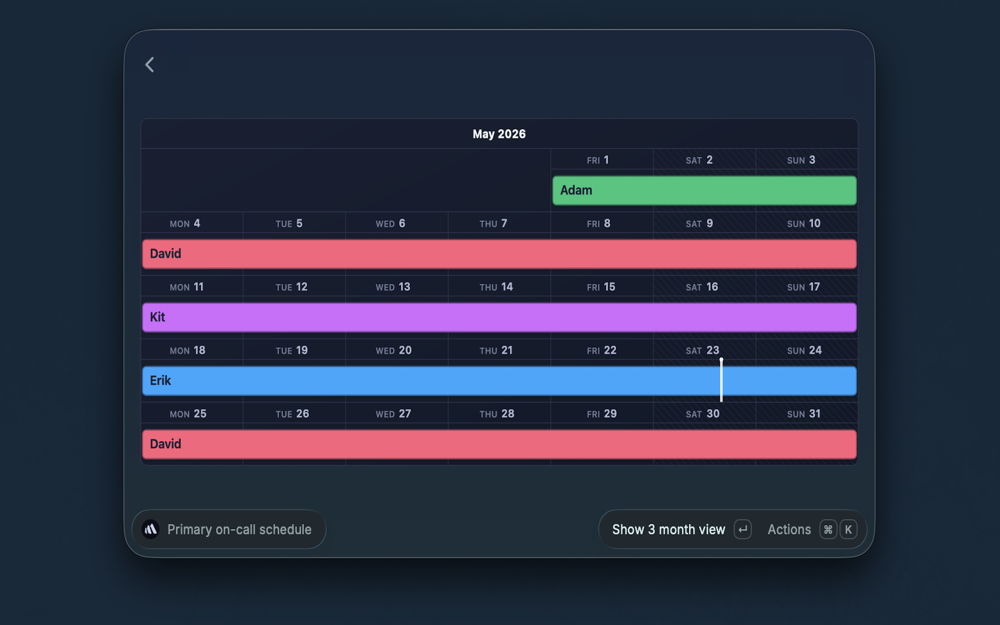

# BetterStack Utils

View your BetterStack on-call primary schedule directly from Raycast.

## Setup

This extension requires a BetterStack API token.

1. Go to [BetterStack Global API Tokens](https://betterstack.com/settings/global-api-tokens)
2. Create a new token (or copy an existing one)
3. Paste the token into the **API Token** field when prompted by Raycast