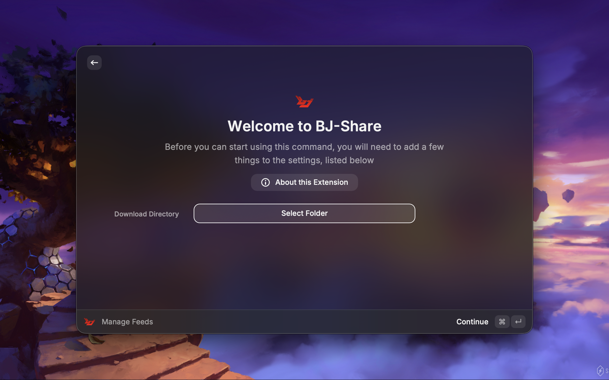
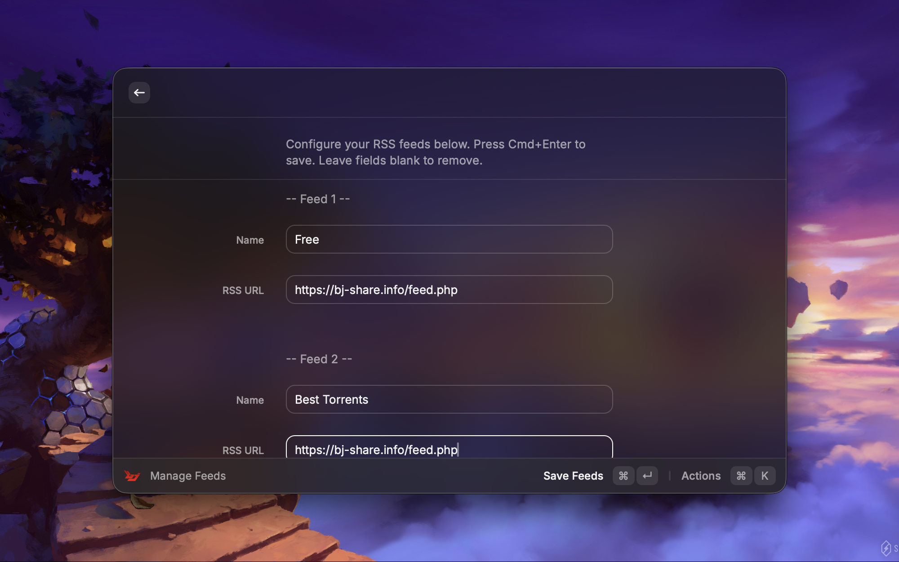
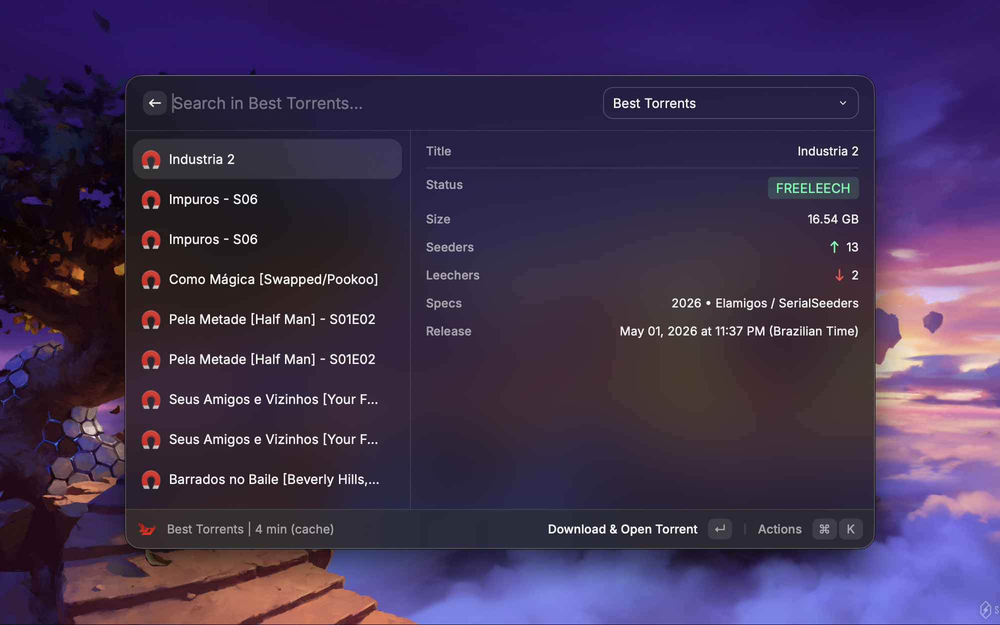

# BJ-Share

A Raycast extension to monitor, search, and directly download torrents from your BJ-Share RSS feeds.

## ⚙️ Setup and Configuration

### 1. Set Your Download Directory
Before downloading torrents, configure where you want the `.torrent` files to be saved.

* Open Raycast and search for the **Search Torrents** or **Manage Feeds** command.
* Press `Cmd + option + ,` to open the extension preferences.
* Use the directory picker to select your preferred **Download Directory** (e.g., `~/Downloads`).

### 2. Register RSS Feeds
You can add multiple RSS feed URLs using the dynamic feed manager.

* Open the **Manage Feeds** command in Raycast.
* Press `Cmd + N` to add a new feed entry.
* Fill in the **RSS Name** (e.g., "BJ-Share Movies", "BJ-Share Free Torrents") and the **RSS URL**.
**Note: When generating the RSS URL on BJ-Share, you must select the "Download Link" option. This ensures the RSS provides direct `.torrent` links, otherwise downloading will not work.**
* Press `Cmd + Enter` to save your feeds.
* The manager includes URL validation to ensure your feeds are correctly formatted.

## 🚀 Usage

### Searching and Managing Torrents
Once your feeds are configured, open the **Search Torrents** command to view the latest releases.

* **Dropdown Menu:** Switch between your configured RSS feeds using the menu in the top right.
* **Smart Search:** Use the search bar to filter torrents by title or specifications. If no results are found, a **"Search on Site"** action is provided.
* **Detailed Metadata:** The list displays real-time statistics including seeders, leechers, file size, release tags (e.g., 4K, 1080p, x265, HEVC), and freeleech status.
* **Release Dates:** Dates are formatted clearly for better readability.

### Available Actions
Select any torrent from the list and press `Cmd + K` to reveal the actions menu. You can also trigger these actions directly using the following shortcuts:

* **Download & Open Torrent - `Enter (↵)`:** Downloads the `.torrent` file and opens it in your default client. Filenames are automatically sanitized for your OS.
* **View on Site - `Cmd + Enter (⌘↵)`:** Opens the torrent's detail page in your browser.
* **Open Download Link in Browser - `Cmd + Shift + Enter`:** For those who prefer their browser's download manager.
* **Copy Download Link - `Cmd + L`:** Copies the direct RSS download link to your clipboard.
* **Copy Torrent ID - `Cmd + Shift + I`:** Copies the tracker's internal torrent ID.
* **Filter Freeleech Only - `Cmd + Shift + F`:** Instantly toggles the list to show only Freeleech torrents.
* **Force Refresh - `Cmd + R (⌘R)`:** Clears the cache and fetches the latest items immediately.

## ⚠️ Limitations
* **Tracker Optimization:** The title parsing logic and extraction of tags are specifically tailored to the BJ-Share naming conventions. It includes support for various formats (MKV, MP4, Jogo, Pack, etc.) and resolutions. Using RSS feeds from other trackers may result in missing metadata.
