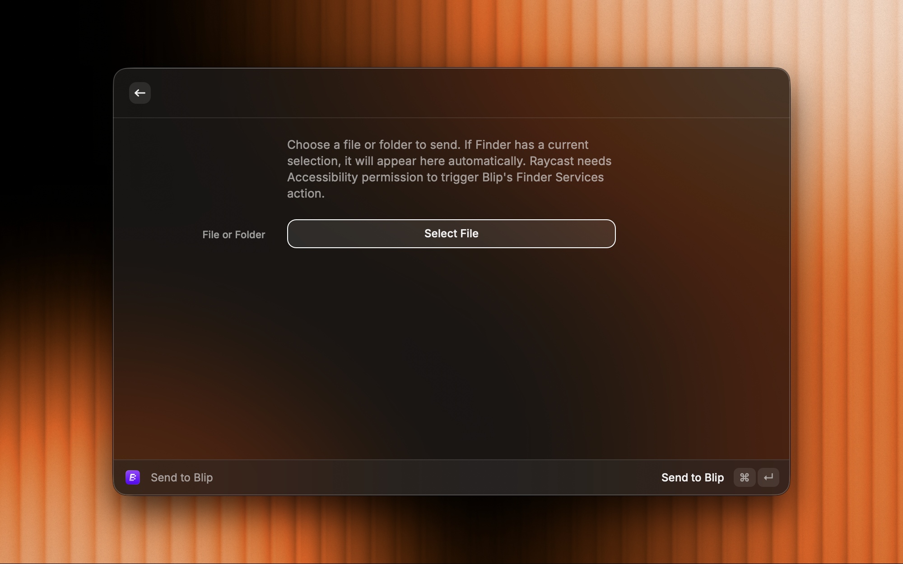

# Blip

Send files and folders to Blip from Raycast.

Blip does not expose a public file-send API on macOS, so this extension triggers Blip through its Finder `Services` action.

## Screenshot

## Commands

- `Send to Blip`: opens a form with a file picker and pre-fills it from the current Finder selection when possible.
- `Send Selected Finder Item to Blip`: sends the current Finder selection to Blip immediately.

## Local development

1. Run `npm install`
2. Run `npm run dev`
3. Import the extension into Raycast when prompted

## How it works

The extension reveals the selected file in Finder and triggers Blip's Finder `Services` action. This currently requires Accessibility permission so Raycast can drive the Finder menu item.

## Permissions

- Enable Accessibility for Raycast in `System Settings > Privacy & Security > Accessibility`
- This is required because the extension drives Finder's `Services > Blip…` menu item on your behalf.

## User-facing behavior

- The extension selects the file in Finder and invokes Blip's `Blip…` service.
- Blip then opens its send flow with the selected file attached.
- If Accessibility is missing, the command will fail with setup instructions.
