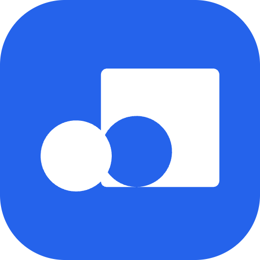

    

# Context.dev (fka Brand.dev)

This is a Raycast extension for [Context.dev](https://context.dev/) (formerly known as [Brand.dev](https://brand.dev)) - _Web Scraping & Crawl API for AI Agents_.

## 🚀 Getting Started

1. **Install extension**: Click the `Install Extension` button in the top right of [this page](https://www.raycast.com/xmok/brand-dev) OR via Raycast Store

2. **Get your API Key**: The first time you use the extension, you'll need to enter your 'Context.dev' API Key:

    a. `Sign in` to your Account at [this link](https://www.context.dev/login)

    (if you don't have an account, `Sign up` at [this link](https://www.context.dev/signup))

    b. `Navigate` to "API Keys"

    c. `Create` a new key
  
    d. `Enter` this key in Preferences OR at first prompt

## ⚙️ Configuration

In "Retrieve Brands", by default the secondary `Action` performs "Deletion" but if you prefer, you can change this in Command `Preferences` to be "New".

## 🗒️ NOTE

The Free Plan of Context.dev includes **500** *one-time* API Calls so to reduce usage of API Calls, when you retrieve a Brand, it is stored locally in `LocalStorage`.

## ❗ TIP

If you are using an old API Key (prefix "brand__"), for best results, please create a new API Key via Context.dev dashboard (prefix "ctxt_secret_").

## ➕ More

Looking for more information on a Lead? Try the following extension:

