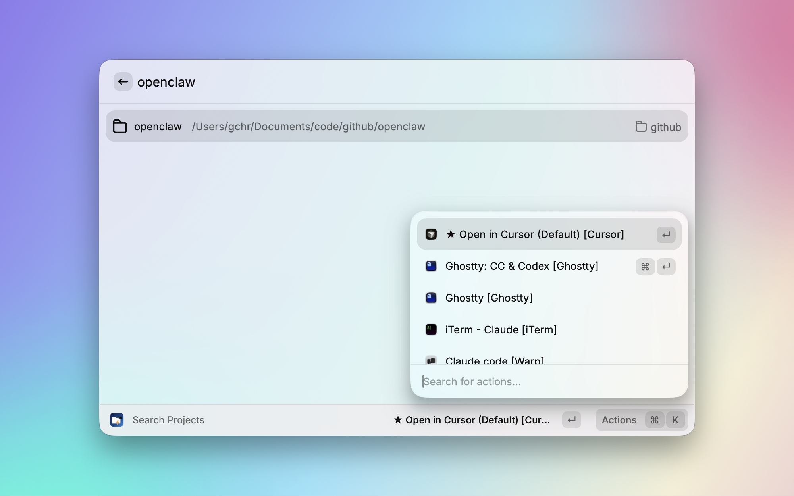
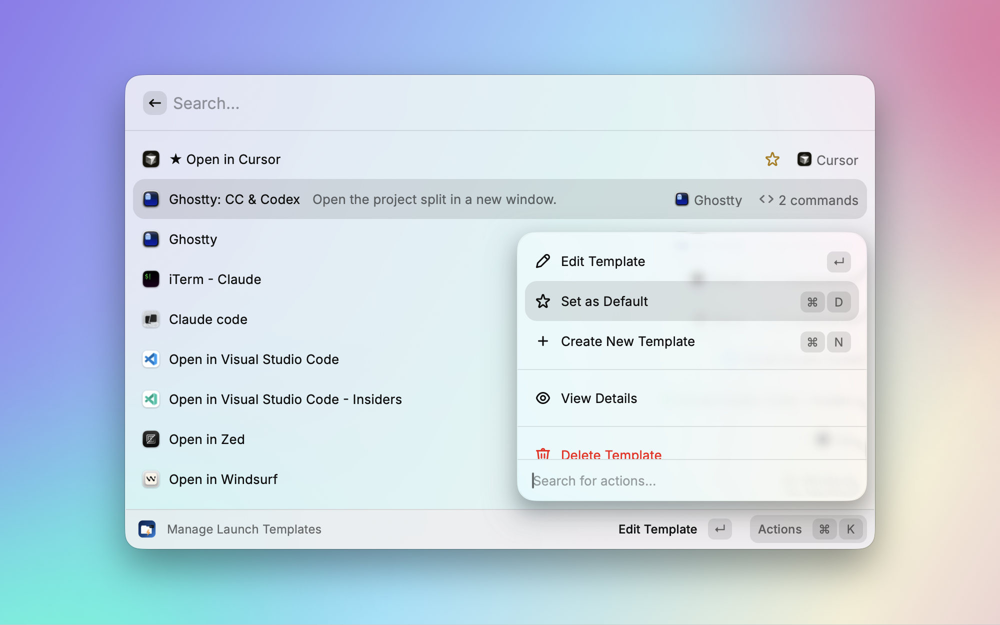
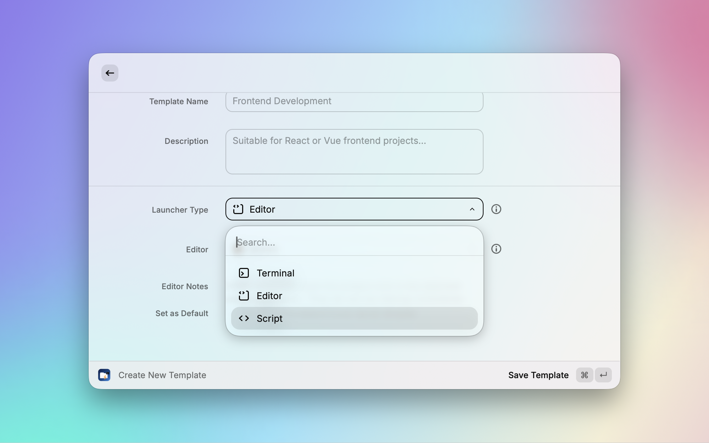
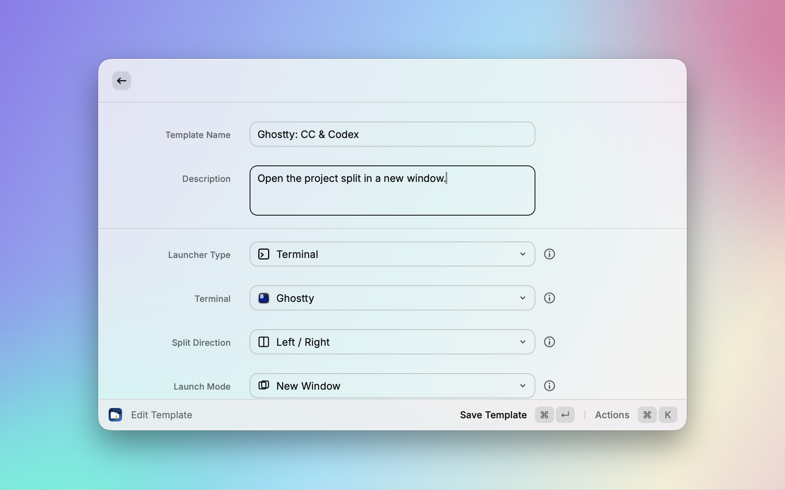
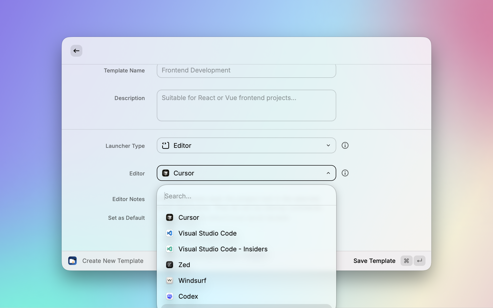

# Code Runway

一个强大的 Raycast 扩展，快速搜索项目并在终端或编辑器中启动，支持多终端分屏、多标签页等布局，方便 Vibe Coding。

[中文文档](https://github.com/gongchunru/raycast-code-runway/blob/main/README_CN.md) | [English](https://github.com/gongchunru/raycast-code-runway/blob/main/README.md)

## ✨ 功能特性

- 🔍 **智能项目发现**: 自动扫描和索引配置目录中的所有项目
- 🚀 **快速启动**: 一键启动项目，支持自定义模板配置
- 🖥️ **多终端支持**: 支持 **Warp**、**Ghostty**、**iTerm** 和 **cmux**
- ✏️ **编辑器集成**: 支持 **Cursor**、**Windsurf**、**VS Code**、**Codex** 等编辑器直接打开项目
- 🎯 **启动模板**: 为不同开发场景预定义启动模板
- ⭐ **默认模板**: 将常用模板设为默认，实现超快速启动
- ⚙️ **可配置回车行为**: 可选择回车直接启动默认模板，或显示模板选择列表
- 🛠️ **自定义命令**: 配置多个终端命令，支持自定义工作目录
- 📁 **目录管理**: 简单易用的项目目录管理，支持启用/禁用控制
- 🎨 **原生应用图标**: 模板列表自动显示对应终端/编辑器的原生图标

## 📋 系统要求

- [Raycast](https://raycast.com/) — 必需
- 至少一个支持的终端或编辑器：
  - **终端**: [Warp](https://www.warp.dev/)、[Ghostty](https://ghostty.org/)、[iTerm](https://iterm2.com/)、[cmux](https://cmux.dev/)
  - **编辑器**: [Cursor](https://cursor.sh/)、[Windsurf](https://codeium.com/windsurf)、[VS Code](https://code.visualstudio.com/)、[Codex](https://openai.com/codex/) 等

## 🚀 快速开始

### 1. 配置项目目录

首先，添加你的项目根目录：

1. 打开 Raycast 搜索 **"Project Directory Settings"**
2. 点击 **"Add New Directory"** 或按 `Cmd + N`
3. 选择你的项目根目录（支持多选）
4. 可选：添加显示名称前缀来组织目录

扩展会自动扫描这些目录中的项目。

### 2. 搜索和启动项目

1. 打开 Raycast 搜索 **"Search Projects"**
2. 输入关键词搜索项目
3. 按 `Enter` 启动：
   - 默认直接使用 **默认模板** 启动
   - 也可以在扩展设置中配置为打开 **模板选择列表**



### 3. 管理模板

创建和自定义启动模板：

1. 搜索 **"Launch Templates"**
2. 创建新模板或编辑现有模板
3. 选择终端（Warp、Ghostty、iTerm、cmux）或编辑器（Cursor、Windsurf、Codex 等）
4. 配置分屏方向、启动模式和命令
5. 使用 **"Set as Default"** 操作设置默认模板（`Cmd + D`）



## 🔍 项目识别

通过检测以下文件自动识别项目：

- `package.json` (Node.js/JavaScript)
- `Cargo.toml` (Rust)
- `go.mod` (Go)
- `pom.xml` / `build.gradle` (Java)
- `requirements.txt` / `pyproject.toml` (Python)
- `Gemfile` (Ruby)
- `composer.json` (PHP)
- `.git` (Git 仓库)
- `Makefile` / `CMakeLists.txt` (C/C++)
- `Dockerfile` (Docker)

## ⌨️ 快捷键

- `Enter`: 启动项目（行为可在偏好设置中配置）
- `Cmd + R`: 刷新项目列表
- `Cmd + Shift + R`: 刷新模板
- `Cmd + N`: 添加新目录（在项目目录设置中）
- `Cmd + D`: 设为默认模板（在模板管理中）

## 🔧 可用命令

| 命令                           | 描述                       |
| ------------------------------ | -------------------------- |
| **Search Projects**            | 搜索并启动你的开发项目     |
| **Project Directory Settings** | 管理项目目录，提供完整控制 |
| **Launch Templates**           | 创建和管理启动模板         |

## 🎨 模板自定义

### 启动类型



模板支持三种启动类型：

| 类型 | 说明 | 适用场景 |
| ---- | ---- | -------- |
| **终端 (Terminal)** | 在终端中打开项目，支持分屏、多标签页和多窗口布局 | 需要运行命令的开发场景，如启动服务、AI Agent 等 |
| **编辑器 (Editor)** | 直接在编辑器中打开项目目录 | 快速用 Cursor、VS Code、Codex 等打开项目 |
| **脚本 (Script)** | 运行自定义 Bash 脚本，项目路径通过 `$1` 和环境变量传入 | 自定义启动流程，如组合多个工具、运行 AppleScript 等 |

> **脚本模板**中可用的变量：
> - `$1` — 项目路径
> - `CODE_RUNWAY_PROJECT_PATH` — 项目完整路径
> - `CODE_RUNWAY_PROJECT_NAME` — 项目名称

### 创建自定义模板

1. 打开 **"Launch Templates"**
2. 点击 **"New Template"**
3. 配置：
   - **启动类型**: 终端、编辑器 或 脚本
   - **终端 / 编辑器**: 选择你的应用（终端和编辑器类型时）
   - **脚本内容**: 输入 Bash 脚本（脚本类型时）
   - **分屏方向**: 左右 或 上下（Warp、Ghostty & cmux）
   - **启动模式**: 分屏、多标签页 或 多窗口
   - **命令**: 添加多个命令，支持自定义工作目录

### 启动模式说明（终端类型）

| 模式 | 说明 | 适用场景 |
| ---- | ---- | -------- |
| **分屏 (Split Panes)** | 所有命令在同一窗口内以分屏排列，可配置左右或上下方向 | 需要同时查看多个终端输出，如前端 + 后端 + AI Agent |
| **多标签页 (Multi-Tab)** | 每个命令在独立标签页中打开，共享同一窗口 | 命令较多但不需要同时查看，切换方便 |
| **多窗口 (Multi-Window)** | 每个命令在独立窗口中打开 | 需要在不同桌面或显示器上分布终端 |

### 在终端中启动

Ghostty 新窗口分屏启动 `Claude Code`，`Codex CLI`



### 在编辑器中启动
Cursor、Windsurf、Codex 等编辑器中打开项目



### 示例：自定义脚本模板

```bash
# 最简单的用法：在 Cursor 中打开项目
cursor "$1"
```

```bash
# 安装依赖后用 Xcode 打开项目
cd "$1" && pod install && open *.xcworkspace
```

```bash
# 启动 Docker 环境并打开编辑器
cd "$1" && docker compose up -d && cursor .
```

```bash
# 运行项目自定义的初始化脚本
"$CODE_RUNWAY_PROJECT_PATH/scripts/dev-setup.sh"
```

## 🖥️ 终端支持

| 功能             | Warp | Ghostty | cmux | iTerm |
| ---------------- | ---- | ------- | ---- | ----- |
| 分屏             | ✅   | ✅      | ✅   | ❌    |
| 多标签页         | ✅   | ✅      | ✅   | ❌    |
| 多窗口           | ✅   | ✅      | ✅   | ❌    |
| 自定义分屏方向   | ✅   | ✅      | ✅   | ❌    |
| 单独命令         | ✅   | ✅      | ✅   | ✅    |
| 工作目录         | ✅   | ✅      | ✅   | ✅    |

详细终端集成信息请查看 [Terminal Support](https://github.com/gongchunru/raycast-code-runway/blob/main/TERMINAL_SUPPORT.md)。
