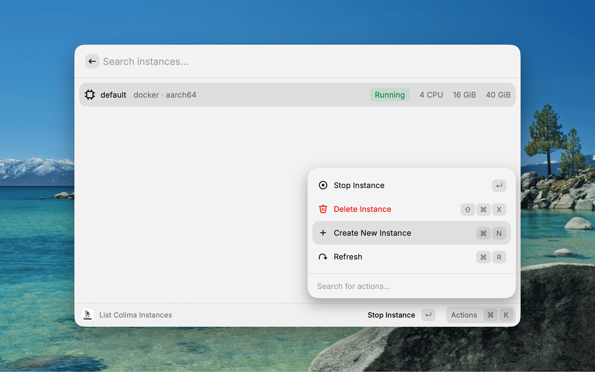
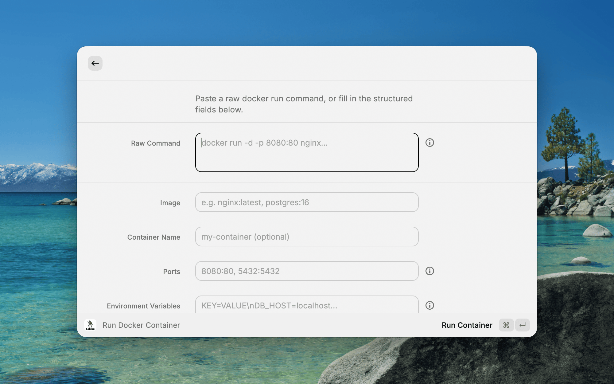

# [Colima — Raycast Extension](https://github.com/Miskamyasa/raycast-colima)

Manage [Colima](https://github.com/abiosoft/colima) virtual machine instances and Docker environments without leaving Raycast.

## Why

Colima is a lightweight alternative to Docker Desktop on macOS, but managing it means switching to the terminal for every `colima start`, `docker ps`, or `docker run`. This extension brings the full workflow into Raycast so you can start VMs, inspect containers, pull images, and run new containers — all from a single launcher, with keyboard shortcuts and instant feedback.

## Prerequisites

- [Raycast](https://raycast.com/) installed on macOS
- [Colima](https://github.com/abiosoft/colima) installed (`brew install colima`)
- [Docker CLI](https://docs.docker.com/engine/install/) installed (`brew install docker`)

The extension checks for both dependencies on launch and shows installation links if anything is missing.

## Commands

### List Colima Instances

View all Colima VM profiles with their status, CPU, memory, disk, runtime, and architecture at a glance. From the action panel you can start, stop, delete, or create new instances.

Creating a new instance opens a form pre-populated with your Colima template defaults (read from `~/.colima/_templates/default.yaml`), where you can configure CPUs, memory, disk, runtime (`docker` / `containerd` / `incus`), VM type (`qemu` / `vz` / `krunkit`), and Kubernetes.



### List Docker Containers

Browse running and stopped containers filtered by status. Each item shows the container name, image, state, port mappings, and creation time. Actions include start, stop, restart, remove, view logs, copy container ID, and run a new container.

The **View Logs** action opens a detail view with the last 200 log lines, which you can copy to clipboard or refresh.

### List Docker Images

See all local images with their repository, tag, size, and age. You can run a container directly from an image, pull a new image, remove or force-remove images, and copy the image ID or name. Dangling (untagged) images are clearly marked with a warning icon.

### Pull Docker Image

A simple form to pull any image by reference (e.g. `nginx`, `postgres:16`, `ghcr.io/org/repo:latest`). Validates input and shows progress via an animated toast with a 5-minute timeout for large images.

### Run Docker Container

A flexible form that supports two workflows: paste a raw `docker run` command, or fill in structured fields individually.



Structured fields include:

| Field                 | Example                                           |
| --------------------- | ------------------------------------------------- |
| Image                 | `nginx:latest`, `postgres:16`                     |
| Container Name        | `my-app` (optional)                               |
| Ports                 | `8080:80, 5432:5432`                              |
| Environment Variables | `KEY=VALUE` (one per line)                        |
| Volumes               | `/host/path:/container/path` (one per line)       |
| Network               | Default (bridge) or any existing Docker network   |
| Restart Policy        | `no` / `always` / `unless-stopped` / `on-failure` |
| Detached              | Enabled by default                                |
| Additional Flags      | `--memory 512m --cpus 2`                          |

## Development

```bash
# Install dependencies
npm install

# Start development mode with hot reload
npm run dev

# Build for production
npm run build

# Lint
npm run lint

# Lint with auto-fix and formatting
npm run fix-lint
```

## License

[MIT](https://github.com/Miskamyasa/raycast-colima/blob/main/LICENSE)
