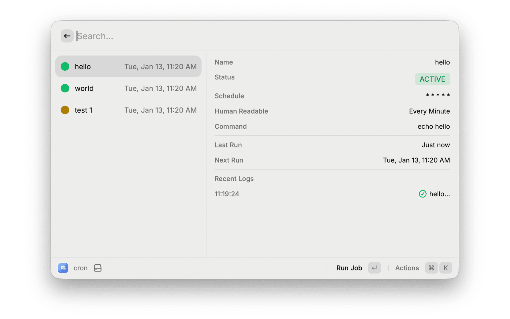

# Cron Manager

Manage your local cron jobs directly from Raycast. Create, edit, run, and monitor cron jobs with a beautiful and easy-to-use interface.

## Features

- **Create & Manage Jobs**: Easily create cron jobs with a user-friendly form.
- **Schedule Presets**: Choose from common presets (Minute, Hourly, Daily) or enter custom cron expressions.
- **One-Click Run**: Manually trigger any job immediately to test your commands.
- **Execution Logs**: View detailed logs of every execution, including success and error messages.
- **Visual Status**: Quickly see which jobs are active, paused, or failing.
- **Search**: Filter jobs by name or command instanty.

## Usage

1.  **Create a Job**: Use `Cmd + N` to create a new job.
2.  **Run a Job**: Select a job and press `Enter`.
3.  **View Logs**: Press `Cmd + L` to view the execution history.
4.  **Edit**: Press `Cmd + E` to modify a job.
5.  **Toggle Status**: Press `Cmd + Shift + P` to pause/resume.

## Author

Created by **tahazahit**.

## License

MIT