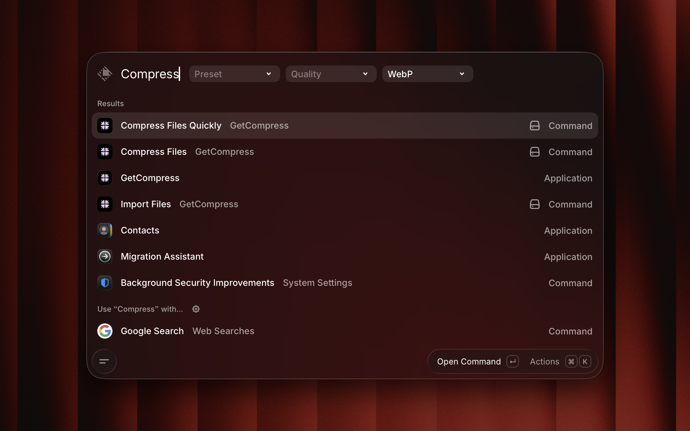
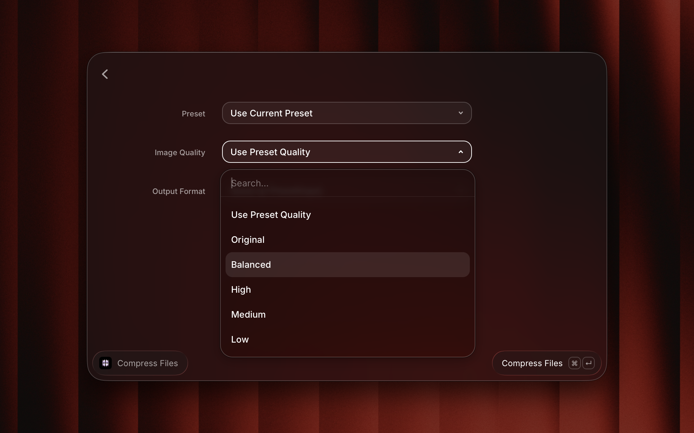

<h1 align="center">GetCompress</h1>

Quickly compress videos, images, GIFs, and PDFs in batches: enjoy up to 90% smaller files with minimal quality loss, all offline and secure on your Mac or PC.

## Prerequisites

[GetCompress](https://GetCompress.com) installation is required to use this extension

## Commands

- **Import Files**
  - Add the selected files to GetCompress for further compression or conversion.
- **Compress Files quickly**
  - Hit enter and compress the selected files straight away, using the saved presets in GetCompress, or choose a preset or quality from dropdown optional arguments. 
  - Note: actual preset names are unavailable here because Raycast does not allow dynamic arguments for commands without opening a separate screen. Instead, you select presets by index, following the same ordering that you see in your app.
- **Compress Files**
  - Compress selected files after selecting quality, output format or presets
  - More options are available here, as presets names and quality values are fetched from GetCompress data.

## Screenshots

