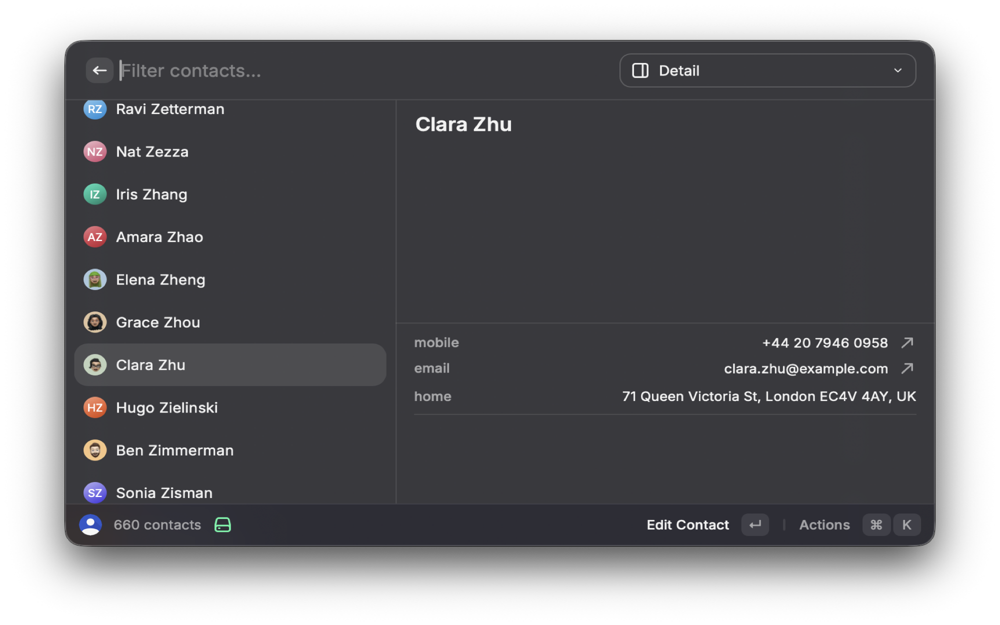
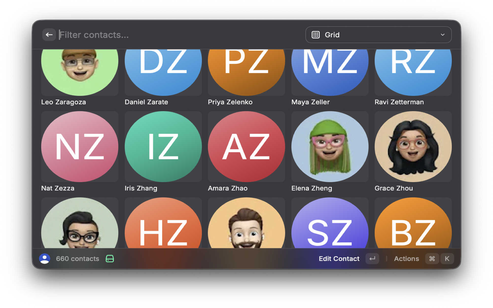

# Google Contacts

Browse, search, and manage your Google Contacts directly from Raycast — create, edit, delete, and action contacts without leaving your keyboard.

## Setup

This extension requires a Google Cloud OAuth Client ID. Each user creates their own — it takes about 2 minutes.

### 1. Enable the People API

Go to the [People API page](https://console.cloud.google.com/apis/library/people.googleapis.com) in your Google Cloud Console and click **Enable**.

If you don't have a Google Cloud project yet, [create one first](https://console.cloud.google.com/projectcreate).

### 2. Configure the OAuth Consent Screen

Go to [OAuth consent screen](https://console.cloud.google.com/apis/credentials/consent) and configure:

- **User Type**: External
- Fill in the required fields (app name, support email, developer email)
- Skip scopes (the extension requests them at runtime)
- Add your Google account as a test user
- Save and continue through all steps

### 3. Create an OAuth Client ID

Go to [Credentials](https://console.cloud.google.com/apis/credentials):

1. Click **+ Create Credentials** → **OAuth client ID**
2. **Application type**: iOS
3. **Bundle ID**: `com.raycast`
4. Click **Create**
5. Copy the **Client ID** (looks like `123456789-xxxx.apps.googleusercontent.com`)

### 4. Enter the Client ID in Raycast

Open any Google Contacts command in Raycast. It will prompt you for the Client ID in extension preferences. Paste it and you're done.

## Commands

### Search Contacts

Browse all your Google Contacts with three view modes:

- **List** — full-width list with email, phone, and group accessories
- **Detail** — split-pane with a metadata panel showing all contact fields
- **Grid** — avatar grid for visual browsing

Use the dropdown in the search bar to switch views. Filter contacts by typing — searches across name, email, phone, and company.

**Actions**: Edit, Delete, Compose Email, Call, Copy Name/Email/Phone, Open in Google Contacts.

### Create Contact

Full form for adding a new contact:

- First name, last name, email, phone, company, job title, notes
- Additional fields section with secondary email, phone, and label picker

Also used for editing — select "Edit Contact" from Search Contacts to open the form pre-populated.

### Quick Add Contact

Add a contact directly from the Raycast command bar without opening a window. Tab through:

- **First name** (required)
- **Last name** (required)
- **Email** (optional)

Shows a warning if a contact with the same name already exists.

### Google Contacts Tool (AI)

Exposes contact operations to Raycast AI:

- Search contacts by name, email, or phone
- View full contact details
- Create, update, and delete contacts (with confirmation)

## FAQ

**Why iOS application type?**
Raycast uses a custom URI redirect (`com.raycast://oauth`) which Google only allows for iOS app types. This is standard for all Raycast extensions using Google OAuth.

**Why do I need my own Client ID?**
Google requires each OAuth app to go through a verification process for published credentials. By using your own Client ID, you avoid this restriction and maintain full control over your API access.

**Is my data safe?**
All authentication is handled locally by Raycast's built-in OAuth PKCE flow. Your tokens are stored securely in your system keychain. The extension never transmits data anywhere other than directly to Google's APIs.
