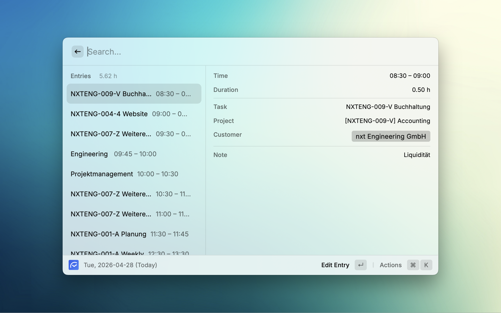
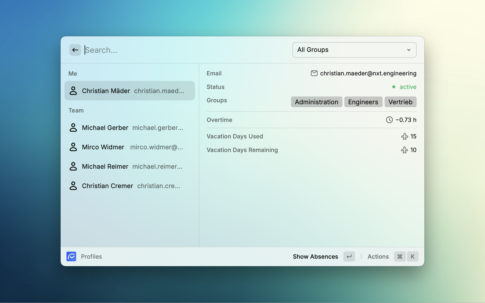
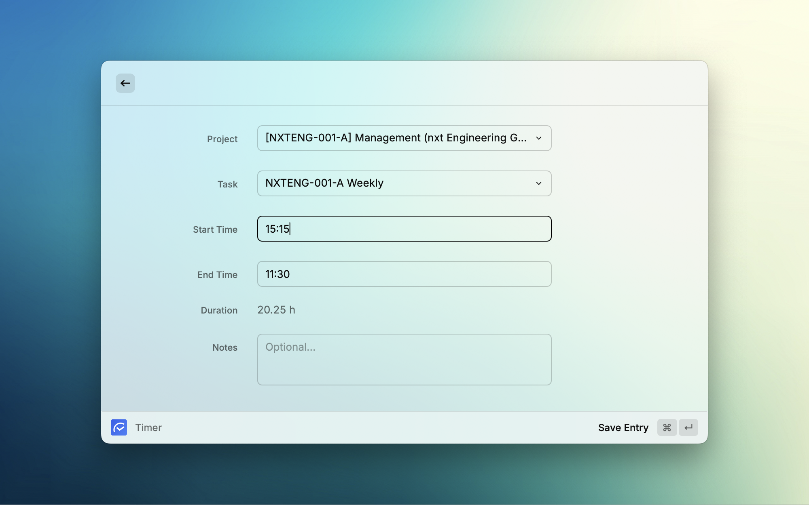
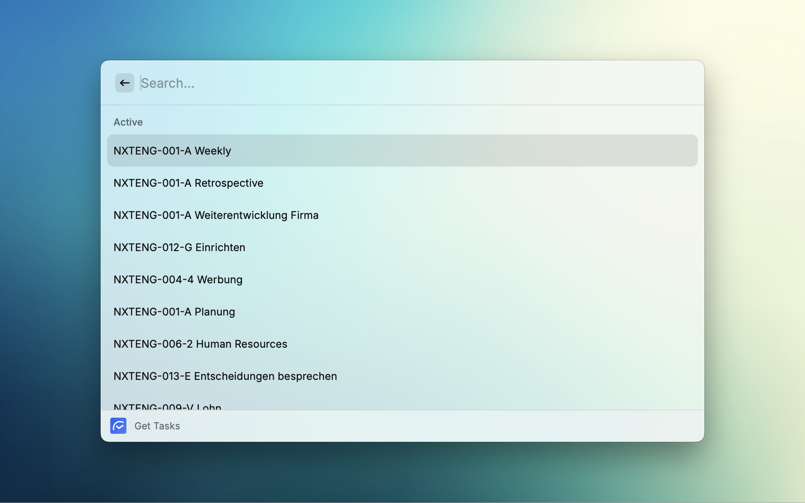
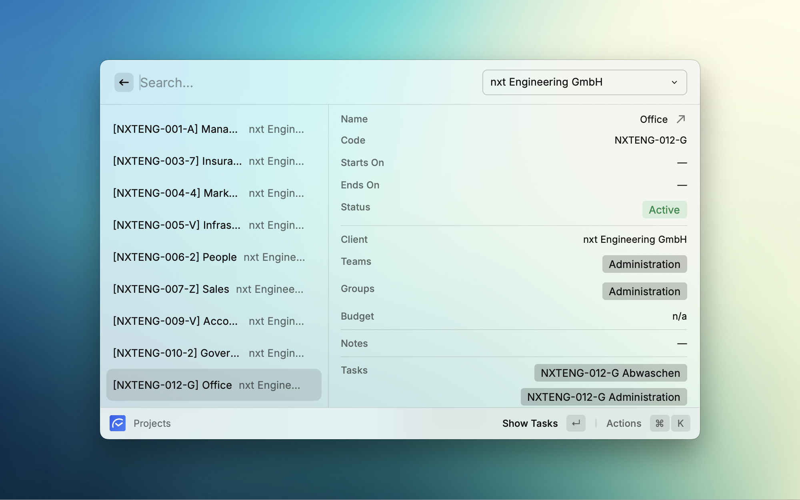

# Hakuna Timer

Hakuna Extention to start and stop a timer at hakuna.ch

## Features

- Support for entries and timers
- Support for projects
- Support for co-workers
- Render times in tenant's format (`hh:mm` vs `hh.hh`)
- Sensible keyboard shortcuts and default actions
- Menu Bar for quick access
- Usage of [Raycast Cache][raycast-cache] for API responses to comply with Hakuna API request limits

## Impressions

## Get your personal API Token

Get your API token from https://app.hakuna.ch/token.

## Development

1. [`nvm use`][nvm] if you don't have a recent (or too recent) Node installed.
1. `npm i`
1. Start developing using `npm run dev`.
1. Run `npm run fix-lint && npm run build` before a commit.

- Or use [lefthook][lefthook] to do this for you before every git commit.

[nvm]: https://github.com/nvm-sh/nvm
[lefthook]: https://lefthook.dev/
[raycast-cache]: https://developers.raycast.com/api-reference/cache
