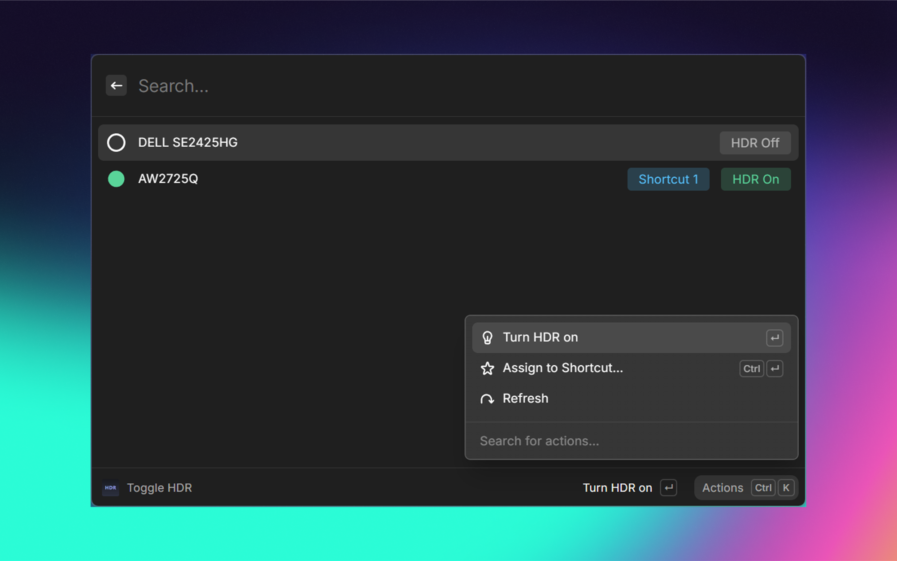

# HDR Toggle

Turn HDR on or off for **one monitor at a time** on Windows — right from Raycast.

Windows already has an HDR shortcut (`Win`+`Alt`+`B`), but it switches HDR on **every**
display at once. That's usually not what you want. Most people want HDR on their good
monitor — for games or movies — while their other screens stay normal. HDR Toggle solves
that: it shows each HDR-capable monitor on its own and lets you flip HDR for just that one.

## Using it

Open the **Toggle HDR** command. You'll see your HDR-capable monitors, each showing whether
HDR is currently on or off. Pick one and press Enter to flip it. The list always reflects
the real, current state, so you can also use it just to check what's on.

## One-press hotkeys for a monitor

If you toggle the same screen a lot, give it its own keyboard shortcut:

1. In **Toggle HDR**, select a monitor and choose **Assign to Shortcut → Shortcut 1**
   (there are four slots, 1–4).
2. Open Raycast Settings → Extensions → HDR Toggle, turn on **Toggle HDR – Shortcut 1**,
   and assign it a hotkey.

Now that hotkey flips HDR on that monitor instantly — no window, just a quick confirmation.
Each monitor can use one slot, and you have four to hand out. (The shortcut commands stay
hidden until you turn them on, so they don't clutter your search.)

## Requirements

- Windows 10 (version 1803 or newer) or Windows 11
- At least one HDR-capable monitor
- No administrator rights needed

If a monitor isn't in the list, Windows doesn't consider it HDR-capable — the extension only
shows displays you could actually enable HDR for in Windows Settings.

## How it works (for the curious)

Raycast extensions are written in JavaScript and can't talk to display hardware directly, so
HDR Toggle includes a small, readable PowerShell script (`assets/hdr.ps1`) that asks Windows'
built-in display configuration service to read and change each monitor's HDR state.

- On **Windows 11 24H2 and newer**, it uses the modern HDR-specific interface for an exact
  reading of which displays support HDR and whether it's on.
- On **older Windows**, it falls back to the legacy interface and filters out wide-gamut-only
  displays, so the list still shows only true HDR monitors.

Monitors are matched by a stable device ID, so a shortcut keeps pointing at the right screen
even after a reboot or reconnecting a display. There are no hidden binaries — just the
plain-text script — and nothing needs administrator access.

## Credits

Inspired by [GiulioSamp/HDRToggler](https://github.com/GiulioSamp/HDRToggler), which
demonstrates the same per-monitor HDR technique as a C# tray app.
