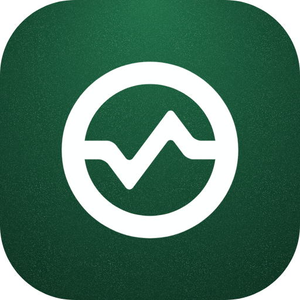
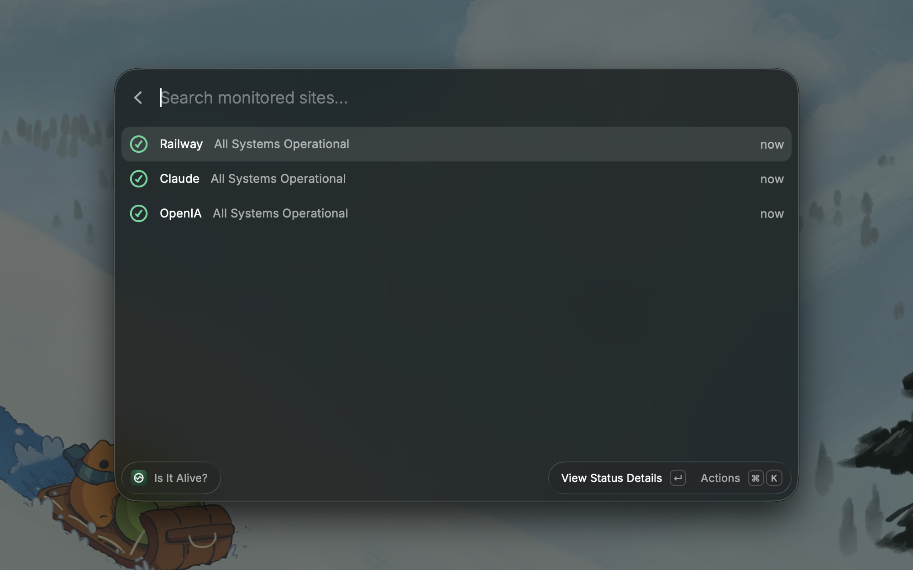
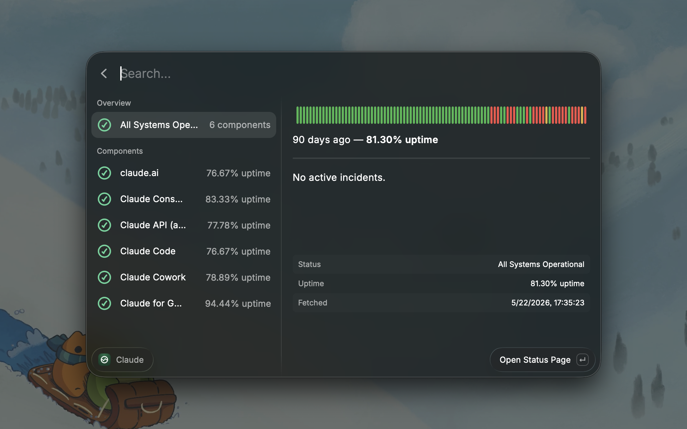

<p align="center">
  
</p>

<h1 align="center">Is It Alive?</h1>

<p align="center">
  Raycast extension that monitors status pages so you can quickly answer: <strong>is the outage on my side or theirs?</strong>
</p>

<p align="center">
  Add status page URLs, get a color-coded list of services, and drill into component-level detail with uptime history — without opening a browser tab.
</p>

## Screenshots

<p align="center">
  
</p>

<p align="center">
  <em>Site list — parallel fetch, status subtitles, and quick access to details.</em>
</p>

<p align="center">
  
</p>

<p align="center">
  <em>Detail view — component breakdown, active incidents, and 90-day uptime history.</em>
</p>

## Supported status pages

The extension auto-detects the provider when you add a URL. Detection order: **Railway → incident.io → Better Stack → Statuspage**.

| Provider          | Examples                                                       | Detection                             |
| ----------------- | -------------------------------------------------------------- | ------------------------------------- |
| **Railway**       | [status.railway.com](https://status.railway.com)               | Hostname match                        |
| **incident.io**   | [status.openai.com](https://status.openai.com)                 | `/proxy/{host}/component_impacts` API |
| **Better Stack**  | [status.yachtway.com](https://status.yachtway.com)             | `/index.json` JSON:API                |
| **Statuspage.io** | [status.claude.com](https://status.claude.com), GitHub, Vercel | `/api/v2/summary.json`                |

incident.io is checked before Statuspage because some Statuspage hosts expose proxy-style URLs that look similar but lack incident.io-only endpoints like `component_impacts`.

## Features

- **Site list** — parallel fetch, status subtitle, incident accessories
- **Add / edit / delete** — sites stored in Raycast local storage
- **Detail view** — overview, active incidents, per-component status
- **Uptime charts** — 90-day SVG bar history with uptime percentage

## Usage

1. Open **Is It Alive?** in Raycast
2. Add a status page URL (display name is optional — it defaults to the page title)
3. Press Enter to preview

## Development

Requires [Raycast](https://raycast.com), Node.js, and npm.

```bash
npm install
npm run dev      # run in Raycast dev mode
npm run lint     # lint + format check
npm run build    # production build
```

### Project structure

```
src/
  alive.tsx              # main list command
  adapters/
    index.ts             # provider detection + registry
    statuspage.ts        # Statuspage.io v2 API
    betterstack.ts       # Better Stack /index.json API
    incident-io.ts       # incident.io proxy API
    railway.ts           # Railway status API
  components/
    site-form.tsx        # add / edit form
    site-detail.tsx      # preview with uptime charts
  hooks/use-sites.ts     # local storage CRUD
  lib/
    fetch-json.ts        # shared JSON fetch helper
    snapshot-text.ts     # uptime labels + status descriptions
    status-colors.ts     # indicator + component colors
    uptime-chart.ts      # SVG chart generation + uptime math
    url.ts               # URL normalization + Railway host check
  types/                 # shared + provider-specific API types
```

### Adding a new provider

1. Add a `SiteProvider` variant in `src/types/index.ts`
2. Add provider API types under `src/types/` if needed
3. Implement `StatusAdapter` (`detect?` + `fetchSnapshot`) in `src/adapters/`
4. Register it in `src/adapters/index.ts` and update `detectProvider`

Each adapter normalizes its API into a shared `StatusSnapshot` shape so the UI stays provider-agnostic.

## License

MIT
