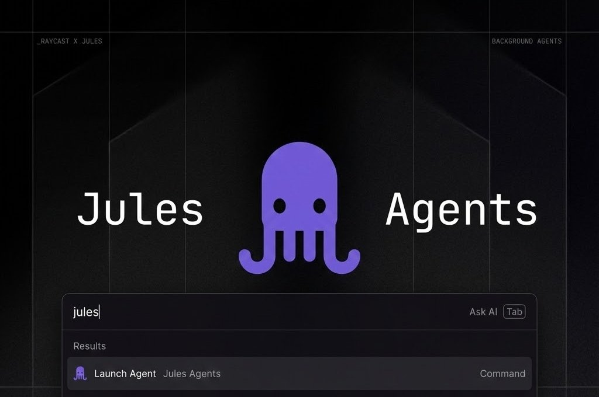

Manage and monitor your Google Jules sessions directly from Raycast.

## Features

- **Launch & Manage**: Start new Google Jules sessions from anywhere and manage them in a unified view.
- **AI Summaries**: Quickly understand long session logs with built-in AI summarization.
- **Media Viewer**: Easily view screenshots and visual artifacts generated by a session.
- **Menu Bar Overview**: Monitor your active sessions at a glance from your Mac's menu bar.
- **Session Activities**: Filter session activity logs and cut out the clutter.

## Setup

### API Key Configuration

To use this extension, you'll need to configure your Jules API key:

1. Visit the [Jules Settings page](https://jules.google.com/settings/api)
2. Generate a new API key or copy your existing API key
3. Configure the API key in the extension settings