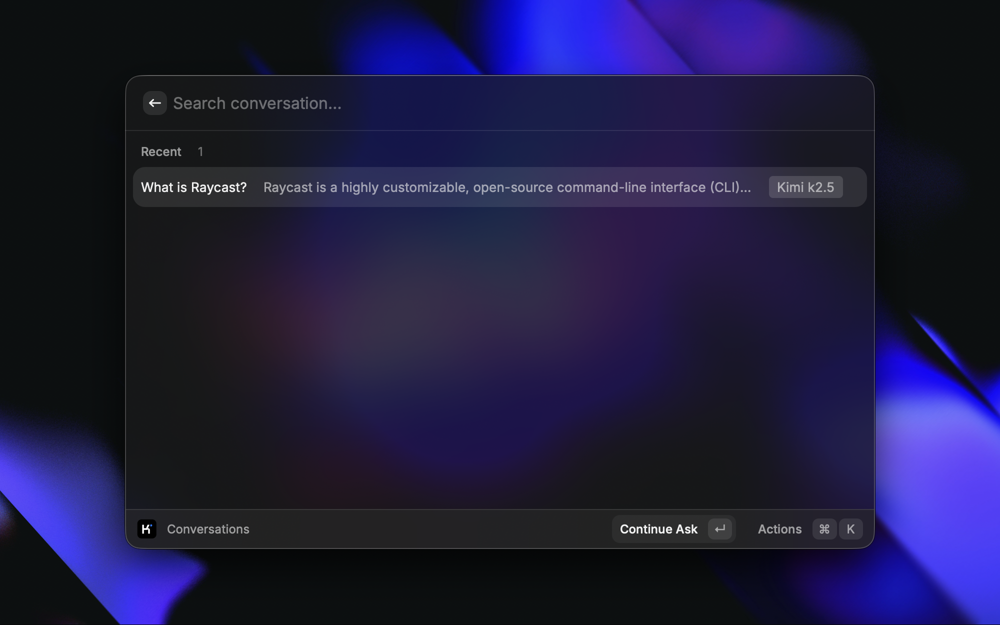
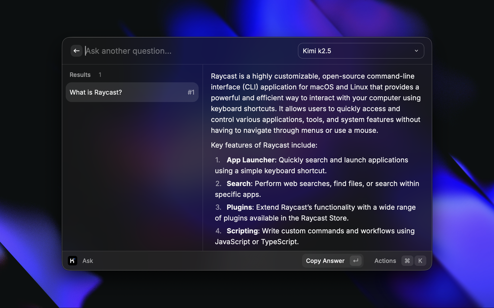
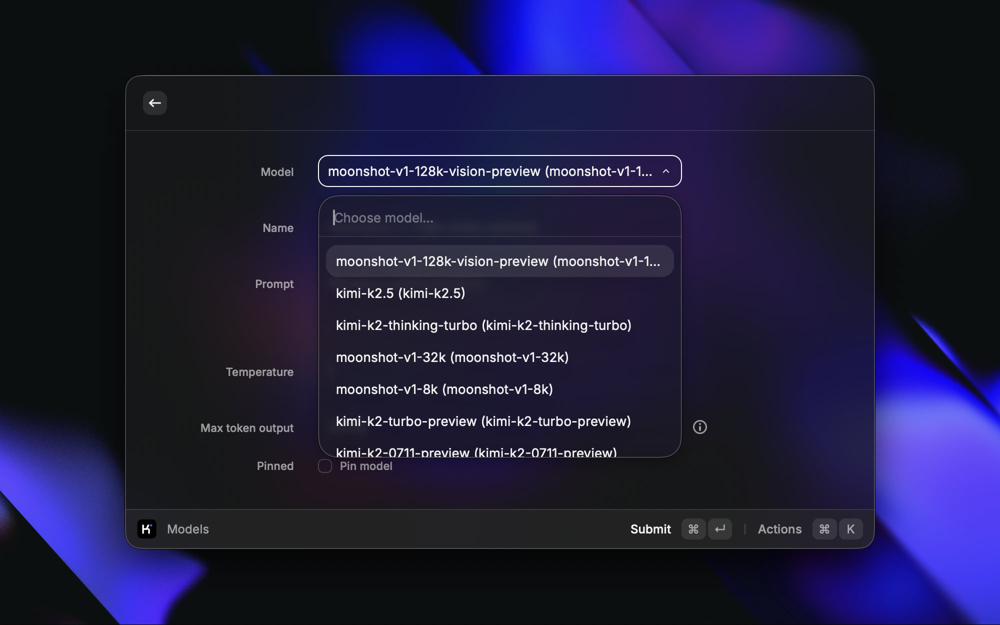
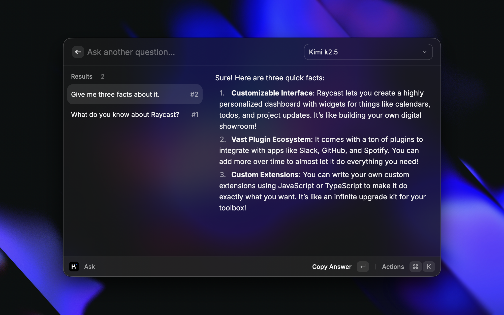
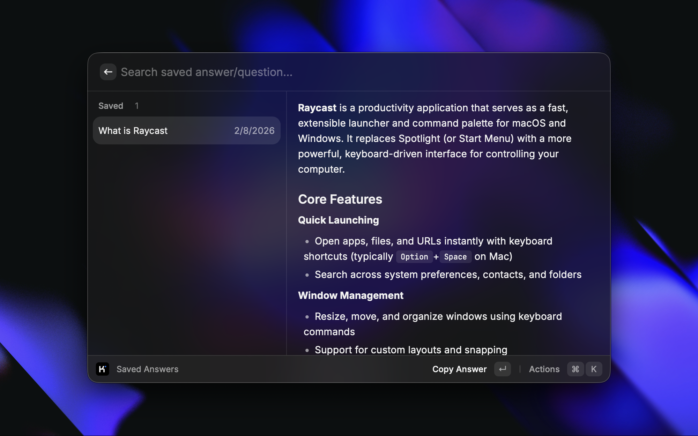

<h1 align="center">Kimi by Moonshot AI</h1>

<em>Note: This extension uses a single icon that works for both light and dark mode. No separate <code>@dark</code> icon is provided.</em>

<h3 align="center">
Interact with Moonshot AI's Kimi right from your command bar
</h3>

<a href="https://github.com/raycast/extensions/tree/main/extensions/kimi" title="Kimi Raycast extension latest source code">Latest source code
</a>

# Features

## Ask anything

Straight from your command bar, ask anything you want answered.

## Personalized for you

Customize the model to your liking.

## Continue talking

Continue talking, right from where you left off.

## Save answers

Got the answer that you wanted? Great.

# Models available

## Kimi K2.5

- `kimi-k2.5`

## Kimi K2

- `kimi-k2-0905`
- `kimi-k2-0711`
- `kimi-k2-thinking`

# How to use

This package requires a valid API key from [Moonshot AI](https://platform.moonshot.ai/).

> All the preferences value will be stored locally using [Preferences API](https://developers.raycast.com/api-reference/preferences)

# Preferences

All preferences properties list that can be customize through `Raycast Settings > Extensions > Kimi`

| Properties               | Label                  | Value                               | Required | Default | Description                                                                                                      |
| ------------------------ | ---------------------- | ----------------------------------- | -------- | ------- | ---------------------------------------------------------------------------------------------------------------- |
| `apiKey`                 | API Key                | `string`                            | `true`   | `empty` | Your personal Kimi API key |
| `useStream`              | Stream Responses        | `boolean`                           | `true`   | `true`  | Stream responses from Kimi in real-time |                                                                         
| `isAutoLoad`             | Auto-load              | `boolean`                           | `false`  | `false` | Load selected text from your front most application to the question bar or full text input form automatically |
| `isAutoFullInput`        | Use Full Text Input    | `boolean`                           | `false`  | `false` | Switch to `full text input form` from `question bar` automatically whenever you want to ask or type a question   |
---
