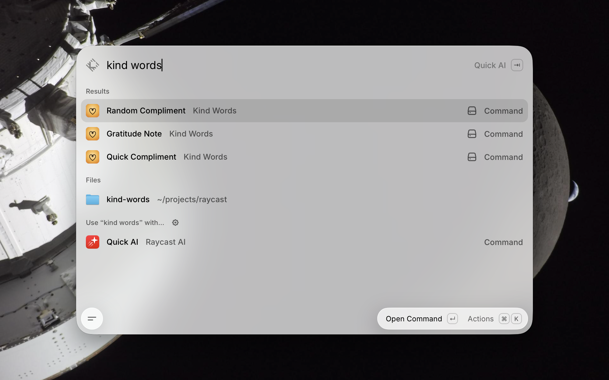

# Kind Words

A Raycast extension for picking up a small kindness — a compliment to send, or a gratitude prompt with notes on how to use it.

## Commands

### Random Compliment

Browse the full library of compliments with one preselected at random. Filter by tone (warm, playful, sincere, specific-skill). Press ⏎ to copy the focused compliment, or ⌘R to reshuffle.

### Quick Compliment

A no-view command that copies a random compliment straight to your clipboard with a HUD confirmation. Use it when you don't need to browse — just need one to send.

### Gratitude Note

Browse curated gratitude prompts with one preselected at random. Each prompt comes with a short note on when it works and two or three opener examples to start the conversation. Press ⏎ to copy the prompt, ⌘R to reshuffle.

## Why

Saying something kind is often gated less by feeling and more by friction. Kind Words removes a small amount of that friction: it gives you a starting point and a copy-ready phrasing in two keystrokes.

## Screenshots

## Privacy

Everything runs locally. No network calls, no analytics, no tracking. Compliments and prompts ship as static JSON in the extension itself.
