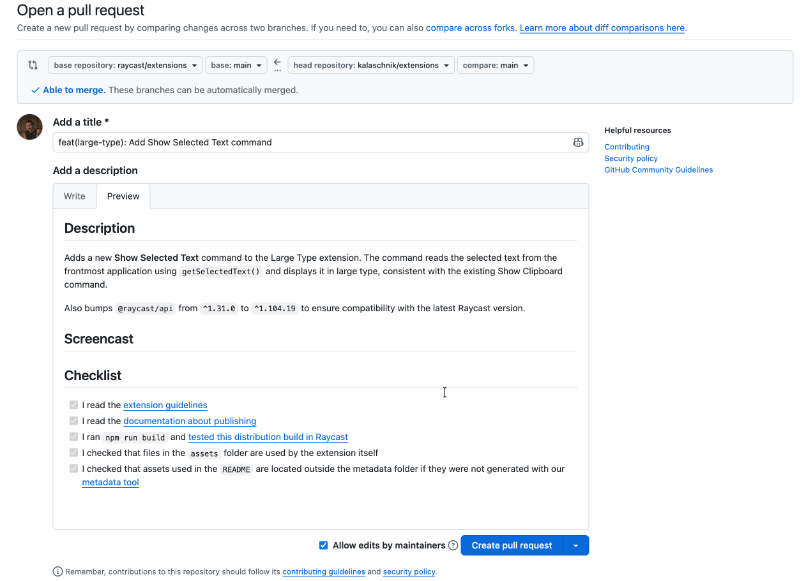

# Large Type

Display text in large characters across your screen which is great for sharing a phone number, password, or any short text across a room.

## Commands

### Enter Text

Type any text and it will be displayed in large type immediately.

### Show Clipboard

Instantly displays the current clipboard contents in large type — no typing needed.

### Show Selected Text

Displays the selected text from the frontmost application in large type.

## Preferences

| Preference                         | Description                                                                                  |
| ---------------------------------- | -------------------------------------------------------------------------------------------- |
| **Font Style**                     | Choose between Sans Serif or Monospaced font                                                 |
| **Split by letter and index**      | Break up text character by character with an index below each                                |
| **Color code numbers and symbols** | Highlights numbers and symbols in a different color to help differentiate similar characters |

## Screenshots

