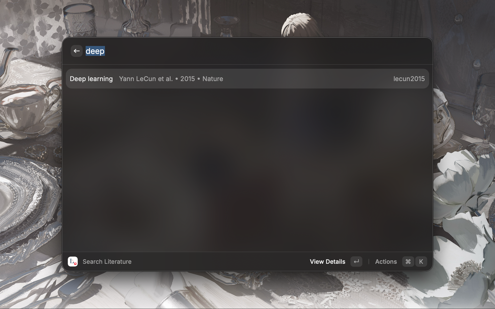
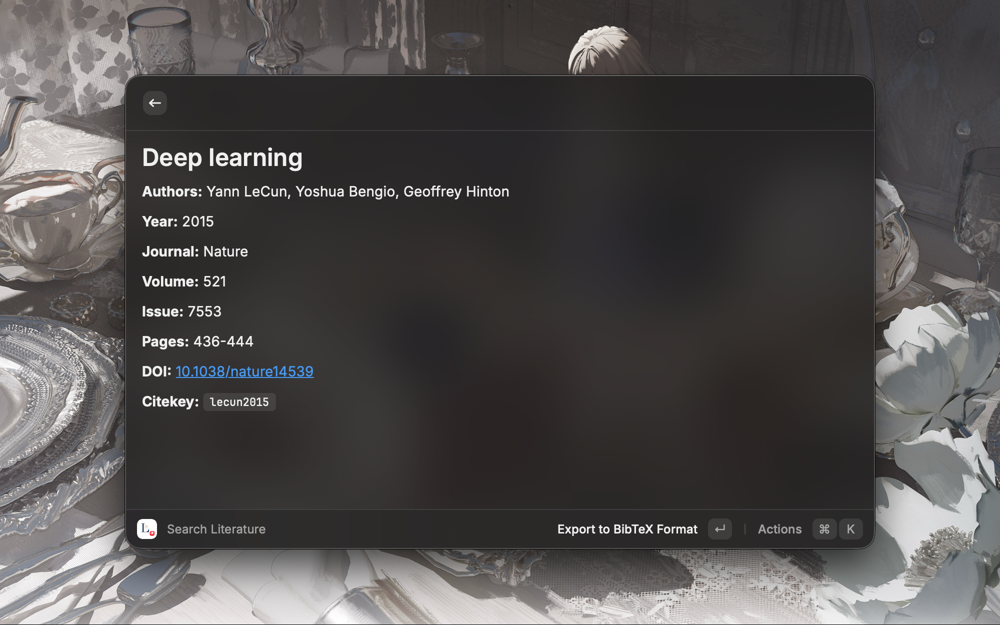
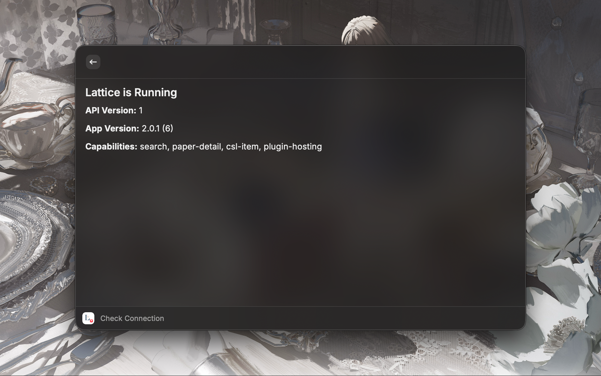
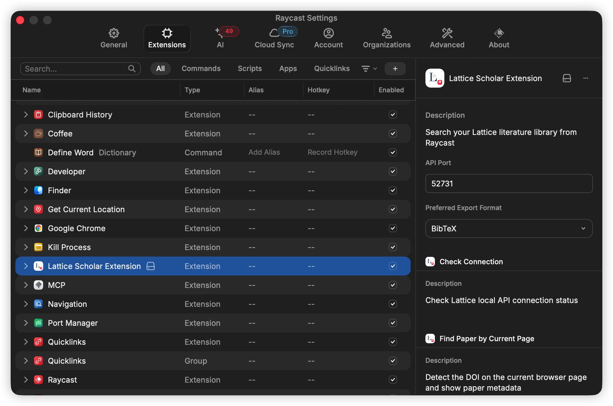
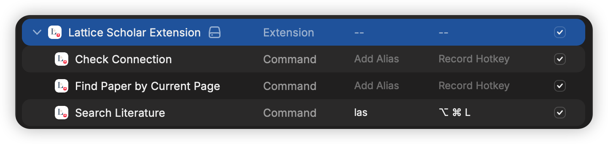

# Lattice Scholar

[中文文档](README.zh-CN.md)

Search your [Lattice](https://apps.apple.com/app/lattice-reference-manager/id6761349832) literature library directly from Raycast — no switching apps, no context loss.

## Features

- **Instant search** across your entire Lattice library as you type
- **Full citation details** — authors, journal, DOI, year, and more
- **Flexible citation export** — copy citations as BibTeX, RIS, CSL-JSON, or any bundled CSL bibliography style
- **Quick copy** — copy your preferred format instantly with `⌘ C`
- **Rich-text clipboard export** — tune font family and size for Word-friendly bibliography output
- **DOI detection** — extract paper metadata from the current browser page via CrossRef or arXiv
- **Connection check** — verify that the local Lattice API is reachable from Raycast

## Screenshots

## Requirements

- [Lattice](https://apps.apple.com/app/lattice-reference-manager/id6761349832) desktop app must be running
- The local API is served at `http://127.0.0.1:52731` by default — configurable in extension preferences

## Preferences

Open Raycast Preferences (`⌘ ,` → Extensions → Lattice Scholar Extension) to configure:

- **API Port** — port number for the Lattice local API (default: `52731`)
- **Preferred Export Format** — default format for the quick copy action. Supports `bibtex`, `ris`, `csl-json`, or any CSL style shipped in `assets/styles`
- **Clipboard Font Family** — font family used for rich-text citation exports
- **Clipboard Font Size** — font size in points used for rich-text citation exports

## Usage

### Search Literature

1. Open Raycast and run **Search Literature**
2. Type any part of a title, author, or keyword
3. Press `↵` to open the detail view, or use the action panel (`⌘ K`) to copy citation data

**Keyboard shortcuts in search results:**
- `⌘ C` — Copy citation in your preferred format (configurable in preferences)
- `⌃ ⌘ C` — Export to more formats
- `⌘ ⇧ C` — Copy citekey

**Actions in the paper detail view:**
- `⌘ C` — Copy citation in your preferred format
- `⌃ ⌘ C` — Export to more formats
- `⌘ ⇧ C` — Copy citekey
- `⌘ O` — Open DOI in browser
- `⌘ K` — Access copy DOI and copy title actions

### Find Paper by Current Page

1. Open a paper page in your browser (arXiv, journal site, etc.)
2. Run **Find Paper by Current Page** in Raycast
3. The command detects the DOI from the page URL or content and displays paper metadata
4. Copy the DOI, citation, or open the paper at doi.org

Requirements: [Raycast Browser Extension](https://www.raycast.com/browser-extension)

### Check Connection

Run **Check Connection** to confirm that the Lattice desktop app is running and the local API is reachable. This command displays:

- API version
- App version
- Reported server capabilities

## Tips: Alias & Hotkey

For faster access, assign an alias or hotkey to the **Search Literature** command in Raycast Preferences (`⌘ ,` → Extensions → Lattice Scholar Extension).

- **Alias** — type a short keyword (e.g. `las`) to launch the command without scrolling through the list
- **Hotkey** — bind a global shortcut (e.g. `⌥ ⌘ L`) to open the search from anywhere

