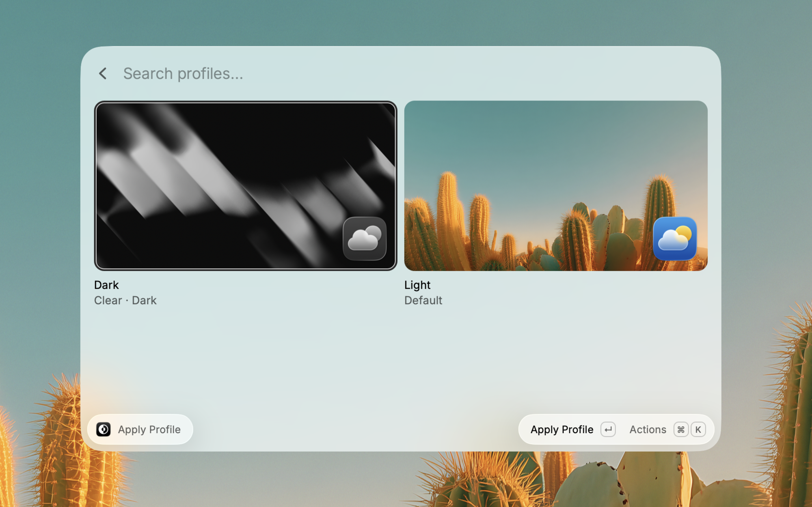
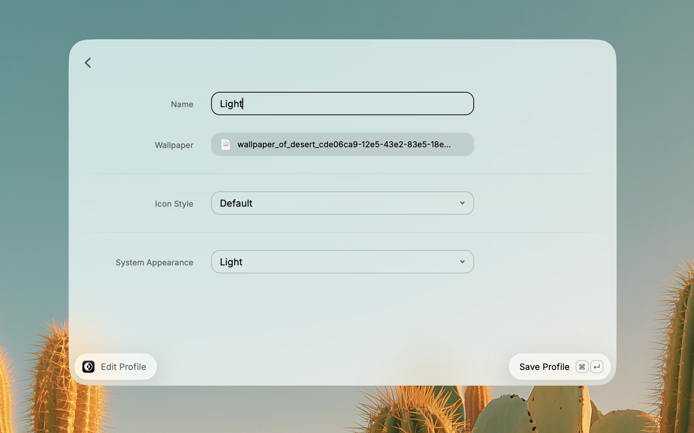
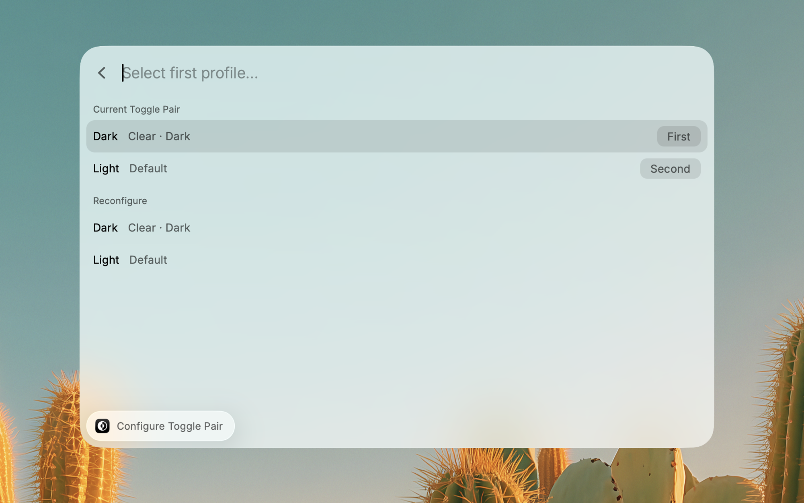

# macOS Appearance Changer

A [Raycast](https://raycast.com) extension that lets you save and apply macOS appearance profiles — wallpaper, icon style, and dark mode — all at once.

I switch between a dark setup at night and a light one during the day. Changing all three settings manually every time got old fast, so I built this to do it in one step.

## What It Does

A profile is a combination of:

- **Wallpaper** — any image file on your Mac
- **Icon Style** — Default, Dark, Clear, or Tinted (the macOS icon appearance setting)
- **Icon Mode** — the display variant for the chosen icon style (Always, Auto, Light, Dark)
- **System Appearance** — Light, Dark, or Auto

Create a few profiles, then apply whichever one you want from Raycast. That's it.

### Commands

| Command                   | Description                                                          |
| ------------------------- | -------------------------------------------------------------------- |
| **Apply Profile**         | Browse your profiles in a grid with thumbnail previews and apply one |
| **Create Profile**        | Build a new profile or edit an existing one                          |
| **Toggle Profiles**       | Instantly switch between two profiles with a single hotkey (no UI)   |
| **Configure Toggle Pair** | Pick which two profiles the toggle command switches between          |

## Screenshots

### Apply Profile



### Create Profile



### Configure Toggle



## How It Works

The TypeScript side handles the UI and profile storage through Raycast's API. The actual system changes happen in Swift — modifying macOS preferences, patching the wallpaper plist, and restarting the relevant processes (Dock, WallpaperAgent) so changes take effect immediately.

Thumbnail previews are composited in Swift as well: each profile gets a generated preview that combines the wallpaper with an icon style overlay, cached by content hash so they only regenerate when something changes.

## Install

Search for **macOS Appearance Changer** in the [Raycast Store](https://www.raycast.com/store).

### Development

```bash
git clone https://github.com/neo773/macos-appearance-changer.git
cd macos-appearance-changer
npm install
npm run dev
```

Requires macOS 26+ and Swift 5.9+.

## License

MIT
