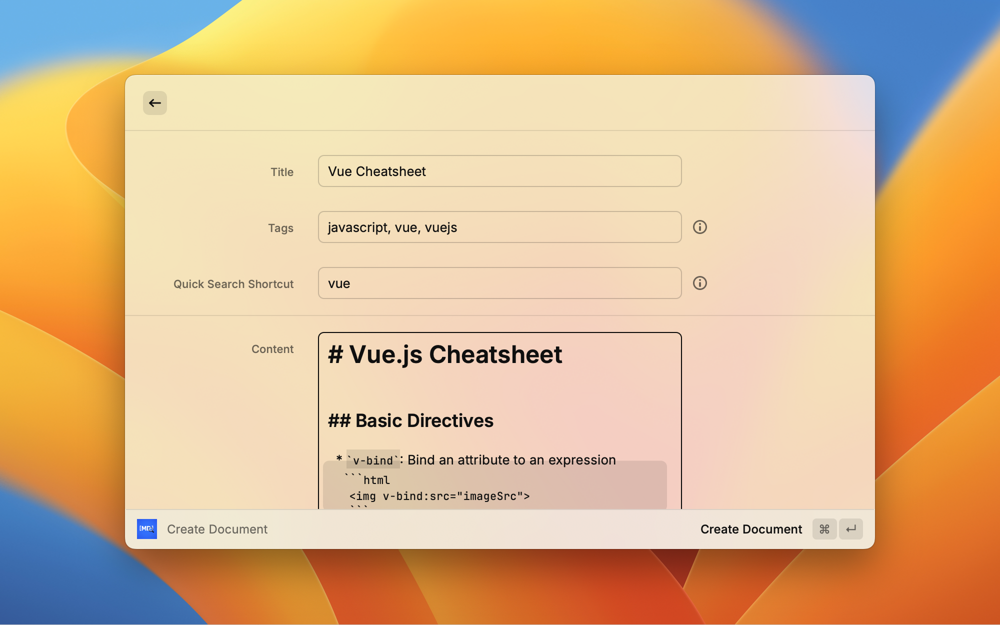

# Markdown Documents

Manage and search markdown cheatsheets and documents directly from Raycast.



## Features

- **Create & Edit Documents** — Write markdown documents with title, tags, and content directly in Raycast
- **Quick Search Shortcuts** — Assign shortcuts like `vue` to documents, then search with `vue: v-model`
- **In-Document Search** — Find text within documents with highlighted results and line numbers
- **Jump to Line** — Press Enter on a search result to view the document positioned at that line
- **iCloud Sync** — Documents sync automatically across all your Macs via iCloud Drive
- **Open in Editor** — Quickly open any document in your preferred markdown editor

## Commands

### Browse Documents

Browse, search, and manage all your markdown documents.

| Action              | Shortcut |
| ------------------- | -------- |
| View Document       | `Enter`  |
| Search in Document  | `⌘ F`    |
| Edit Document       | `⌘ E`    |
| Create New Document | `⌘ N`    |
| Delete Document     | `⌃ X`    |

### Create Document

Create a new markdown document with:
- **Title** — Display name for the document
- **Tags** — Comma-separated tags for filtering (e.g., `javascript, react, tips`)
- **Quick Search Shortcut** — Short prefix for quick search (e.g., `js`)
- **Content** — Markdown content with syntax highlighting

### Quick Search

Search within documents using the shortcut syntax:

```
shortcut: search term
```

**Examples:**
- `vue: v-model` — Searches "Vue cheatsheet" doc for "v-model"
- `js: async await` — Searches "JavaScript" doc for "async await"
- `react: useEffect` — Searches "React" doc for "useEffect"

If no shortcut is provided, filters the document list by title/tags.

## Configuration

| Preference         | Description                                                                                                            |
| ------------------ | ---------------------------------------------------------------------------------------------------------------------- |
| **Storage Folder** | Folder for storing documents. Defaults to iCloud Drive (`~/Library/Mobile Documents/com~apple~CloudDocs/RaycastDocs/`) |
| **Default Editor** | Application to open documents in (e.g., "Visual Studio Code"). Leave empty for system default.                         |

## Storage

Documents are stored as individual `.md` files with an `index.json` for metadata:

```
~/Library/Mobile Documents/com~apple~CloudDocs/RaycastDocs/
├── index.json
├── javascript-cheatsheet.md
├── react-hooks.md
└── adventure-game-studio.md
```

This structure enables:
- **iCloud sync** across all your Macs
- **Version control** — Add the folder to git if desired
- **External editing** — Edit files in any markdown editor
- **Backup** — Files are regular markdown, easy to backup

## Tips

1. **Assign meaningful shortcuts** — Use short, memorable prefixes like `js`, `py`, `react`
2. **Use tags for grouping** — Filter documents by technology, project, or topic
3. **Open in editor for complex edits** — Press `⌘ O` to open in your preferred editor
4. **Search from anywhere** — Use Quick Search with a shortcut to instantly find information

## License

MIT
