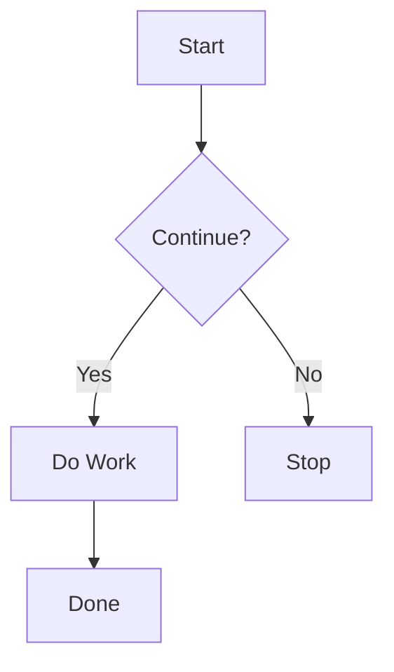
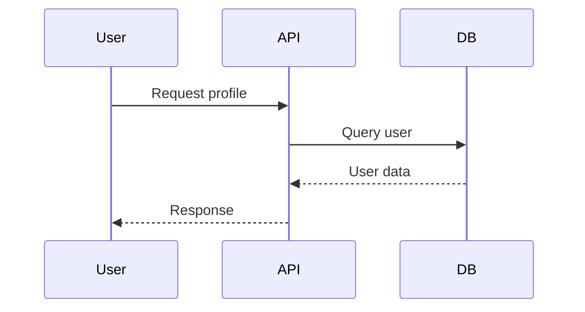
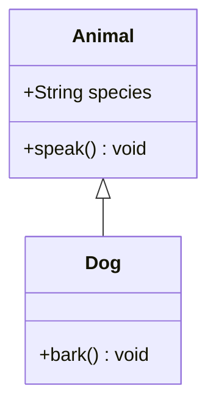

# Mermaid to Image

A Raycast extension that converts Mermaid syntax from selected text or the clipboard into shareable PNG and SVG diagrams.

## Highlights

- Hybrid renderer: `beautiful-mermaid` for supported SVG diagrams, `mermaid-cli` (`mmdc`) for PNG and compatibility fallback
- Selected text first, clipboard second
- Copy images directly to the macOS clipboard
- SVG output with a dedicated `Copy SVG Code` action
- ASCII preview item for supported `beautiful-mermaid` syntax
- Quick Look support for wide diagrams with `cmd+y`
- Raycast AI tool that uses hybrid rendering, copies an image to the clipboard, and opens the result in Preview

## Requirements

### No extra setup required for SVG generation

If you use:

- `Render Engine = Auto` or `Beautiful`
- `Output Format = SVG`
- Supported `beautiful-mermaid` syntax

the extension works without installing anything else.

For some SVG preview and `Copy Image` cases that need browser-backed raster fidelity, the extension may still ask to download a managed browser later. This mainly affects diagrams whose SVG output is known to render incorrectly through the macOS raster path, such as `sequenceDiagram`.

If you want to override the bundled `beautiful-mermaid`, the extension resolves sources in this order:

1. `Custom beautiful-mermaid Path`
2. Global npm install of `beautiful-mermaid`
3. Bundled dependency inside the extension

### Required for PNG, compatibility fallback, and browser-backed SVG rasterization

For these cases the extension uses `mermaid-cli` (`mmdc`), so you still need:

1. [Node.js](https://nodejs.org/) (`24.14.0` recommended for local development)
2. `mermaid-cli`
3. A compatible Chromium-based browser binary

```bash
npm install -g @mermaid-js/mermaid-cli
```

Browser resolution order for compatible rendering is:

1. `PUPPETEER_EXECUTABLE_PATH`
2. `CHROME_PATH`
3. Installed macOS app binaries such as Google Chrome / Chromium / Chrome Canary
4. A managed browser downloaded by the extension into Raycast support storage

Safari is not supported for compatible rendering. The `mmdc` / Puppeteer path requires a Chromium-based browser such as Google Chrome, Chromium, Chrome Canary, or the managed `chrome-headless-shell` downloaded by the extension.

If no browser is available and your current request needs `mmdc` or browser-backed SVG rasterization, the manual command will show a setup screen and offer `Download Browser`. The managed browser stays local to the extension and is reused for future compatible renders and high-fidelity SVG preview/copy cases.

### Optional local override for `beautiful-mermaid`

If you want the extension to prefer your local installation instead of the bundled version:

```bash
npm install -g beautiful-mermaid
```

## Development

- Recommended local Node version: `24.14.0`
- The repo includes `.nvmrc` and `package.json.engines` to make the supported Node range explicit.
- Odd-numbered Node releases such as `23.x` can trigger install-time engine warnings from the toolchain even when the extension code itself is fine.
- `docs/` is intentionally local-only and excluded from git tracking; it is not part of extension publish artifacts.

```bash
nvm use
npm install
npm run dev
```

## How It Works

### Manual command

1. Select Mermaid code in any app, or copy Mermaid code to the clipboard.
2. Run `Mermaid to Image` in Raycast.
3. The command uses selected text when available, otherwise it falls back to the clipboard.
4. After rendering, you can:
   - `Copy Image`
   - `Copy SVG Code` for SVG output
   - `Save Image`
   - `Open in Default App`
   - Switch between `Image` and `ASCII` in the left sidebar when the Mermaid syntax is supported by `beautiful-mermaid`
   - `Quick Look` with `cmd+y` for wide diagrams
5. If the request needs compatible rendering or browser-backed SVG rasterization and no browser is available yet, the command explains why and lets you download a managed browser locally.

### AI tool

Use `@mermaid-to-image` in Raycast AI to generate a diagram from a description.

Current AI tool behavior:

- Uses `beautiful-mermaid` for supported Mermaid syntax and saves an `SVG`
- Rasterizes supported SVG output before copying it to the clipboard
- Falls back to `Compatible (mmdc)` and saves a `PNG` when the syntax is unsupported
- Copies the image to the clipboard
- Opens the result in Preview
- Saves the file to `~/Downloads/MermaidDiagrams/`
- If compatible fallback or browser-backed SVG clipboard rasterization is needed and no browser is available yet, the AI tool instructs you to run the manual command once and approve `Download Browser`

The AI tool returns a short success message with a Preview link. It does not embed the image inline in chat.
Successful AI responses also include the actual renderer used: `Renderer: beautiful` or `Renderer: mmdc`.

## Preferences

- `Output Format`
  - `SVG` is the default and works best with `Auto (Hybrid)`
  - `PNG`
- `Render Engine`
  - `Auto (Hybrid)`: uses `beautiful-mermaid` for supported SVG diagrams and falls back to `mmdc` when needed
  - `Beautiful`: forces `beautiful-mermaid`
  - `Compatible`: forces `mmdc`
- `Compatible Theme`: theme for `mmdc` rendering only
  - Applies to `PNG`, `Compatible` mode, AI tool fallback output, and `Auto` fallback
- `Beautiful Theme`: theme for `beautiful-mermaid`
  - Applies when `beautiful-mermaid` is the actual renderer, typically `Auto + SVG + supported syntax` or `Beautiful`
  - Includes all bundled themes supported by the installed `beautiful-mermaid` version
- `Custom beautiful-mermaid Path`: optional package root or direct ESM entry file to prefer over global/bundled resolution
- `Generation Timeout`: timeout for compatible rendering
- `Compatible Scale`: raster scale for `mmdc`
  - Default is `4`
  - Applies to `PNG`, AI tool fallback output, and `Auto` fallback
  - Does not affect `beautiful-mermaid` SVG output
- `Save Path`: default save location
- `Custom mmdc Path`: custom executable path if Raycast cannot find `mmdc`

## Hybrid Rendering Rules

- `PNG` always uses `mmdc`
- `AI tool` uses `beautiful-mermaid` for supported syntax and falls back to `mmdc` for unsupported syntax
- `Auto + SVG + supported syntax` tries `beautiful-mermaid` first
- If `beautiful-mermaid` fails in `Auto`, the extension falls back to `mmdc`
- `Beautiful` mode does not auto-fallback for unsupported syntax
- `mmdc` always uses a resolved browser path, preferring the user environment and otherwise a managed local browser
- Some supported SVG outputs still use browser-backed rasterization for faithful preview and `Copy Image`, based on the final SVG structure rather than Mermaid syntax alone

## Supported `beautiful-mermaid` Syntax

`beautiful-mermaid` is currently used for these Mermaid entry points:

- `graph`
- `flowchart`
- `stateDiagram`
- `stateDiagram-v2`
- `sequenceDiagram`
- `classDiagram`
- `erDiagram`
- `xychart-beta`

Everything else is routed to compatible mode in `Auto`.

## SVG Notes

- SVG preview inside Raycast is rasterized for reliable display quality.
- `Copy Image` for SVG copies a high-resolution image representation, not raw SVG text.
- Some SVGs, especially `sequenceDiagram`, use a browser-backed raster path because the macOS rasterizers drop arrowheads or other fidelity details.
- Some flowcharts with custom `linkStyle` arrow markers also use browser-backed rasterization because the macOS SVG rasterizers can drop the colored arrowheads while keeping the edge lines.
- Some `xychart-beta` line charts also use browser-backed rasterization because the macOS SVG rasterizers can drop the connecting lines while keeping the dots.
- `Copy SVG Code` is available when you need the original markup.
- Wide diagrams are easier to inspect with `Quick Look` (`cmd+y`).

## ASCII Preview Notes

- ASCII preview is available in the manual command result screen for Mermaid syntax supported by `beautiful-mermaid`.
- Select `Image` or `ASCII` from the left sidebar.
- The ASCII renderer uses pure ASCII characters, not Unicode box drawing characters.
- ASCII preview availability is based on the Mermaid syntax, not on whether the final image was rendered by `beautiful-mermaid` or `mmdc`.
- When no local `beautiful-mermaid` install is found, the extension falls back to the bundled version and shows a one-time notice with the bundled version number.

## Class Diagram Compatibility Note

`beautiful-mermaid` supports `classDiagram`, but some complex or legacy class member forms may render differently than `mmdc`.

If you need the most compatible class diagram rendering, use:

- `Render Engine = Compatible`, or
- `Render Engine = Auto` with `PNG`

## File Management

### Manual command

- Renders into temporary files under Raycast support storage
- Cleans up temporary files when the preview closes
- Cleans up stale temporary files on launch

### AI tool

- Saves generated diagrams permanently to `~/Downloads/MermaidDiagrams/`
- Uses `SVG` for supported hybrid output and `PNG` for compatibility fallback
- Keeps generated files for later reuse

## Release Checklist

Before publishing to the Raycast Store:

1. Start from a clean working tree on your release branch.
2. Keep `README.md`, `CHANGELOG.md`, and `package.json` metadata aligned on hybrid rendering, browser-backed rasterization, and `Download Browser` wording.
3. Keep the newest changelog heading on `{PR_MERGE_DATE}` until the PR is merged.
4. Run:

```bash
npm run verify
```

5. Manually smoke test in Raycast:
   - `Auto + SVG + flowchart`
   - `Auto + SVG + flowchart` with custom `linkStyle` arrow colors
   - `Auto + SVG + xychart-beta` line chart
   - `sequenceDiagram` browser setup prompt and retry flow
   - AI tool success for supported syntax (`Renderer: beautiful`)
   - AI tool fallback for unsupported syntax (`Renderer: mmdc`)

## Examples

### Flowchart



### Sequence Diagram



### Class Diagram



## Troubleshooting

- `No input found`
  - Select Mermaid code in the frontmost app, or copy it to the clipboard first.
- `mermaid-cli not found`
  - Install it with `npm install -g @mermaid-js/mermaid-cli`, or set `Custom mmdc Path`.
- `Chrome/Chromium not found`
  - Run `Mermaid to Image`, then choose `Download Browser` from the setup screen.
  - Safari cannot be used for compatible rendering; `mmdc` requires a Chromium-based browser.
- `Sequence diagram preview or copy is missing arrows`
  - Update to the latest extension version. Sequence-style SVGs now use browser-backed rasterization instead of the macOS SVG raster path.
  - If prompted, approve `Download Browser` once from the manual command.
- `Flowchart linkStyle colors are present but arrowheads are missing`
  - Update to the latest extension version. Affected flowcharts now use browser-backed rasterization when custom link markers are emitted.
  - If prompted, approve `Download Browser` once from the manual command.
- `xychart-beta` line charts show only dots without connecting lines
  - Update to the latest extension version. Affected line charts now use browser-backed rasterization instead of the macOS SVG raster path.
  - If prompted, approve `Download Browser` once from the manual command.
- `Beautiful mode failed`
  - The syntax may not be supported by `beautiful-mermaid`. Switch to `Auto` or `Compatible`.
- `Selection failed`
  - Some apps do not expose selected text to Raycast. Clipboard fallback still works.

## Credits

- [`beautiful-mermaid`](https://github.com/lukilabs/beautiful-mermaid)
- [`@mermaid-js/mermaid-cli`](https://github.com/mermaid-js/mermaid-cli)
- [Mermaid](https://mermaid.js.org/)

## License

MIT
