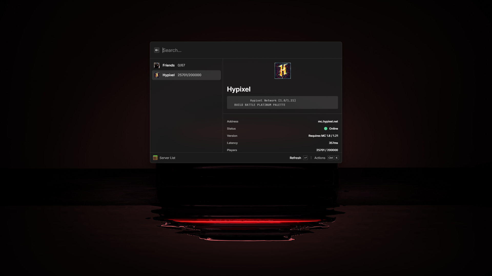

# Minecast

Quickly check the status, MOTD, version, latency, player count, and list of players (when available) of Minecraft servers! Supports Java and Bedrock servers.

## Features

- Add server - Save a server to your list of servers you can check
- Server list - View the status of your saved servers
- Quick check - Same as server list, but directly check the status without saving it to your list

`Note: This extension is pretty much completely made with AI since I do not use React - I just guided it with the UI made and made the logo. I mostly "made" this extension for my personal use with features I wanted but if you add onto it I'd really appreciate it.`
