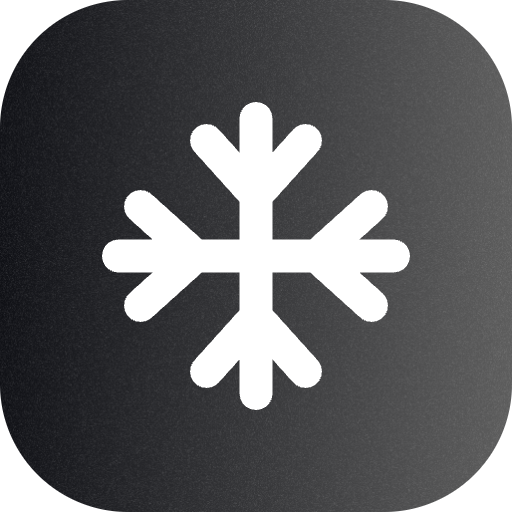
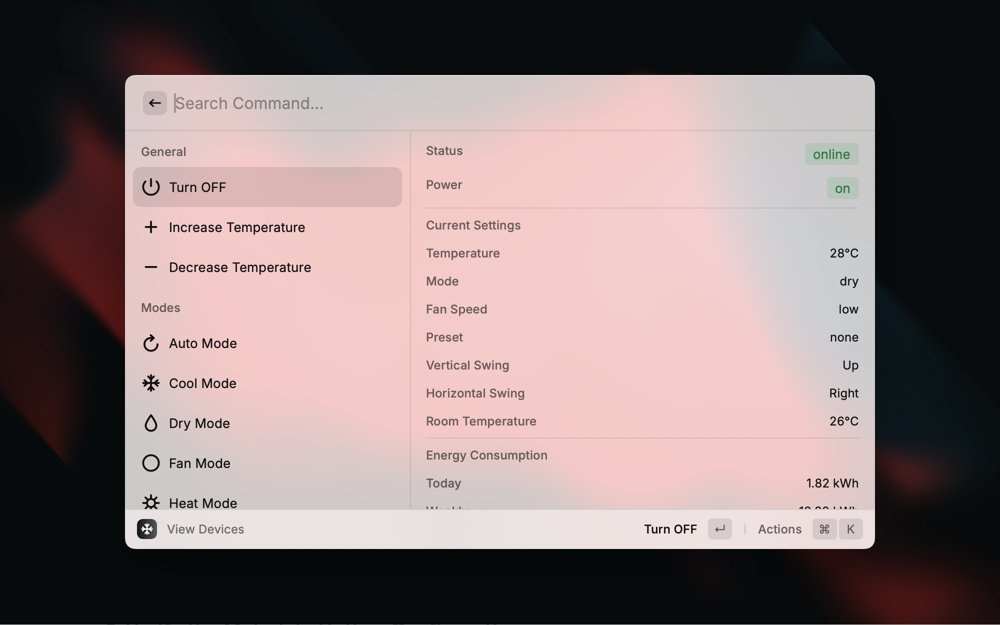
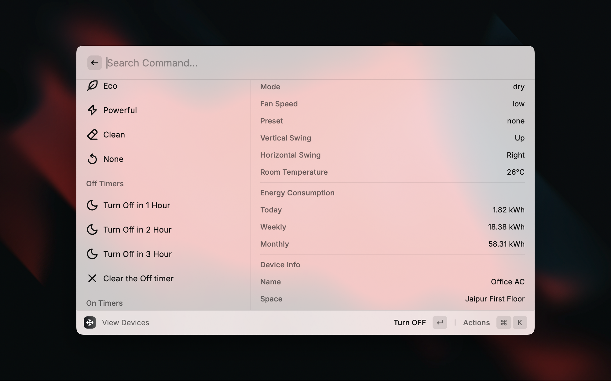
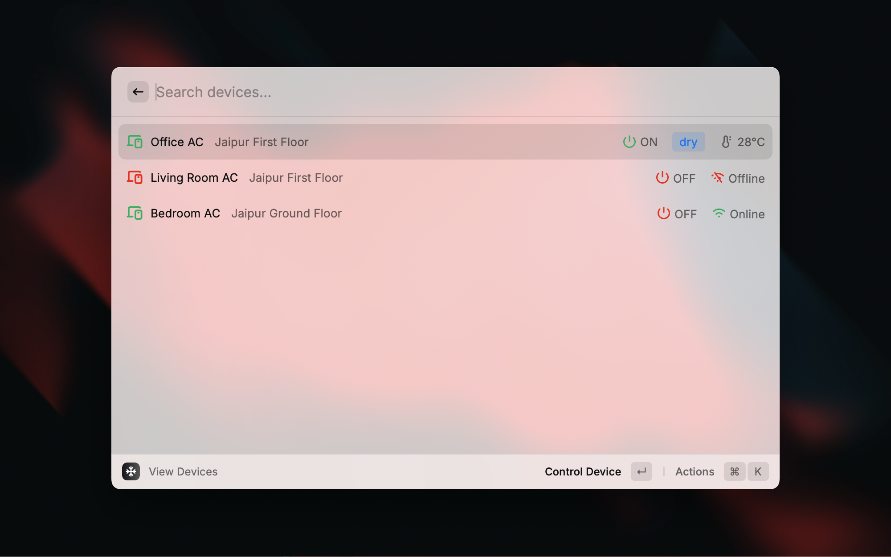
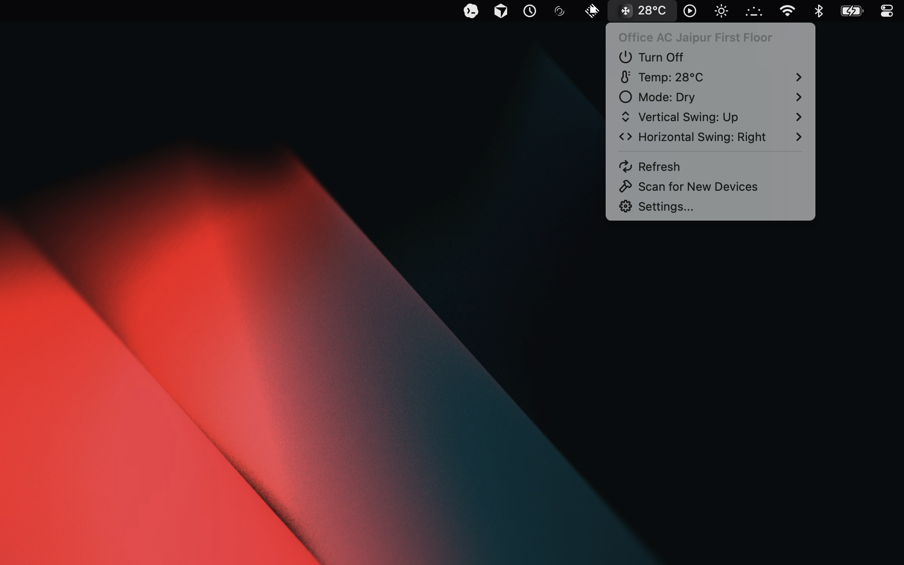

  

<h1 align="center">MirAIe AC Control</h1>

Control Panasonic MirAIe air conditioners directly from Raycast.

> [!NOTE]
> This extension is an independent project and is not affiliated with, authorized, maintained, sponsored, or endorsed by Panasonic or its affiliates.

## ✨ Features

- View all connected MirAIe AC devices in a searchable list
- Turn devices on/off, adjust temperature, HVAC mode, fan speed, swing mode, presets, and timers
- Access quick controls from the menu bar app
- See device details such as room temperature, firmware information, and energy usage

## ⚙️ Setup

1. Enter your MirAIe account mobile number or email and password.
2. Run `View Devices` or enable the menu bar command.

## ⌘ Commands

#### View Devices

Browse your MirAIe AC devices, inspect their current state, and open detailed controls for each device.

#### Menu Bar Control

Control powered-on devices from the menu bar, including temperature, mode, and swing settings.

## 📸 Screenshots

## 🔧 Troubleshooting

- **Credentials:** If login fails, double-check your credentials by logging into the official MirAIe mobile app.
- **Sync Issues:** The extension might occasionally show a cached state. Use the `Refresh` or `Scan for New Devices` actions to force a sync.
- **Cloud Connection:** If a device is offline in Raycast, check the official MirAIe app. If it's offline there too, the AC unit might have lost its WiFi connection or the MirAIe cloud service may be temporarily
  unavailable.
- **Latency:** Commands are sent via MQTT. While usually near-instant, they can sometimes take 2-5 seconds to reflect in the UI depending on your network and the MirAIe cloud status.

## 📄 License

MIT
