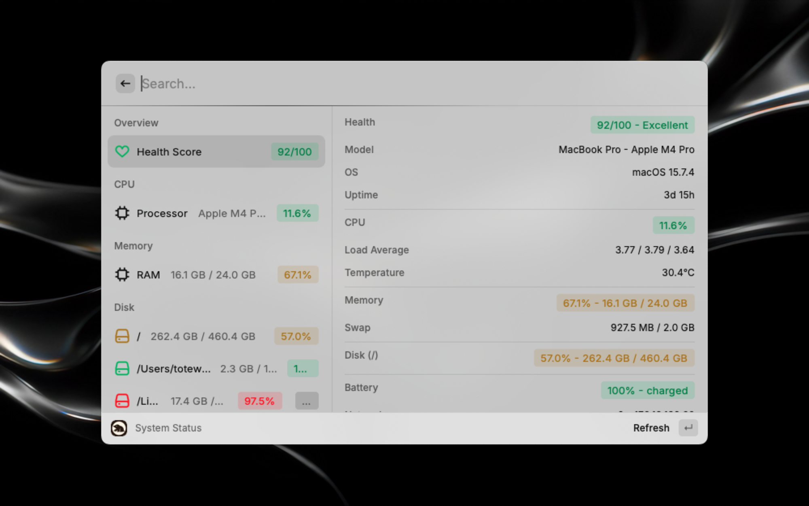
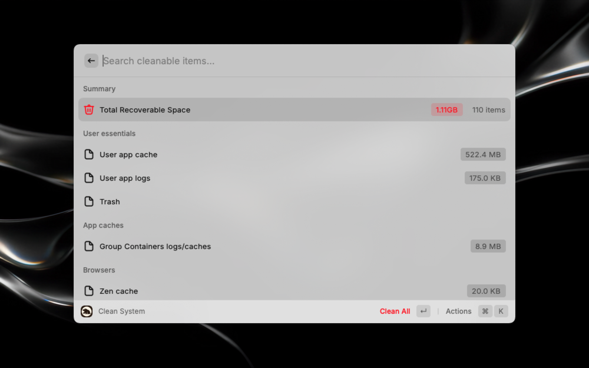
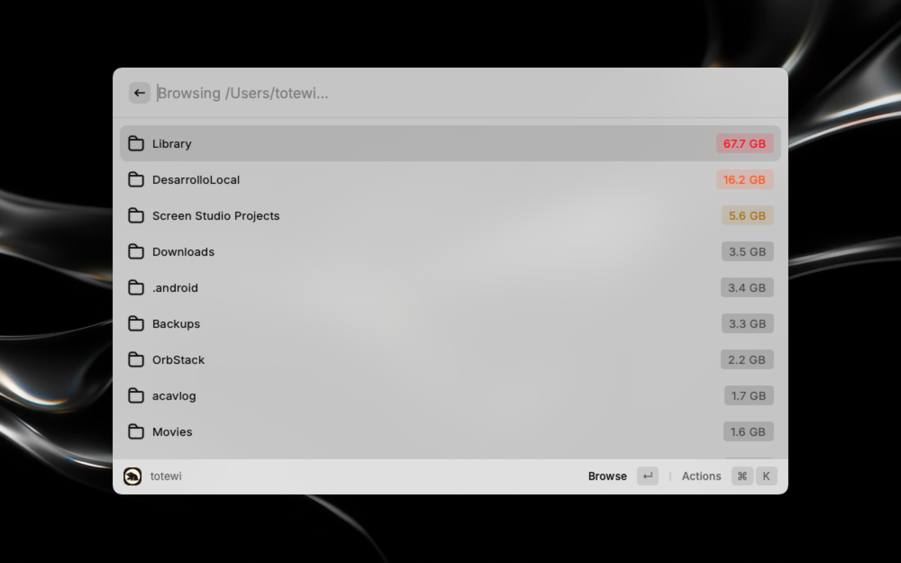
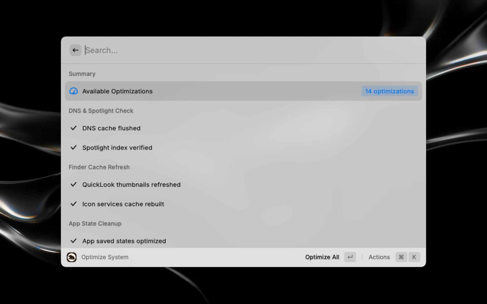

<p align="center">
  
</p>

<h1 align="center">Mole</h1>

<p align="center">
  Deep clean and optimize your Mac from Raycast.
  <br />
  A Raycast extension for <a href="https://github.com/tw93/mole">Mole</a>, the macOS system maintenance CLI.
</p>

## Screenshots

| System Status | Clean System |
|:---:|:---:|
|  |  |

| Analyze Disk | Optimize System |
|:---:|:---:|
|  |  |

## Prerequisites

Mole (`mo`) must be installed on your system:

```bash
brew install mole
```

## Commands

| Command | Description |
|---------|-------------|
| **System Status** | Real-time dashboard with health score, CPU, memory, disk, battery, and network |
| **Clean System** | Preview and remove caches, logs, and temporary files with streaming progress |
| **Optimize System** | Rebuild databases, refresh services, and optimize system performance |
| **Uninstall App** | Browse installed applications and move them to the Trash |
| **Analyze Disk** | Browse folders sorted by size with drill-down navigation |
| **Purge Dev Artifacts** | Find and remove old node_modules, .next, dist, target, and venv folders |
| **Clean Installers** | Find and remove .dmg, .pkg, and .iso files from Downloads, Desktop, and Documents |
| **Touch ID for Sudo** | Check status and toggle Touch ID for sudo authentication |
| **Update Mole** | Update Mole to the latest version |

## Configuration

| Preference | Scope | Description |
|-----------|-------|-------------|
| Mole Binary Path | Extension | Custom path to the `mo` binary (auto-detected by default) |
| Refresh Interval | System Status | How often to refresh status data (3, 5, 10, or 30 seconds) |
| Default Path | Analyze Disk | Starting directory for disk analysis |

## Credits

This extension is a Raycast interface for [Mole](https://github.com/tw93/mole), created by [tw93](https://github.com/tw93). All system maintenance operations are powered by the Mole CLI. This extension is not affiliated with or endorsed by the original project.
