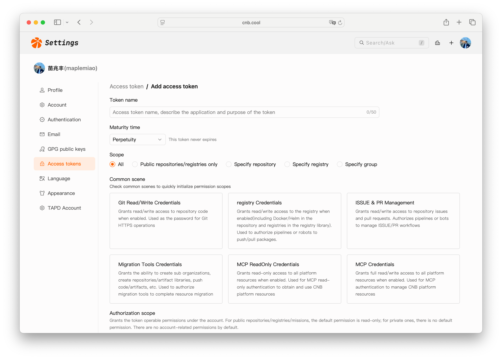
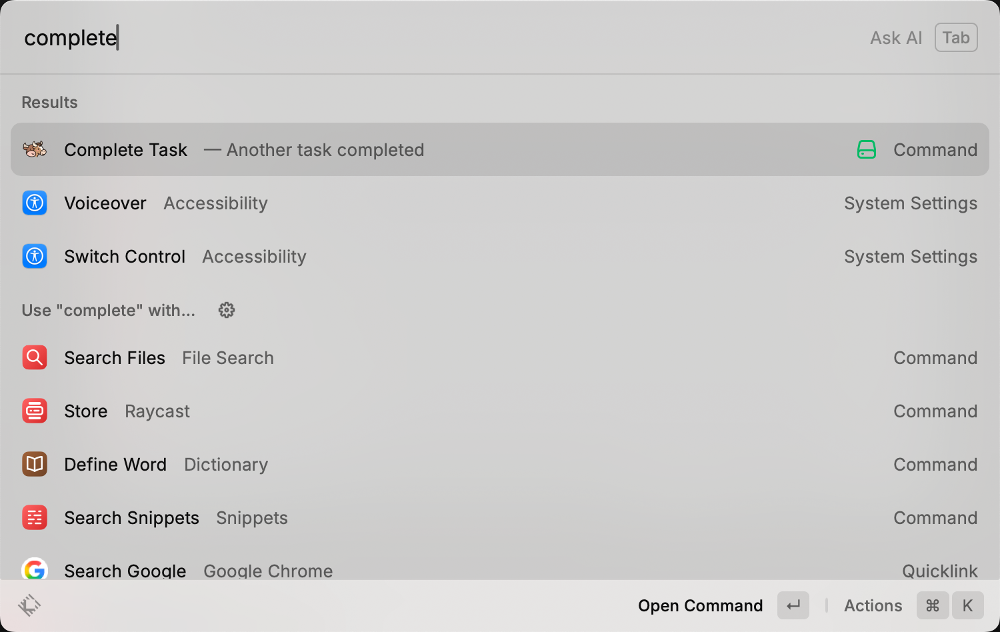
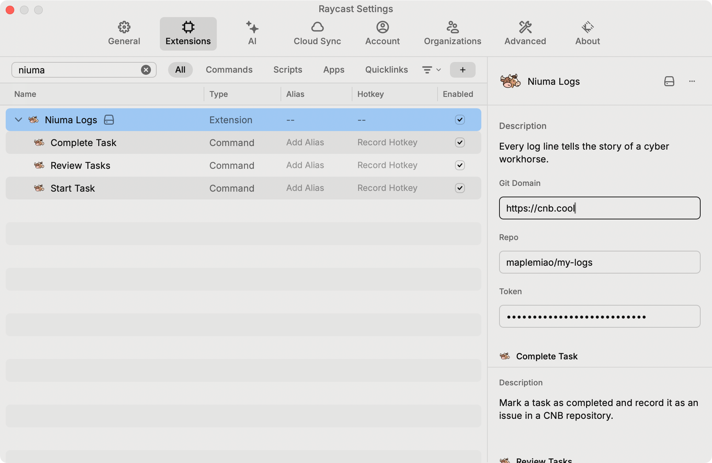

<h1 align="center">Niuma (/ˈnjuː ˈmɑː/) Logs</h1>

Every log line tells the story of a cyber workhorse.

> Where does all the time go?
>
> — Lu Xun

## Here's Where Your Time Went

> If you want to know where your time goes
>
> If you want to record your daily work in the smoothest way possible
>
> If you want a Gantt chart like the one below to review your work
>
> If you don't want to rack your brain during OKR review season, wondering what you've been busy with
>
> If you happen to use a Mac
>
> If you happen to use [Raycast](https://www.raycast.com/) or are interested in learning about it

🎉 Congratulations, you've found a treasure :)

## Highlights

⚡️ **Zero friction** for recording daily tasks — don't let logging become another task

🎥 **Visualize where your time goes** through Gantt chart perspective

🔐 Data permissions are configurable — **rest assured**

## Usage

### 1. Log in to [CNB](https://cnb.cool)

### 2. [Create an Organization](https://cnb.cool/new/groups)

If you already have an existing organization, you may skip this step.

### 3. [Create a Repository](https://cnb.cool/new/repos)

For the repository owner, select the organization you just created.
For the repository name, we recommend `my-logs`. This repository will store your task records and act as a pipeline for generating your periodic work reports.
As for repository visibility, you may choose "Private." If your work can be made public, "Public" is also acceptable.

### 4. [Generate an Access Token](https://cnb.cool/profile/token/create)

Choose a clear and descriptive token name that reflects its intended use, such as `niuma-logs`.
For the organization, select the one you just created.
For permissions, check the following:
- repo-issue (read/write)
- repo-notes (read/write)
- mission-delete (read/write)
- mission-manage (read/write)
- group-resource:rw (read/write)

After submission, be sure to save the access token securely.

### 5. Configure the Relevant Information in Raycast

Open the Raycast command panel (default shortcut: `Opt + Space`). Type `Complete Task` and press Enter.

You will be prompted to enter two fields:

`Repo`: Enter the repository you just created in the format `organization/repository`.
`Token`: Enter your access token.

### 6. 🎉 Setup Complete

You are now ready to start using the extension.

## Tips

- When you start working on something, bring up the Raycast panel and type `start` to find "Start Task".

- When you finish something, bring up the Raycast panel and type `complete` to find "Complete Task". Press Enter to see the incomplete list, then select a task to mark it as done.

- Don't worry about task granularity — from long-term goals spanning half a year to small tasks completable in half an hour, just jot them down. Once recorded, you can free up your brain's RAM, reduce anxiety, and focus better on what's in front of you.

- Personal matters, work tasks — no need to distinguish. As long as your hands are on the keyboard when you receive a task, just dump it all in. No need to worry about data security — everything is stored in your private repository.

- When you've completed a task and don't know what to do next, bring up "Complete Task". It's a convenient way to find your to-do items and calmly decide on your next work item.

- When you question whether your work and life have meaning, open the Gantt chart. Hopefully, looking at the footprints you've left along the way will help you regain optimism and courage.

- If you find this little tool helpful in any way, don't hesitate to share it with your friends. There's genuine camaraderie among us workhorses!
