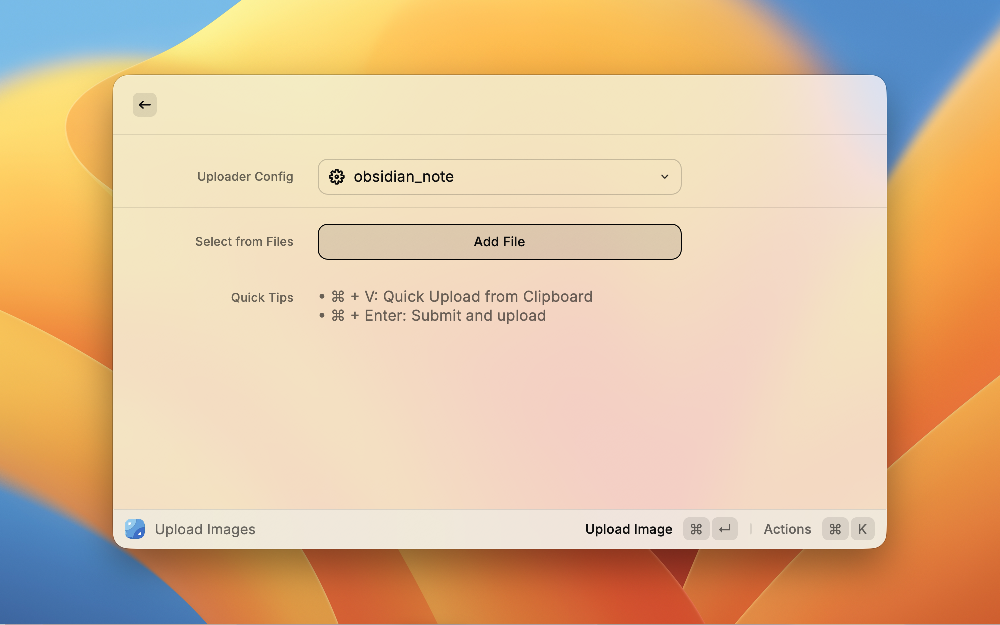
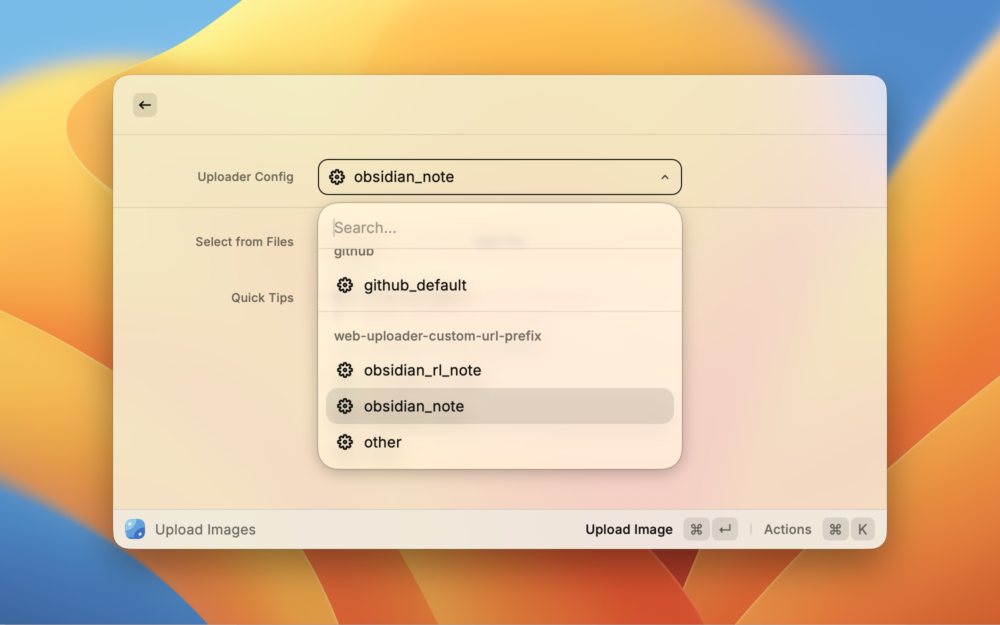
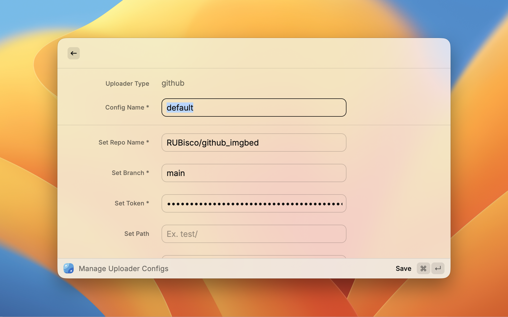

# PicGo for Raycast

[简体中文](./media/README-zh.md)

A [Raycast](https://www.raycast.com/) extension to upload images to image hosts using [PicGo-Core](https://github.com/PicGo/PicGo-Core) API.

<p align="center">
  
</p>

## How It Works

This extension integrates with `picgo` library to handle image uploads.

- **Configuration Management**: The extension reads your PicGo config file (`~/.picgo/config.json`) to detect installed uploaders and their configurations.You can choose which uploader and config to use from the dropdown menu. The extension persists your selection in **Raycast LocalStorage** and won't change your local config file.

- **Select and Send Images**: Select images (allow multi selection) from file picker or paste from clipboard `Cmd+V`. .

- **Copy Result**: Choose your preferred format (URL, Markdown, HTML, or UBB) and copy to clipboard.

## ScreenShots

### Command `Upload Images` and Actions



### Uploader Configs



### Shortcuts


### Export Page



## Prerequisites: PicGo Installation and Configuration

```shell
# install picgo-cli
npm install -g picgo
# or
yarn global add picgo


# install picgo plugins
picgo install [name]
# or use npm
npm install picgo-plugin-[name]


# configuration of uploader
picgo set uploader
# and
picgo use uploader
```

For more, check out:

- [PicGo-Cli installation](https://docs.picgo.app/core/guide/getting-started#install-globally)
- [PicGo plugin installation](https://docs.picgo.app/core/guide/commands#install-add)
- [PicGO-Cli configuration](https://docs.picgo.app/core/guide/config)

## Keyboard Shortcuts

| Action                      | Shortcut    |
| --------------------------- | ----------- |
| Quick upload from clipboard | `Cmd+V`     |
| Submit and upload           | `Cmd+Enter` |
| Copy current format         | `Cmd+C`     |

## Extension Preferences

| Setting        | Description                                        | Default |
| -------------- | -------------------------------------------------- | ------- |
| Upload Timeout | Maximum time (in ms) to wait for upload completion | 30000   |

## Limitations

- It does **NOT** support PicGo plugin management - install/remove plugins via PicGo directly
- It does **NOT** support configuring uploaders - configure them with `picgo set uploader`.
