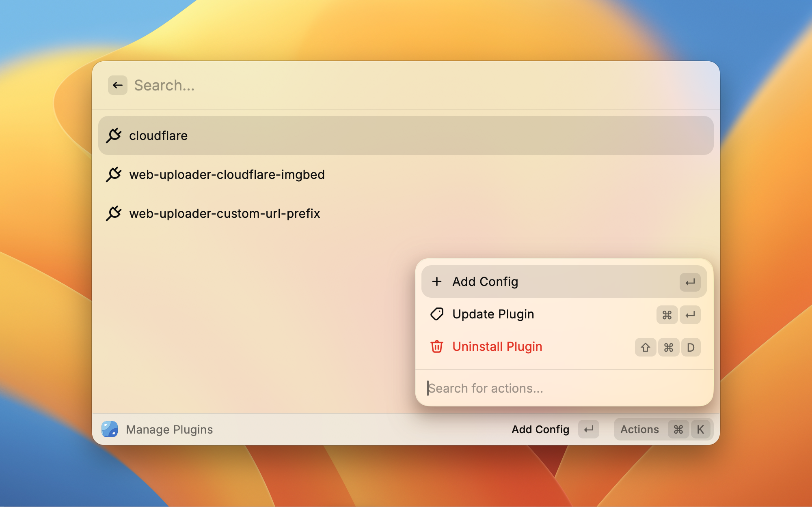

# PicGo for Raycast

A [Raycast](https://www.raycast.com/) extension to upload images to image hosts using [PicGo-Core](https://github.com/PicGo/PicGo-Core).

If you speak Chinese, check out [中文文档](https://github.com/RUBisco0211/raycast-extension-picgo/blob/master/media/README-zh.md).

## Features

- **Upload Images**: Seamlessly upload images from your clipboard or file selection.
- **Multi-Format Export**: View upload results and copy links in various formats (URL, Markdown, HTML, UBB).
- **Multi-Config Support**: Switch between different uploader configurations easily within Raycast.
- **Plugin Management**: Search, install, update, and uninstall PicGo plugins directly from Raycast via NPM.
- **Uploader Configuration**: Manage your uploader configurations (Url, Access Key, Secret Key, etc.).

## Prerequisites

- **NPM**: This extension requires Node.js. Ensure `npm` is accessible. You can configure the `NPM Path` in the extension preferences if it's not in the default location.

## Commands

### Upload Images

Select images from the file picker or paste from the clipboard (`Cmd+V`) to upload.

- **Switch Config**: Use the dropdown menu to select the uploader configuration. The config will be remember (in **Raycast LocalStorage** without directly changing your local config file) once you upload some images with it.
- **Upload from Files or Clipboard**: Supporting multi-image upload from files or clipboard (press `Cmd+V`).

- **Copy Result**: Multi-formats copying supported.

### Manage Uploader Configs

View and manage all your uploader configurations.

- **Manage**:Add, duplicate, edit or delete a configuration. Press `enter` to set as default uploader config.

### Search Plugins

Search for PicGo plugins on NPM to extend uploader functionality.

### Manage Plugins

View installed plugins. You can update, uninstall, or configure them.

## Preferences

| Preference | Description | Default |
| ---------------- | -------------------------------------------------- | ------- |
| Upload Timeout | Maximum time (in ms) to wait for upload completion. | 30000 |
| Upload Proxy | Custom proxy address for uploading images (e.g., `http://127.0.0.1:7890`). | - |
| NPM Path | Path to the NPM executable (e.g., `/usr/local/bin`). Do not include `/npm` in the path. | - |
| NPM Proxy | Proxy address for installing plugins via NPM. | - |
| NPM Mirror | Custom NPM registry mirror (e.g., `https://registry.npmmirror.com`). | - |

## Troubleshooting

- **"NPM not found"**: Check the `NPM Path` in extension preferences. Run `which npm` in your terminal to find the correct path.
- **Plugin installation fails**: Try setting a valid `NPM Mirror` or `NPM Proxy` if you have network issues.

## For More

checkout:
- [PicGo-Core Documentation](https://docs.picgo.app/core/)

## License

MIT
