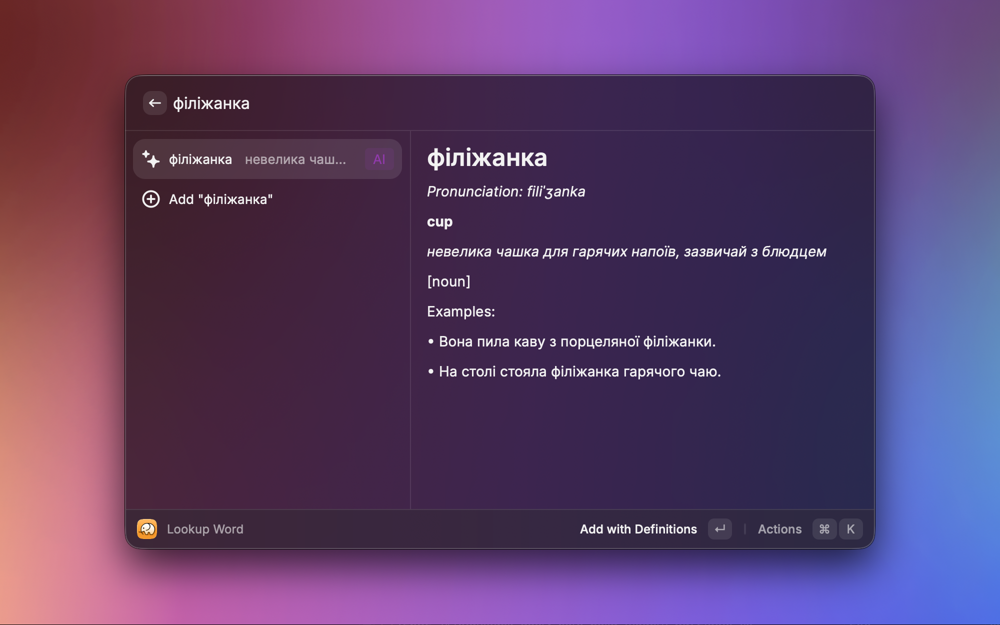
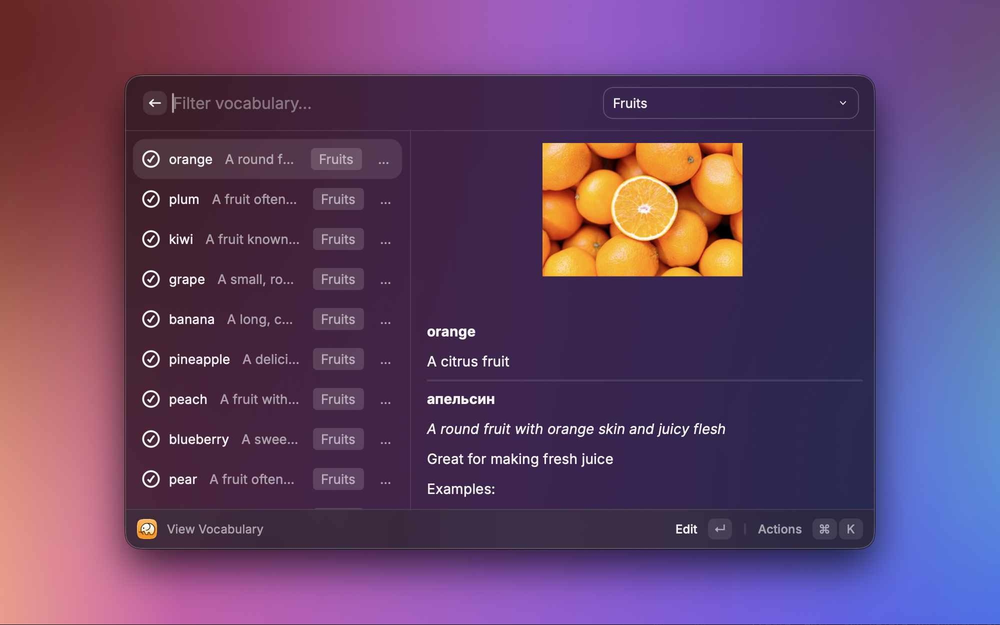
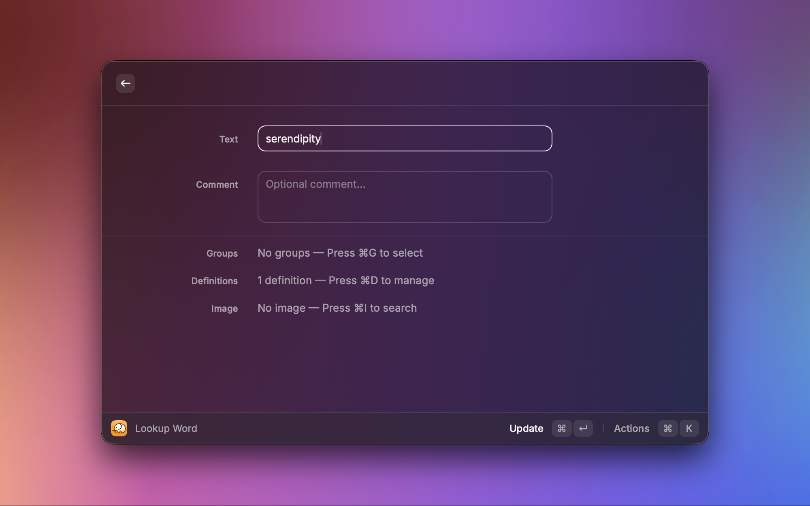
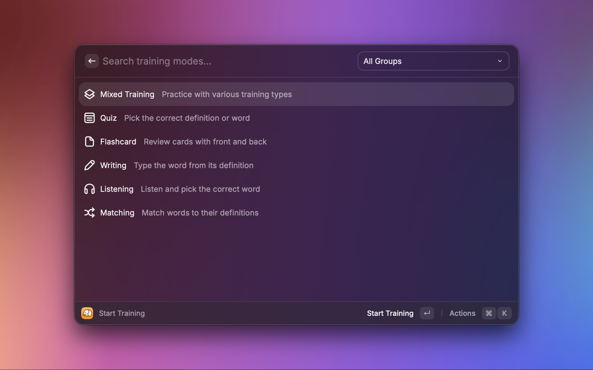
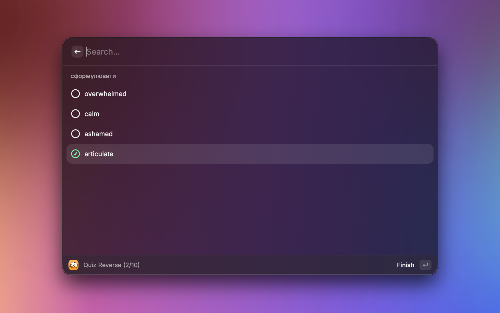
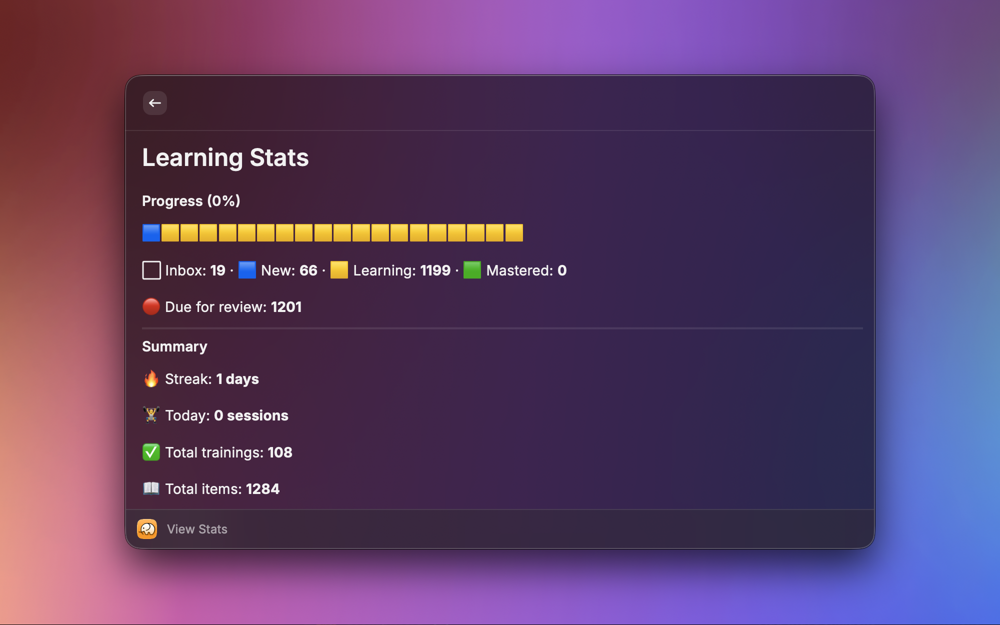

# Polidict

Raycast client for [Polidict](https://polidict.com) — a language learning service for advanced learners. Look up words, manage vocabulary, and train with spaced repetition, all without leaving Raycast.

## Setup

1. **Create a Polidict account** at [polidict.com](https://polidict.com)
2. **Sign in** when prompted by the extension (Google OAuth or email magic link)
3. **Select your languages** — choose your learning language and set your native language for translations

## Commands

### Lookup Word

Search for words and get definitions from multiple sources:

- **Your Vocabulary** — words you've already saved
- **Blueprints** — curated definitions from Polidict's database
- **AI Definitions** — generate definitions using Raycast AI (requires Raycast Pro)

### View Vocabulary

Browse, filter, and manage your saved vocabulary. View definitions, filter by groups, edit or delete items.

### Start Training

Practice your vocabulary with interactive exercises:

- **Quiz** — pick the correct definition for a word
- **Quiz Reverse** — pick the correct word for a definition
- **Flashcard** — review cards with front and back

### Quick Add Word

Save a word from typed text or the current selection without opening a full UI.

### Manage Groups

Create, edit, and delete vocabulary groups to organize your words.

### View Stats

View your learning statistics, streak, and training history.

## Requirements

- **Polidict account** — required for all features ([sign up](https://polidict.com))
- **Raycast Pro** (optional) — enables AI-generated definitions when no blueprint is available

## Support

For issues and feature requests, contact [support@polidict.com](mailto:support@polidict.com).
