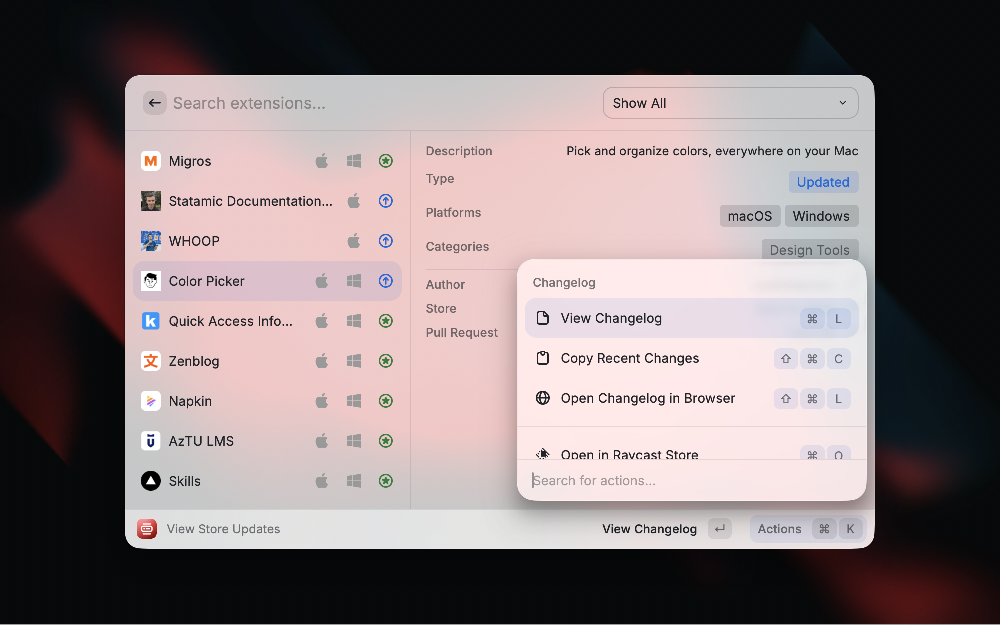

# Raycast Store Updates

Never miss new extensions or extension updates ever again!

## Features

- **New Extensions Feed** — See the latest extensions published to the Raycast Store via the official JSON feed
- **Extension Updates** — Track recently updated extensions via merged GitHub PRs in the [raycast/extensions](https://github.com/raycast/extensions) repo
- **Detailed Metadata** — View extension type, platforms, categories, version, publish/update date, author, and PR link in a rich detail panel
- **Changelog Viewer** — Read an extension's changelog inline, copy recent changes, or open it on GitHub
- **Platform Filter Toggles** — Show or hide macOS-only and Windows-only extensions directly from the action panel (cross-platform extensions are always shown)
- **Installed-Only Filter** — Filter updated extensions to only those you have installed locally
- **Read/Unread Tracking** — Optionally mark items as read to keep your list tidy, with "Mark All as Read" and undo (⌘Z) support
- **Filter Dropdown** — Quickly switch between Show All, New Only, and Updated Only views

## Preferences

| Preference               | Type     | Default | Description                                                        |
| ------------------------ | -------- | ------- | ------------------------------------------------------------------ |
| Track Read/Unread Status | Checkbox | Off     | When enabled, items can be marked as read and hidden from the list |

## Actions

| Action                            | Shortcut | Description                                            |
| --------------------------------- | -------- | ------------------------------------------------------ |
| View Changelog                    | `↵`      | Push view showing the extension's full changelog       |
| Copy Recent Changes               | `⌘⇧C`    | Copy the latest changelog section to clipboard         |
| Open Changelog in Browser         | `⌘⇧L`    | Open the changelog on GitHub                           |
| Open in Browser                   | —        | Open the extension's store page in a browser           |
| Open in Raycast Store             | —        | Open the extension via Raycast deeplink                |
| Copy Extension URL                | `⌘C`     | Copy the store URL                                     |
| Hide/Show macOS-only Extensions   | —        | Toggle visibility of macOS-exclusive extensions        |
| Hide/Show Windows-only Extensions | —        | Toggle visibility of Windows-exclusive extensions      |
| Only Show Updates for Installed   | —        | Filter updates to extensions you have installed        |
| Mark as Read                      | `⌘⇧R`    | Mark the selected item as read (when tracking enabled) |
| Mark All as Read                  | `⌘⇧A`    | Mark all visible items as read (when tracking enabled) |
| Undo                              | `⌘Z`     | Undo the last read action (when tracking enabled)      |
