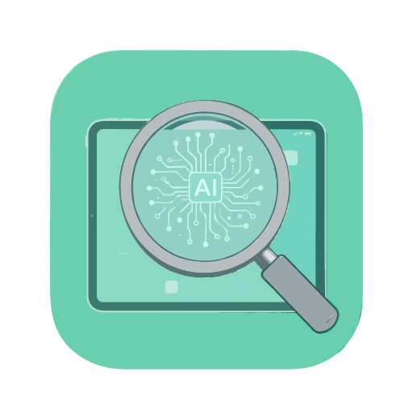
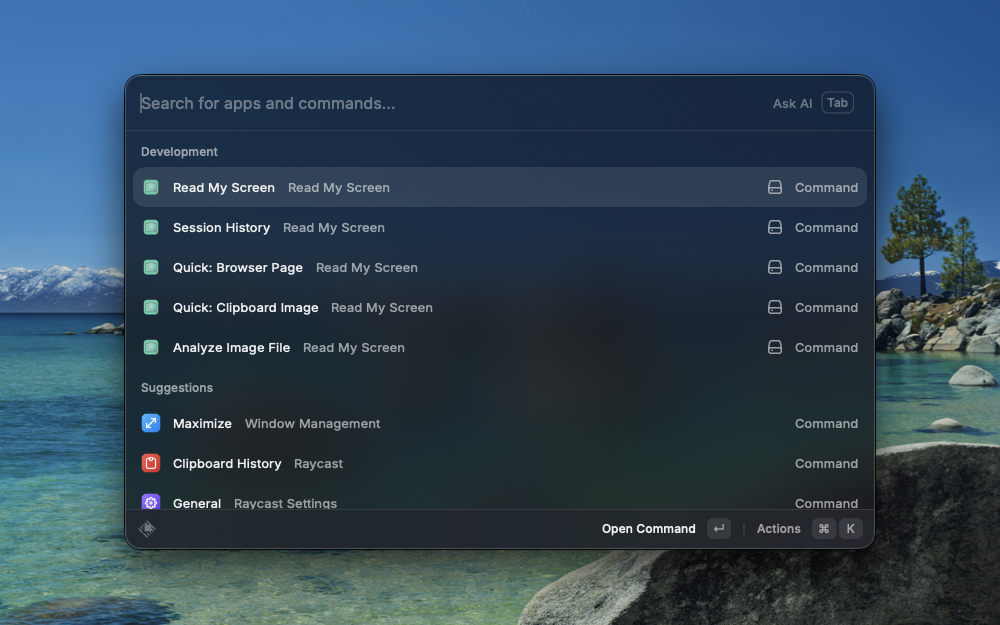
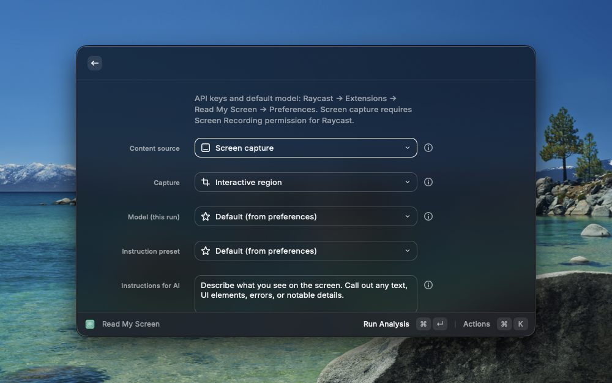
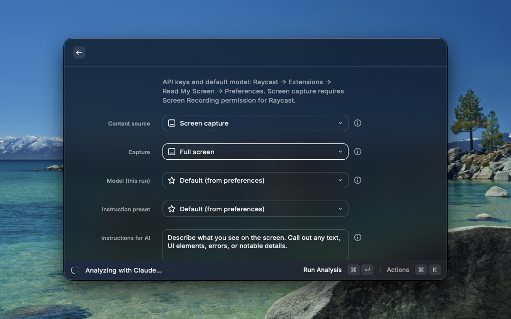
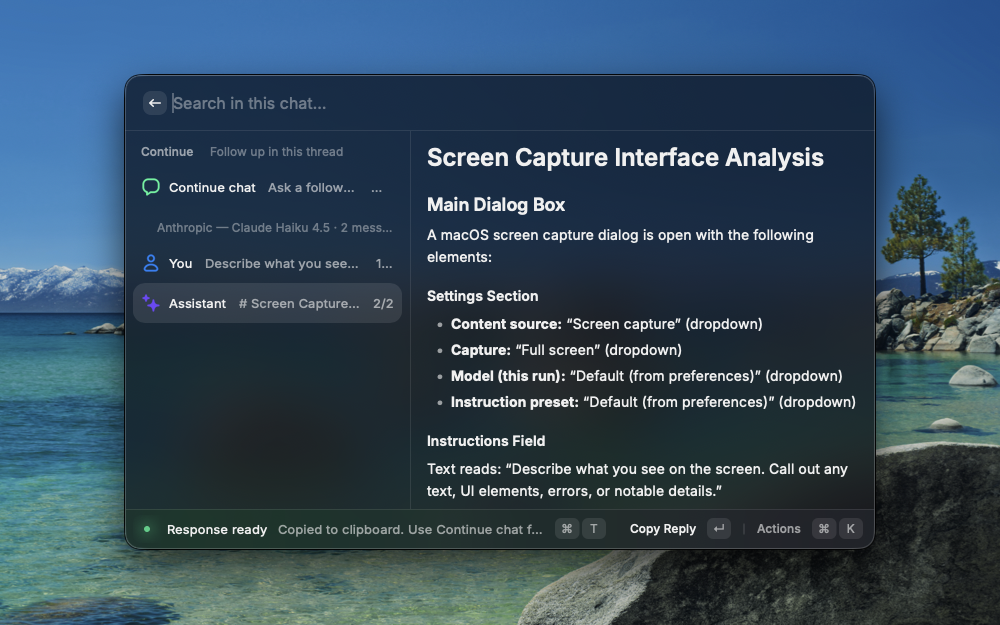
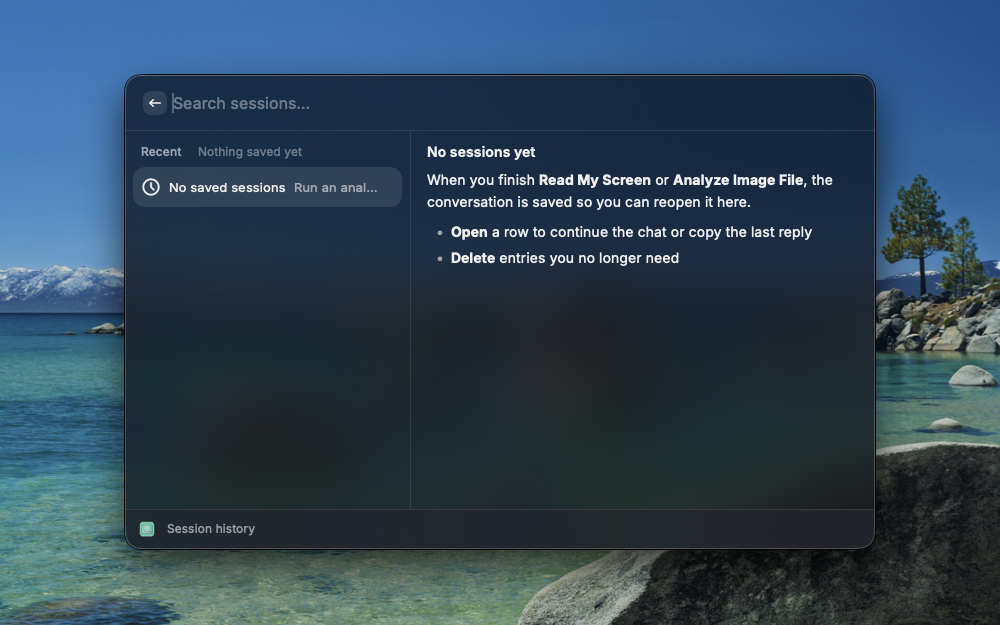

<p align="center">
  
</p>

# Read My Screen

**Read My Screen** is a [Raycast](https://www.raycast.com/) extension that turns **screenshots**, **clipboard images**, **image files**, and the **active browser tab** into AI-powered explanations — using **OpenAI** (GPT-4o and more), **Anthropic Claude**, or **Google Gemini**. You add your own API keys; requests go directly to the provider you choose (no custom backend).

## Screenshots

<p align="center">
  <br />
  <em>Extension commands in Raycast.</em>
</p>

<p align="center">
  <br />
  <em>Configure capture, model, and instructions before running analysis.</em>
</p>

<p align="center">
  <br />
  <em>Analysis in progress with your chosen provider.</em>
</p>

<p align="center">
  <br />
  <em>Structured reply, copy actions, and follow-up in the same thread.</em>
</p>

<p align="center">
  <br />
  <em>Reopen past runs from Session History once you have saved conversations.</em>
</p>

## What you can do

- **Screenshot AI** — Capture a region, window, or full screen and ask questions (OCR, errors, UI review, summaries).
- **Browser tab** — Read the current page as text (Chrome, Safari, Arc, Dia, Brave, Edge, Opera, Vivaldi, and more).
- **Clipboard & files** — Quick commands for clipboard images; pick a local PNG/JPEG/WebP/GIF for analysis.
- **Chat** — Follow-up questions, regenerate answers, optional model override per session.
- **History** — Saved sessions with thumbnails; reopen and continue.

## Requirements

- macOS with [Raycast](https://www.raycast.com/)
- At least one API key:
  - [OpenAI](https://platform.openai.com/)
  - [Anthropic](https://console.anthropic.com/)
  - [Google AI Studio](https://aistudio.google.com/apikey) (Gemini)

## Development

```bash
npm install
npm run dev
```

Build and lint:

```bash
npm run build
npm run lint
```

**Versioning ([Changesets](https://github.com/changesets/changesets)):** The semver lives in `package.json` (`version`). After a change worth releasing, run `npm run changeset` to record it, then `npm run version-packages` to bump the version and update `CHANGELOG.md`. Publish to the Raycast Store with `npm run publish` when ready.

**Icon:** The menu bar icon is generated from [`assets/extension-icon.svg`](assets/extension-icon.svg). After editing the SVG, run `npm run generate-icon` (writes `extension-icon.png` for Raycast).

## Configuration

Open **Read My Screen** in Raycast → **Extensions** → **Preferences** to set API keys, default **model** (must match the provider whose key you use), and **default instructions** for new runs.

## Security & privacy

- **API keys** stay in **Raycast preferences** on your Mac. They are not sent to the extension author and are not hardcoded in this repository.
- **Network traffic** goes **directly** from your machine to **OpenAI**, **Anthropic**, or **Google** (official APIs), depending on the model you choose. There is no separate backend operated by this project.
- **Content you analyze** (screenshots, clipboard images, fetched page text, chat messages) is sent to that provider under **their** terms and your account. Use only data you are allowed to share.
- **Session history** and custom presets are stored **locally** via Raycast (and image files under the extension support path).

For reporting security issues in this codebase, see [SECURITY.md](SECURITY.md).

## License

MIT — see [LICENSE](LICENSE).
