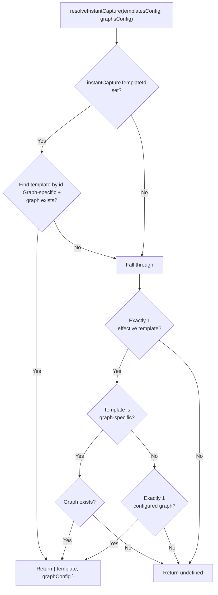
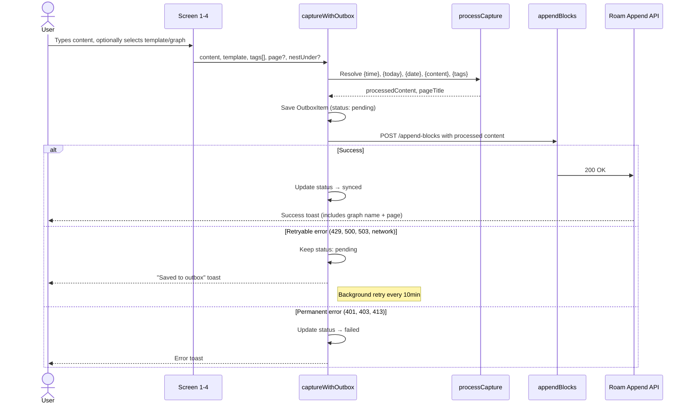

# Capture Templates

Developer reference for the capture template system.
Templates define how Quick Capture formats and routes notes to Roam graphs — controlling the content pattern, target page, nesting location, and default tags.

---

## Append API

Templates ultimately produce a request to the Roam Append API (`append-api.roamresearch.com`). Understanding its shape makes the template fields self-evident:

```json
{
  "location": {
    "page": { "title": "March 8th, 2026" },
    "nest-under": { "string": "[[Raycast]]", "open": false }
  },
  "append-data": [{ "string": "- 14:30 Buy groceries #[[Work]]" }]
}
```

- **`page`** — the target page. Can be a named page title or a daily note (Roam auto-creates a page for each day, e.g. "March 8th, 2026"). Maps to `CaptureTemplate.page` (undefined = daily note).
- **`nest-under`** — finds an existing block on the page by its text content and nests new blocks as children. `open: false` keeps the parent block collapsed after appending. Maps to `CaptureTemplate.nestUnder`.
- **`append-data`** — the processed template output after variable substitution. Maps to `CaptureTemplate.contentTemplate` after `{content}`, `{time}`, `{today}`, `{date}`, `{tags}` are replaced.

---

## Data Model

### `CaptureTemplate` (`globals.d.ts`)

```typescript
type CaptureTemplate = {
  id: string;              // UUID or "__builtin__" for the auto-migrated legacy template
  name: string;            // Display name shown in lists
  graphName?: string;      // Set = graph-specific; undefined = universal (works with any graph)
  page?: string;           // Target page title; undefined = Daily Notes Page
  nestUnder?: string;      // Block text to nest under (e.g. "[[Raycast]]")
  tags?: string[];         // Default tags, rendered as #[[tag]] in output
  contentTemplate: string; // Pattern with {content}, {time}, {today}, {date}, {date:FORMAT}, {tags}
};
```

### Storage

Templates are independent entities stored in their own LocalStorage key, separate from graph configs:

| Storage | LocalStorage Key | Type | Contains |
|---------|-----------------|------|----------|
| **Templates** | `"templates-config"` | `TemplatesConfig` | Ordered array of all templates + legacy migration flag |
| **Graphs** | `"graphs-config"` | `GraphsConfigMap` | Graph configs (tokens, capabilities). No templates. |

```typescript
type TemplatesConfig = {
  templates: CaptureTemplate[];            // Ordered — display order only (no functional significance)
  legacyTemplateConsumed?: boolean;
  instantCaptureTemplateId?: string;       // Points to a graph-specific template used for Instant Capture and ⌘⇧↵
};
```

Each template can be **universal** (`graphName` undefined — works with any graph) or **graph-specific** (`graphName` set — pinned to one graph). Array ordering is purely cosmetic (Move Up/Down controls display order only). The `instantCaptureTemplateId` designates which template is used by the Instant Capture command and the `⌘⇧↵` shortcut in Quick Capture.

### Built-in Default (`utils.ts → BUILTIN_DEFAULT_TEMPLATE`)

```typescript
export const BUILTIN_DEFAULT_TEMPLATE: Omit<CaptureTemplate, "id"> = {
  name: "Default Template",
  page: undefined,
  nestUnder: "[[Raycast]]",
  tags: [],
  contentTemplate: "- {time} {content} {tags}",
};
```

When no templates are saved, `getFirstTemplate()` returns this hardcoded constant with `id: "__builtin__"` as a fallback for empty-state rendering. Once a user creates or migrates templates, saved templates take priority.

---

## Template Resolution

When the system needs a template + graph pair for Instant Capture or `⌘⇧↵` shortcuts, it uses `resolveInstantCapture()`:



- `utils.ts → resolveInstantCapture(templatesConfig, graphsConfig)` — 3-step resolution:
  1. **Explicit designation**: `instantCaptureTemplateId` set → find that template → use its `graphName` to look up the graph config.
  2. **Implicit single-template fallback**: exactly 1 effective template → graph-specific uses its graph; universal + 1 configured graph uses that graph; universal + multiple graphs fails.
  3. **Otherwise**: returns `undefined` (no resolution possible).

- `utils.ts → getFirstTemplate(templatesConfig)` — returns the first saved template, or the hardcoded `BUILTIN_DEFAULT_TEMPLATE` if none exist. No longer has "primary" semantics; used only as a fallback for empty-state rendering in `TemplateListView` and `TemplateSelectionList`.

**Invariants enforced by `useTemplatesConfig()`**:
- Only graph-specific templates can be designated as Instant Capture. Changing a designated template's scope to universal auto-clears `instantCaptureTemplateId`.
- Deleting the designated template clears `instantCaptureTemplateId`.
- The built-in `__builtin__` template is locked to universal scope (cannot be designated).

> **Why plain functions, not hooks?** The `instant-capture-default-graph` command is a `no-view` async function that cannot call hooks. `resolveInstantCapture()` is a pure function for this reason.

---

## Legacy Migration

Users upgrading from the old `quickCaptureTemplate` Raycast preference are auto-migrated silently.

**Auto-migration** (`utils.ts → useTemplatesConfig()`): On first load, when the templates array is empty and `legacyTemplateConsumed` is false, the hook reads the `quickCaptureTemplate` Raycast preference:
- If it matches the old default (`"- from [[Raycast]] at {date} \n  - {content}"`) → mark `legacyTemplateConsumed: true`, use hardcoded new default
- If it differs (user customized) → auto-create a universal template with their customization, mark consumed

No migration UI, no user choice needed. `{date}` variable remains backward-compatible.

**Instant Capture edge case**: The no-view command reads `LocalStorage` directly (no hooks). If `"templates-config"` has no templates, it falls back to the hardcoded default. Migration runs on the next interactive command (Quick Capture or Manage Templates).

> **Why `legacyTemplateConsumed`?** The legacy `quickCaptureTemplate` Raycast preference is read-only (can't be cleared programmatically). Without this flag, resetting templates would re-import the old preference value. The flag persists on `TemplatesConfig`, not on the template entry.

---

## Variable Substitution Engine

Template processing happens in `roamApi.ts → processCapture()`. This is a pure synchronous function that returns `{ processedContent, pageTitle, nestUnder }`. Both capture paths (`captureWithOutbox` in Quick Capture and Instant Capture) call `processCapture()` at capture time so that variables like `{time}` and `{today}` reflect the moment of capture, not a later retry.

| Variable | Syntax | Replaced With | Example |
|----------|--------|---------------|---------|
| Content | `{content}` | User's input text | `Buy groceries` |
| Time | `{time}` | Current time in `HH:mm` format | `14:30` |
| Today | `{today}` | Today's daily note page as a Roam page ref | `[[April 3rd, 2026]]` |
| Date (legacy) | `{date}` or `{date:FORMAT}` | `dayjs().format(FORMAT)`, default `HH:mm` | `14:30` |
| Tags | `{tags}` | `#[[Tag1]] #[[Tag2]]` (leading space trimmed) | `#[[Work]]` |

`{time}` and `{today}` are preferred over `{date}` for new templates. `{date}` is kept for backward compatibility.

**Multi-line `{content}` handling**: When the user's content contains newlines (nested markdown), the `{content}` replacement keeps everything that followed `{content}` on the template line (e.g. ` {tags}`) on the first content line, so tags land on the top-level block rather than the deepest child. Single-line content uses a simple `replaceAll`.

**Legacy tag placement**: When the template does NOT contain `{tags}`, tags are appended to the first line of the output (pre-template-system behavior). Controlled by the `templateHadTagsVar` flag.

**1-space indentation compat**: Lines starting with ` - ` (1 space) get their indentation doubled to meet the Append API's 2-space-per-level requirement. This handles legacy templates from the old `parseTemplate` write path.

**`nestUnder` routing**: Flows through to `roamApi.ts → appendBlocks()` as `location["nest-under"] = { string: nestUnder, open: false }` in the Roam Append API payload. The API finds an existing block on the target page whose content matches the string, and nests new blocks as its children. The `open: false` keeps the parent block collapsed after appending.

---

## CRUD Operations

Methods on the `useTemplatesConfig()` hook (`utils.ts`):

| Method | Behavior |
|--------|----------|
| `saveTemplate(template)` | Upserts by `id`. New templates append to end; existing update in-place (preserve position). When saving `__builtin__`, also sets `legacyTemplateConsumed: true`. If the saved template is the designated Instant Capture template and its scope changes to universal, auto-clears `instantCaptureTemplateId`. |
| `removeTemplate(templateId)` | Removes by `id`. If all templates removed, hardcoded default activates automatically. If the removed template is the designated Instant Capture template, clears `instantCaptureTemplateId`. |
| `moveTemplate(templateId, direction)` | Swaps template with its neighbor (`"up"` or `"down"`). No-op at boundaries. Purely cosmetic — affects display order only, no functional significance. |
| `setInstantCaptureTemplate(templateId)` | Sets `instantCaptureTemplateId` on `TemplatesConfig`. Only meaningful for graph-specific templates. |
| `clearInstantCaptureTemplate()` | Clears `instantCaptureTemplateId` (sets to `undefined`). |

**Save callback pattern**: `TemplateFormView` receives an `onSave: (template) => void` callback from `TemplateListView`, which is just `saveTemplate` from the hook.

**Form validation** (`manage-templates.tsx → TemplateFormView`): Name and content template are required. Duplicate names checked case-insensitively against all templates in `templatesConfig.templates`, excluding self when editing.

**Reset to Default**: In `TemplateFormView`, shown only for `__builtin__` templates. Saves the hardcoded `BUILTIN_DEFAULT_TEMPLATE` back over the saved version.

---

## UI Components & Entry Points

| Component / Entry Point | File | Purpose |
|------------------------|------|---------|
| `QuickCaptureFromGraph` | `components.tsx` | Wrapper for "Quick Capture to graph" from `GraphDetail`. Loads `useTemplatesConfig()`, filters to relevant templates (universal + matching graph). If 1 relevant → skip to form; if multiple → shows template picker, then form. |
| `QuickCaptureForm` | `components.tsx` | Detail capture form: content, page, nestUnder, tags, DNP checkbox, per-capture content template editor. Props: `{ graphConfig, content, template }`. Template is always pre-selected before reaching this form. |
| `PageDropdown` | `components.tsx` | Reusable page selector: Daily Note, Recently Used, All Pages, or custom name. Uses `filtering={false}` + `onSearchTextChange` for dynamic search with NFD normalization and ranked results (exact → starts-with → token match). Shows up to 100 results per query; all pages reachable by typing. |
| `GraphTagPicker` | `components.tsx` | Multi-select tag picker from graph pages (shows up to 200, sorted by edit time). Only renders if graph has read access. |
| `useGraphPages` | `components.tsx` | Hook: loads `getAllPagesCached()` + `getUsedPages()`, returns pages and `canRead` flag. |
| `resolvePageFromDropdown` | `components.tsx` | Pure helper: converts dropdown value + custom title into `{ page }` or `{ error }`. |
| `TemplateListView` | `manage-templates.tsx` | Flat ordered list of all templates. Designated Instant Capture template tagged "Instant Capture" (orange). Scope shown as "All Graphs" (blue) or graph name (purple). Actions: Edit, Set/Remove as Instant Capture Template, Move Up/Down, Create, Delete. |
| `TemplateFormView` | `manage-templates.tsx` | Scope-aware create/edit form. Scope dropdown: "All Graphs" / "Specific Graph" (built-in template has scope locked to universal). Graph-specific templates show a "Use for Instant Capture" checkbox and get `PageDropdown` + `GraphTagPicker`. Universal: plain text fields for page/tags, no Instant Capture checkbox. |
| Manage Templates command | `manage-templates.tsx` | Entry point: directly renders `TemplateListView` (no graph selection step). |
| Quick Capture command | `quick-capture.tsx` | Entry point: 4-screen progressive flow (see below). |
| `TemplateSelectionList` | `quick-capture.tsx` | Screen 2: all templates in order. Graph-specific → skip to form; universal + 1 graph → skip to form; universal + multiple → graph picker. |
| `GraphSelectionList` | `quick-capture.tsx` | Screen 3: appendable graphs. Only shown for universal templates with multiple graphs. Graphs shown in user-configured order (`orderedGraphNames`). |
| `performQuickCapture` | `quick-capture.tsx` | Shared async helper for shortcut captures (screens 1–3). Resolves tags, calls `captureWithOutbox()`, shows toast, pops to root. |
| Instant Capture command | `instant-capture-default-graph.tsx` | No-view async command. Reads `"graphs-config"` and `"templates-config"` from `LocalStorage` directly, uses `resolveInstantCapture()`. Returns error toast if no resolution possible. |
| "Manage Capture Templates" | `detail.tsx → GraphDetail` | Menu item that pushes to `TemplateListView` (no props). |
| "Quick Capture" | `detail.tsx → GraphDetail` | Menu item that pushes to `QuickCaptureFromGraph`. |

### Quick Capture Progressive Flow

The Quick Capture command uses a 4-screen progressive flow. Users can capture with defaults at any step via `⌘⇧↵`, or drill deeper for more control:

| Screen | Component | UI | Enter action | Skip condition |
|--------|-----------|-----|-------------|----------------|
| 1 | `Command` | List + search bar (content entry) | Continue → screen 2 | — |
| 2 | `TemplateSelectionList` | All templates in order | Select → screen 3 or 4 | Only 1 effective template |
| 3 | `GraphSelectionList` | Appendable graphs | Select → screen 4 | Template is graph-specific, OR only 1 appendable graph |
| 4 | `QuickCaptureForm` | Full detail form | Capture | — |

Screen 1 also shows a "Capture to {graph} with template {name}" item when `resolveInstantCapture()` returns a result, allowing one-step capture via `⌘⇧↵`.

**Template pre-selection**: Templates are always selected before reaching `QuickCaptureForm`. The form does not have a template switching dropdown. The per-capture content template editor (`Form.TextArea id="template"`) is preserved — users can tweak the pattern for this capture without permanently modifying the saved template.

**`TemplateListView` ordering**: Templates display in their stored array order (purely cosmetic). The designated Instant Capture template shows an "Instant Capture" tag (orange). Scope shown as "All Graphs" (blue) or graph name (purple, red if graph not found). When no saved templates exist, the hardcoded built-in is shown with "Built-in" (grey) tag.

**Read-only graph degradation**: `displayTemplate()` (in both `components.tsx` and `manage-templates.tsx`) strips the `{tags}` variable from template display when the graph lacks read access (graph-specific scope only), since `GraphTagPicker` is hidden in that case. Universal templates always show `{tags}` since there's no graph to check.

---

## Capture Flow

Quick Capture has two capture paths:

1. **Shortcut capture** (screens 1–3 via `performQuickCapture`): Uses template defaults directly — tags from template + optional DNP tag. Calls `captureWithOutbox()` and `popToRoot()`.
2. **Detail capture** (screen 4 via `QuickCaptureForm` submit): Uses form field values — user may have changed page, tags, nestUnder, or template text. Calls `captureWithOutbox()` and `popToRoot()`.

Both paths share the same outbox pipeline:



**Instant Capture** follows the same outbox flow but reads `LocalStorage` directly (no hooks), calls `resolveInstantCapture(templatesConfig, graphsConfig)` to resolve both the template and its graph, and shows HUD messages instead of toasts. Returns an error toast if no resolution is possible.

### DNP Tagging

When capturing to a non-Daily-Notes page, all three entry points can automatically add today's Daily Notes Page title (e.g. "March 8th, 2026") as a tag. `roam-api-sdk-copy.ts → dateToPageTitle()` converts `Date` to Roam's DNP title format (returns `null` if invalid).

- **`QuickCaptureForm`** (`components.tsx`): controlled by a user-facing "Tag today's DNP?" checkbox (only shown when target is a non-DNP page). Tags merged via `[...new Set([...formTags, ...dnpTags])]`.
- **`performQuickCapture`** (`quick-capture.tsx`): controlled by the `quickCaptureTagTodayDnp` Extension Settings preference. Same merge/dedup logic.
- **Instant Capture** (`instant-capture-default-graph.tsx`): controlled by the `quickCaptureTagTodayDnp` Extension Settings preference. Same merge/dedup logic.
