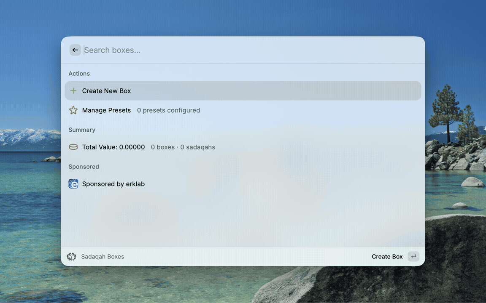

# Sadaqah Box Raycast Extension

<div align="center">
  

  **Track Your Charity & Sadaqah Contributions**

  Raycast extension for tracking your charitable giving (Sadaqah) with multi-currency support and gold value conversion.

  [](https://www.typescriptlang.org/)
  [](https://reactjs.org/)
  [](LICENSE)


  ## Sponsor

  <a href="https://erklab.com" target="_blank">
    
  </a>

  Sponsored by [erklab](https://erklab.com) — Architecting production-grade systems with AI-driven velocity and human-centered precision.
</div>

## Demo

<div align="center">
  
</div>

---

## Features

### 📦 Box Management
- **Create Boxes**: Organize your sadaqahs into different boxes (e.g., "Ramadan Charity", "Daily Sadaqah")
- **Track Progress**: Monitor total value, count, and currency breakdown for each box
- **Multi-Currency Support**: Handle donations in different currencies with automatic conversion tracking

### ⚡ Quick Actions
- **Presets**: Define preset amounts for quick donation recording (e.g., "Daily Sadaqah - 0.1g Gold")
- **Keyboard Shortcuts**: `⌘⇧1-5` for quick preset access
- **Default Preset**: Set a preset as default for one-click adding

### 📊 Statistics & Reporting
- **Dashboard Overview**: Total boxes, sadaqahs, and value across all boxes
- **Collection Receipts**: Generate beautiful markdown receipts when emptying boxes
- **Historical Data**: Track all collections and their values over time

### 🔐 Security & Performance
- **Input Validation**: All inputs validated with Zod schemas
- **Request Timeouts**: 30-second timeout with retry logic
- **API Response Caching**: Intelligent caching to reduce API calls
- **Secure Error Handling**: User-friendly error messages without exposing internals
- **Cryptographically Secure IDs**: Using `crypto.randomUUID()` for ID generation

## Installation

### Prerequisites
- Raycast installed on macOS
- Node.js 18+ and npm
- Access to a SadaqahBox API instance

### Setup

1. Clone this repository:
```bash
git clone <repository-url>
cd sadaqahbox-raycast
```

2. Install dependencies:
```bash
npm install
```

3. Configure the extension in Raycast:
   - Open Raycast Preferences
   - Go to Extensions → Sadaqah Box
   - Set the following preferences:
     - **API Host**: Your SadaqahBox API URL (e.g., `https://api.yourdomain.com`)
     - **API Key**: Your Better Auth API key

4. Build and install:
```bash
npm run build
```

## Configuration

### Extension Preferences

| Setting | Description | Required |
|---------|-------------|----------|
| API Host | Base URL of your SadaqahBox API | Yes |
| API Key | Better Auth API key for authentication | Yes |

### Getting an API Key

1. Log in to your SadaqahBox web application
2. Navigate to Settings → API Keys
3. Generate a new API key
4. Copy the key and paste it into Raycast preferences

## Commands

### Dashboard
**Command**: `Dashboard`

Main interface for managing your sadaqah boxes:
- View all boxes with their statistics
- Quick add using presets (⌘⇧1-5)
- Open box details
- Collect/empty boxes
- Delete boxes

### Manage Presets
**Command**: `Manage Presets`

Configure quick-add presets:
- Create preset amounts with names and currencies
- Set default preset for one-click adding
- Reorder presets (⌘⇧↑/↓)
- Delete unused presets

## Architecture

```
src/
├── api/
│   ├── client.ts          # Base HTTP client with timeout & retry
│   ├── index.ts           # API endpoint functions
│   └── cached.ts          # Cached API wrappers
├── constants/
│   └── index.ts           # App constants & configuration
├── utils/
│   ├── cache.ts           # Raycast Cache utilities
│   ├── error-handler.ts   # Error categorization & sanitization
│   ├── security.ts        # Secure ID generation
│   └── type-guards.ts     # Runtime type checking
├── validation/
│   └── schemas.ts         # Zod validation schemas
├── data/
│   ├── quotes.json        # Quranic verses & Hadith on sadaqah
│   └── quotes.ts          # Quote types & utilities
├── services/
│   └── quote-service.ts   # Random quote generation
├── dashboard.tsx          # Main dashboard command
├── box-detail.tsx         # Box detail view
├── create-box.tsx         # Create box form
├── edit-box.tsx           # Edit box form
├── add-sadaqah.tsx        # Add sadaqah form
├── manage-presets.tsx     # Preset management
├── collection-detail.tsx  # Collection receipt view
├── presets-storage.ts     # LocalStorage for presets
├── auth-client.ts         # Better Auth client setup
└── types.ts               # TypeScript type definitions
```

## API Integration

The extension communicates with a SadaqahBox backend API. All API calls include:

- **Authentication**: API key via `x-api-key` header
- **Timeout Protection**: 30-second request timeout with AbortController
- **Retry Logic**: Automatic retry on timeout errors
- **Response Caching**: Intelligent caching to minimize API calls

### Cache Strategy

| Endpoint | Cache TTL | Invalidation |
|----------|-----------|--------------|
| List Boxes | 5 minutes | On create/update/delete |
| Get Box | 5 minutes | On update/delete |
| Stats | 2 minutes | On any mutation |
| Currencies | 1 hour | On currency changes |
| Currency Types | 1 hour | On type changes |
| Sadaqahs | No cache | Real-time data |
| Collections | No cache | Real-time data |

## Development

### Available Scripts

```bash
# Development mode with hot reload
npm run dev

# Build for production
npm run build

# Run linting
npm run lint

# Fix linting issues
npm run fix-lint

# Publish to Raycast Store
npm run publish
```

### Project Structure

- **Components**: Each command is a separate React component
- **API Layer**: Modular API functions with separation of concerns
- **Utilities**: Shared utilities for caching, errors, and security
- **Validation**: Centralized Zod schemas for input validation

### Adding New Features

1. **New API Endpoint**: Add to `src/api/index.ts` and wrap in `src/api/cached.ts`
2. **New Form**: Use `validation/schemas.ts` for validation
3. **New Command**: Create component in `src/` and register in `package.json`

## Security Considerations

### Input Validation
All user inputs are validated using Zod schemas:
- String length limits
- Numeric range validation
- Required field checking
- Type coercion with validation

### Error Handling
- Raw errors are logged internally
- User-facing messages are sanitized
- Error categorization (network, timeout, auth, etc.)

### ID Generation
- Cryptographically secure UUID generation
- No predictable IDs from timestamps

### Data Sanitization
- Input sanitization to prevent XSS
- URL validation for API endpoints

## Troubleshooting

### Common Issues

**"API Key is not configured"**
- Check Raycast preferences for the extension
- Ensure API key is copied correctly

**"Request timed out"**
- Check internet connection
- Verify API host URL is correct
- API server may be slow/unresponsive

**"Failed to load data"**
- Verify API key has correct permissions
- Check API server is running
- Look at Raycast logs for details

### Debug Mode

To see detailed error logs:
1. Open Raycast
2. Run "Toggle Debug Mode" command
3. Reproduce the issue
4. Check Raycast logs

## Contributing

1. Fork the repository
2. Create a feature branch (`git checkout -b feature/amazing-feature`)
3. Commit your changes (`git commit -m 'Add amazing feature'`)
4. Push to the branch (`git push origin feature/amazing-feature`)
5. Open a Pull Request

## License

MIT License - see LICENSE file for details

## Acknowledgments

- Quranic verses and Hadith provided for inspiration
- Built with [Raycast API](https://developers.raycast.com/)
- Authentication powered by [Better Auth](https://www.better-auth.com/)

---

<p align="center">
  May your sadaqah be accepted 🤲
</p>
