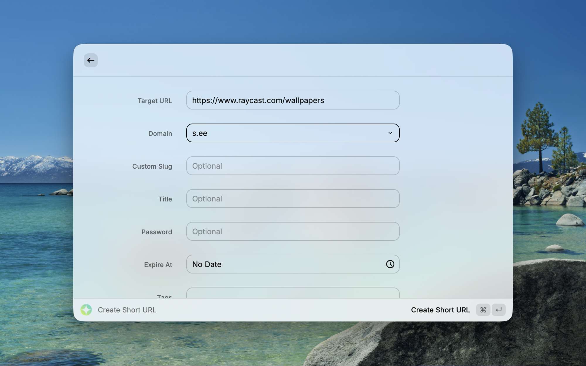
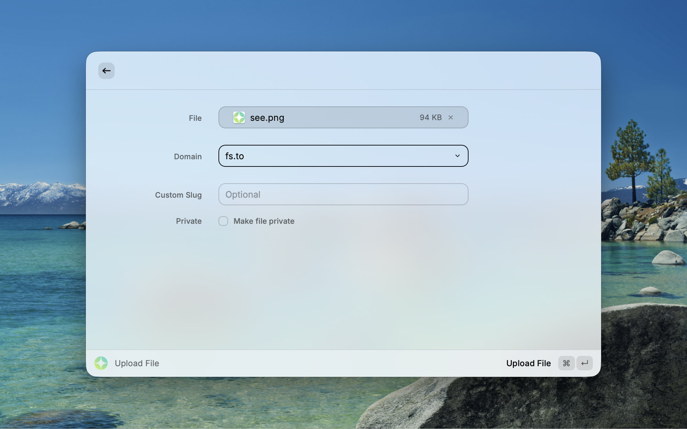
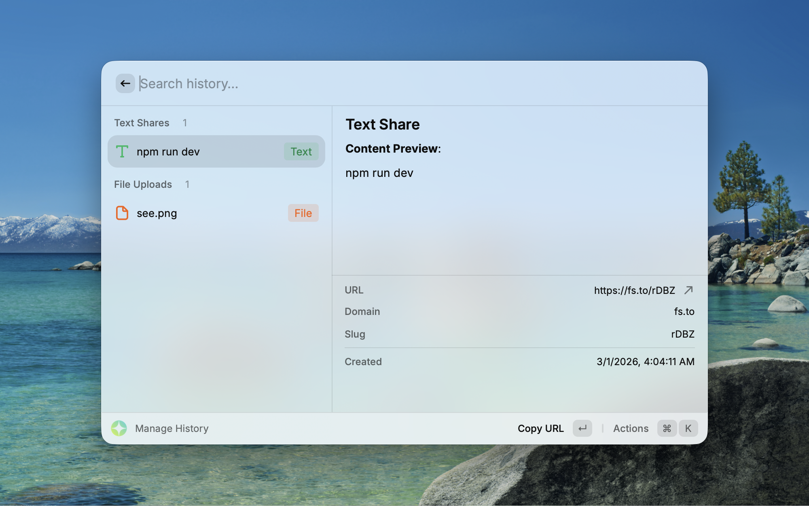

# 🔗 S.EE for Raycast


A powerful Raycast extension that integrates with [S.EE](https://s.ee), bringing URL shortening, text sharing, and file uploading right into your Raycast launcher. Share anything in seconds — a link, a code snippet, or a file — all from your keyboard.

## 📸 Screenshots

| Create Short URL                           | Upload File                           |
| ------------------------------------------ | ------------------------------------- |
|  |  |

| Manage History (Text)                           | Manage History (File)                           |
| ----------------------------------------------- | ----------------------------------------------- |
|  |  |

## ✨ Features

### Core Features

- **URL Shortening**: Create short URLs with custom slugs, password protection, expiry dates, and tag support
- **Text Sharing**: Share plain text, source code, or Markdown snippets with a shareable link
- **File Upload**: Upload files with custom domains and optional private access
- **Quick Share**: Instantly share clipboard content or selected Finder files — auto-detects URLs, text, or files

### Additional Conveniences

- **History Management**: Browse, search, and manage all your shared items in one place
- **One-Click Copy**: Short URLs are automatically copied to your clipboard after creation
- **Multi-Domain Support**: Use different custom domains for URLs, text, and file shares
- **Detail Preview**: View metadata, URLs, and file previews directly within Raycast
- **Keyboard-First**: Fully keyboard-accessible for maximum efficiency
- **Delete from S.EE**: Remove shared items directly from the history view

## 📑 Prerequisites

Before you begin, ensure you have the following:

- An [S.EE](https://s.ee) account with API access
- [Raycast](https://raycast.com) installed on your macOS system

## 📥 Installation

### Option 1: Raycast Store

Install directly from the [Raycast Store](https://www.raycast.com/missuo/sdotee).

### Option 2: Manual Installation

```bash
git clone https://github.com/missuo/raycast-sdotee.git
cd raycast-sdotee
npm install && npm run dev
```

## 🚦 Configuration

After installation, configure the extension with your S.EE credentials:

1. Open **Raycast Settings**
2. Navigate to the **Extensions** tab
3. Find **S.EE** in the list of installed extensions
4. Enter your configuration:

| Setting                 | Required | Description                                          |
| ----------------------- | -------- | ---------------------------------------------------- |
| **API Key**             | ✅       | Your S.EE API key                                    |
| **API Base URL**        | ❌       | Custom API endpoint (default: `https://s.ee/api/v1`) |
| **Default URL Domain**  | ❌       | Default domain for short URLs (e.g. `s.ee`)          |
| **Default Text Domain** | ❌       | Default domain for text shares (e.g. `s.ee`)         |
| **Default File Domain** | ❌       | Default domain for file uploads (e.g. `fs.to`)       |

## 🎯 Usage

### Create Short URL

Shorten any URL with optional settings:

- Select a **domain** from your available S.EE domains
- Set a **custom slug** for a memorable link
- Add a **title**, **password**, or **expiry date**
- Assign **tags** for organization

The short URL is automatically copied to your clipboard.

### Create Text Share

Share text content as a hosted page:

- Enter a **title** (required) and **content**
- Choose a **text type**: Plain Text, Source Code, or Markdown
- Optionally set a **custom slug**, **password**, or **expiry date**

### Upload File

Upload a file to S.EE:

- Pick a **file** using the native file picker
- Choose a **domain** and optional **custom slug**
- Toggle **private mode** for restricted access

### Quick Share

The fastest way to share — automatically detects what to share:

1. **Selected Finder file** → Uploads the file
2. **Clipboard file** → Uploads the file
3. **Clipboard URL** → Creates a short URL
4. **Clipboard text** → Creates a text share (prompts for a title)

### Manage History

View and manage all your shared items:

- **Search** through your history
- **Copy URL** or **Open in Browser** with one action
- **Delete** items from S.EE or remove them from local history
- Items are organized by type: Short URLs, Text Shares, File Uploads

## 🔧 Troubleshooting

If you encounter any issues:

1. Verify your **API Key** is correct in the extension settings
2. Ensure the **API Base URL** is reachable (default: `https://s.ee/api/v1`)
3. Check that you have at least one **domain** configured in your S.EE account
4. Check the Raycast console for error messages

If problems persist, please [open an issue](https://github.com/missuo/raycast-sdotee/issues) on the GitHub repository.

## 👥 Contributing

Contributions are welcome! Here's how you can contribute:

1. Fork the repository
2. Create your feature branch: `git checkout -b my-new-feature`
3. Commit your changes: `git commit -am 'feat: add some feature'`
4. Push to the branch: `git push origin my-new-feature`
5. Submit a pull request

## 📄 License

This project is licensed under the MIT License - see the [LICENSE](LICENSE) file for details.

## ⭐ Support

If you find this extension helpful, consider:

- Starring the [GitHub repository](https://github.com/missuo/raycast-sdotee)
- Sharing it with others who might find it useful
- Contributing to the project's development
