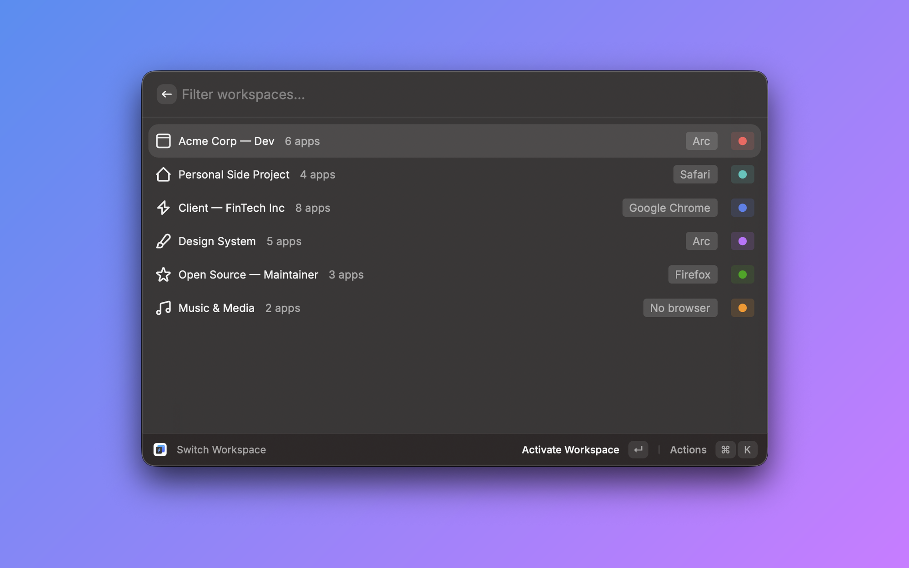

# ShiftPlus for Raycast

Switch your full project context — browser profiles, apps, terminal environment, and window layouts — straight from Raycast.

This extension is a companion to [ShiftPlus](https://shiftplus.app), a native macOS workspace switcher. It lets you trigger workspace switches and open quick links without leaving the Raycast launcher.



## Requirements

- macOS 13 or later
- [Raycast](https://raycast.com) 1.37.0 or later
- [ShiftPlus](https://shiftplus.app) **1.x or later** with **Raycast integration enabled** in Settings

The extension reads a local index file written by ShiftPlus. It does not work without the app installed.

## Setup

1. **Install ShiftPlus** from [shiftplus.app](https://shiftplus.app) if you haven't already.
2. **Install this extension** from the Raycast Store.
3. **Enable Raycast integration in ShiftPlus**:
   - Open ShiftPlus → **Settings** → **Integrations**
   - Toggle **Enable Raycast integration** ON
4. **Run any command** below from Raycast — your workspaces will appear immediately.

That's it. No API keys, no permissions, no network access.

## Commands

### Switch Workspace
Browse and activate any ShiftPlus workspace with fuzzy search. Each result shows the workspace name, app count, browser type, and color tag. Press `Enter` to switch — ShiftPlus will activate the full context (browser profile, apps, windows, terminal env vars).

### Open Quick Link
Search across all quick links in every workspace. Useful when you remember the link but not which project it belongs to. Selecting a quick link activates its workspace if needed, then opens the URL.

### Activate Last Workspace
Re-enter the workspace you most recently activated. Best used as a Raycast hotkey (Settings → Extensions → ShiftPlus → assign hotkey) for one-tap context return.

## How it works

When you enable Raycast integration, ShiftPlus writes a small JSON index to:

```
~/Library/Application Support/ShiftPlus/raycast-index.json
```

This file contains workspace names, colors, icons, app counts, and quick links — nothing else. **No environment variables, terminal commands, file paths, or window positions are ever exposed.** The extension reads this file locally; ShiftPlus actions are triggered through the `shiftplus://` URL scheme.

When you disable the toggle in ShiftPlus, the index file is deleted.

## Privacy

- No network requests. No telemetry. No third-party services.
- All data stays on your Mac, in your home folder.
- The index file is regenerated only when your workspaces change, and only while the toggle is on.

## Troubleshooting

**The list is empty**
- Confirm ShiftPlus is running.
- Open ShiftPlus → Settings → Integrations → check **Enable Raycast integration** is ON.
- Run the **Refresh** action (`⌘R`) inside the Switch Workspace command, or click "Reveal in Finder" in ShiftPlus settings to verify `raycast-index.json` exists.

**"Activate Workspace" does nothing**
- Make sure ShiftPlus is running (background is fine; menu bar icon should be visible).
- Verify the URL scheme handler is registered: open Terminal and run `open "shiftplus://"`. ShiftPlus should come to the foreground.

**Workspaces are out of date**
- Press `⌘R` inside the Switch Workspace command, or trigger an export manually from ShiftPlus settings.
- The index updates automatically on workspace changes but may lag by ~1 second due to debouncing.

**"Activate Last Workspace" says no workspace found**
- This command works after you've activated at least one workspace through ShiftPlus (from any source — hotkey, menu bar, or this extension).

## Feedback

Found a bug or want to suggest a feature? Open an issue at [github.com/nghialuong/extensions](https://github.com/nghialuong/extensions) or reach out at [shiftplus.app](https://shiftplus.app).

## License

MIT