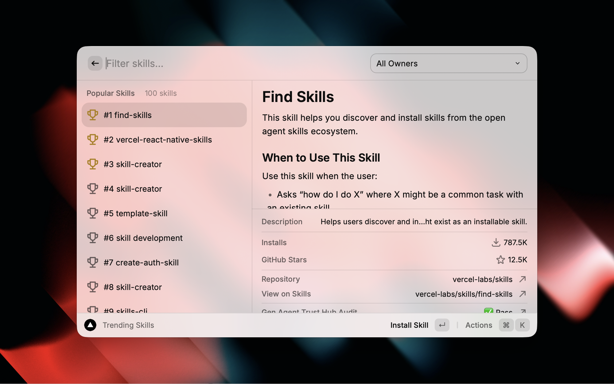
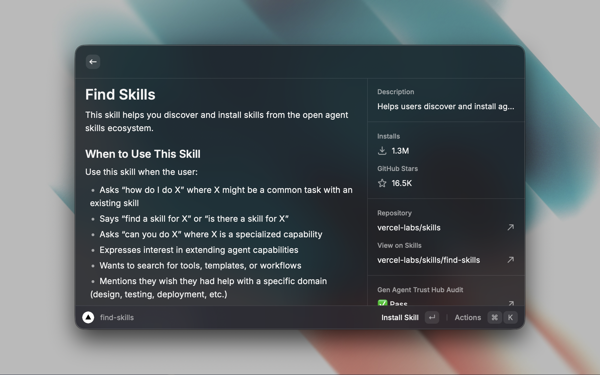
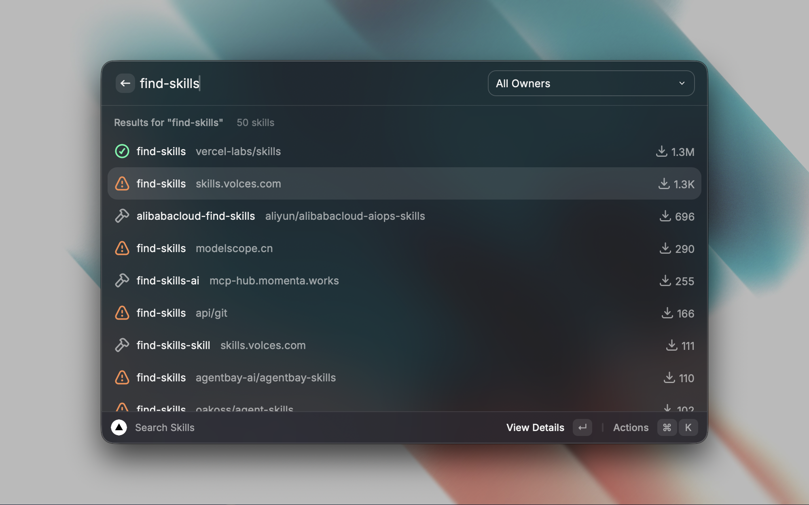

# Skills

Search and manage AI agent skills from [Skills](https://skills.sh) directly in Raycast.

## Features

- Search for specific skills
- Filter available skills by owner
- Install skills for all supported agents
- View security audit status from `skills.sh` before installing
- View, update, and remove installed skills
- Check for skill updates — outdated skills are highlighted with an orange icon
- Filter installed skills by agent
- View skill source, install date, and update date from the lock file
- Open installed skill repositories on GitHub
- View skill details inline with SKILL.md content, including description, license, compatibility, and allowed tools (toggle with Cmd+D)
- See GitHub star counts in the detail panel
- Copy install commands
- Quick access to GitHub repositories

## Commands

### Search Skills

Search for agent skills from skills.sh with real-time results. View skill details in the inline panel, including security audit status when available.

### Manage Skills

View, update, and remove installed skills. Outdated skills are highlighted with an orange icon and grouped in the "Updates Available" section. Filter by agent to see which skills are available for each AI agent.

## Development

- `npm run validate` runs lint, typecheck, and unit tests.
- `npm run build` confirms the Raycast extension still builds.
- `npm run test:api-live` runs the opt-in live API check against `skills.sh`.
- `test/raycast-api.ts` provides the `@raycast/api` stub used by Vitest.
- [TESTING.md](./TESTING.md) contains the manual UI smoke checklist.

## Screenshots

