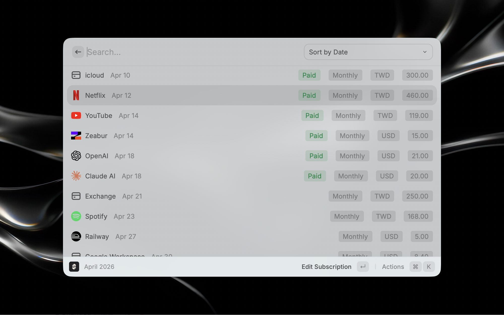

# Subflow

Manage your subscriptions with [Subflow](https://subflow.ing) directly from Raycast.

## Features

### Subscription Menu Bar

See upcoming subscription payments at a glance from your menu bar.

- Shows the number of subscriptions due tomorrow in the menu bar title
- Lists all subscriptions for the current month with payment dates and amounts
- Auto-refreshes every hour
- Click any subscription to quickly edit it in Subflow

### View Subscription

Browse and manage all your subscriptions by month.

- Navigate between months with `⌘ ]` / `⌘ [`
- Search subscriptions by name
- Sort by date, amount, or name
- Tags indicate payment status — **Today** or **Paid**
- Add, edit, or delete subscriptions directly from the list

## Setup

1. Open the extension and go to **Preferences**
2. Enter your Subflow API key — you can find it [here](https://subflow.ing/subscription?menu=api-key)
