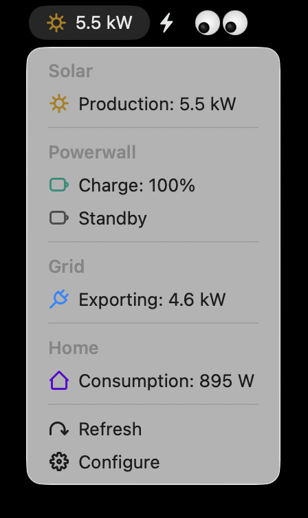

# Tesla Energy

Monitor your Tesla solar panels and Powerwalls from Raycast.

  
  
  

## Commands

### Solar Production

View solar generation, home consumption, Powerwall charge/discharge, and grid import/export — charted by time period.

- Switch between **Today**, **This Week**, **This Month**, and **Year to Date** via the Action Panel
- Charts adapt per period: area charts for intraday, bar charts for multi-day views
- Powerwall and Grid use bidirectional area charts in the Today view — positive (discharging/exporting) in green/blue above the axis, negative (charging/importing) in amber/gray below
- Sidebar shows self-powered percentage (solar + Powerwall), energy totals, and grid net — icons tinted to match chart colors
- **Today Summary**: an AI-generated 2–3 sentence plain-English explanation of the day's energy activity appears above the charts (requires Raycast AI; can be disabled in preferences)

### Solar Status (Menu Bar)

Live solar wattage in the menu bar, refreshed every 10 minutes.

- Shows current production, Powerwall charge level, grid status, and home consumption
- Displays `—` when solar production is below 50 W (nighttime / minimal production)

## Requirements

- Tesla account with solar panels and/or Powerwalls
- Raycast will prompt you to connect your Tesla account on first use
- Today Summary requires a Raycast Pro subscription (Raycast AI)
