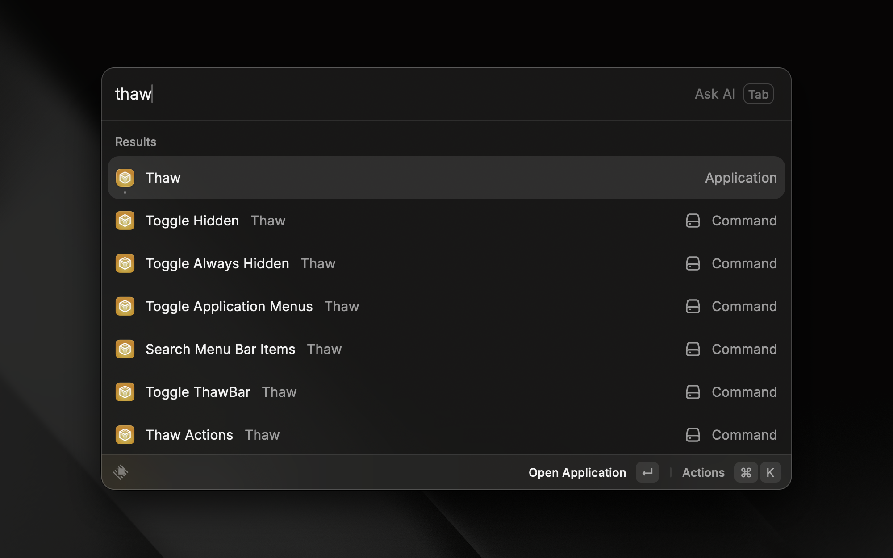

# Thaw Raycast Extension

Control [Thaw](https://github.com/stonerl/Thaw) directly from Raycast. Toggle visibility sections, search menu bar items, and open settings without touching your mouse.

## Requirements

[Thaw](https://github.com/stonerl/Thaw/releases/latest) must be installed and running on your Mac (macOS 14 or later).

## Commands

| Command | Description |
|---|---|
| **Thaw Actions** | Browse and run all available Thaw actions from a single searchable list |
| **Toggle Hidden** | Show or hide the hidden menu bar section |
| **Toggle Always Hidden** | Show or hide the always-hidden menu bar section |
| **Search Menu Bar Items** | Open Thaw's built-in menu bar item search panel |
| **Toggle ThawBar** | Toggle the ThawBar on the active display |
| **Toggle Application Menus** | Show or hide application menus |
| **Open Settings** | Open the Thaw settings window |

## How It Works

The extension communicates with Thaw using its `thaw://` URL scheme. Each command triggers the corresponding action in the Thaw app directly. Make sure Thaw is running before using any command.

## About Thaw

Thaw is a powerful macOS menu bar manager — a fork of [Ice](https://github.com/jordanbaird/Ice) by Jordan Baird — that lets you hide and show menu bar items, rearrange them via drag-and-drop, customize the menu bar's appearance, and more. See the [Thaw repository](https://github.com/stonerl/Thaw) for full details.
