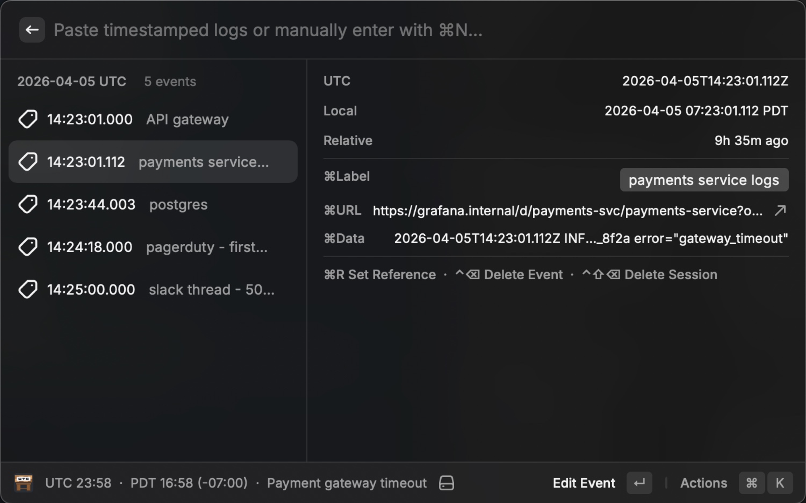
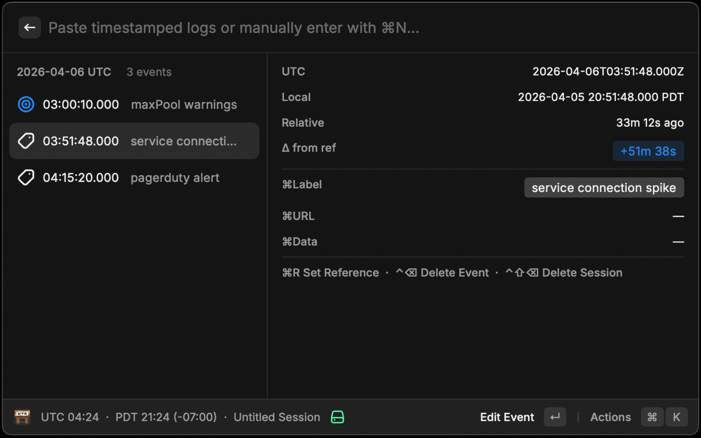
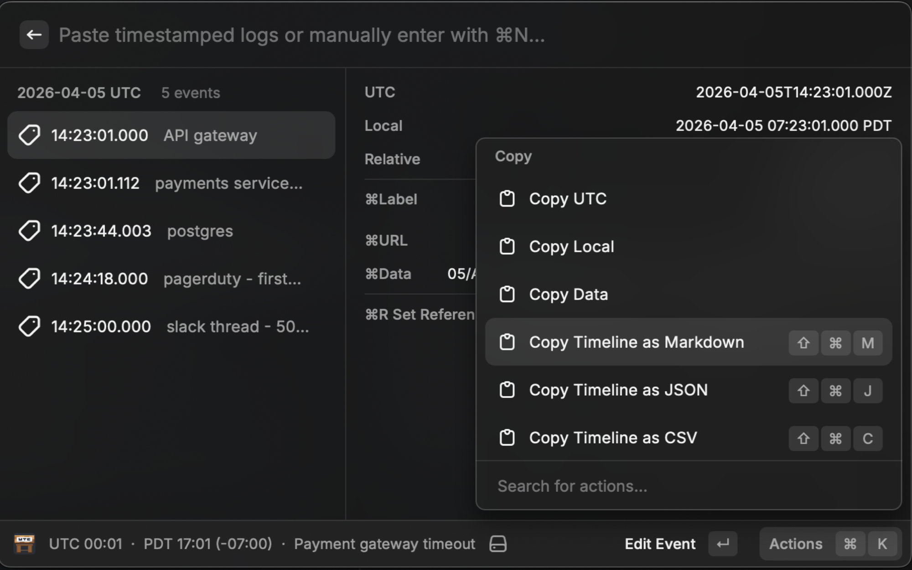

# UTC Workbench

Paste log lines from any source, normalize timestamps to UTC, and reconstruct a timeline as you debug.

Quickly see time offsets from a reference event to a target event.

As you conclude investigation, export the timeline as JSON, CSV, or markdown to transcribe into other ticketing systems.

## Audience

You're troubleshooting an incident and timestamps are coming from everywhere: system logs in different formats, localized times from a UI, epoch values from an API, notes relayed by a user. You need to know what happened in what order, and people are waiting in the incident channel.

UTC Workbench is a timestamp normalizer and timeline builder that lives in Raycast. Paste a log line, get UTC. Paste five log lines from different systems, pin them, and you have a chronological timeline of labeled data with links back to their source. Never waste time Googling "UTC to {timezone}" during an incident again.

## How it works

Paste a log line into the search bar and UTC Workbench extracts and resolves timestamps from raw text. If a timestamp is ambiguous, it is flagged for manual timezone assignment. You can also add events manually. All timestamps are normalized and presented in UTC.

- **Pin** timestamps as you troubleshoot to build a timeline. Events are sorted by UTC and grouped by date.
- Set any event as a **reference point** to see offsets relative to a specific moment (e.g., "how long after the first 503 did the alert fire?").
- **Label** events by source (e.g., `nginx`, `postgres`, `pagerduty`) and attach **URLs** or other raw **Data**.
- When the investigation is done, **Export** the assembled timeline as Markdown, JSON, or CSV.
- **Sessions** let you save and switch between investigations.
