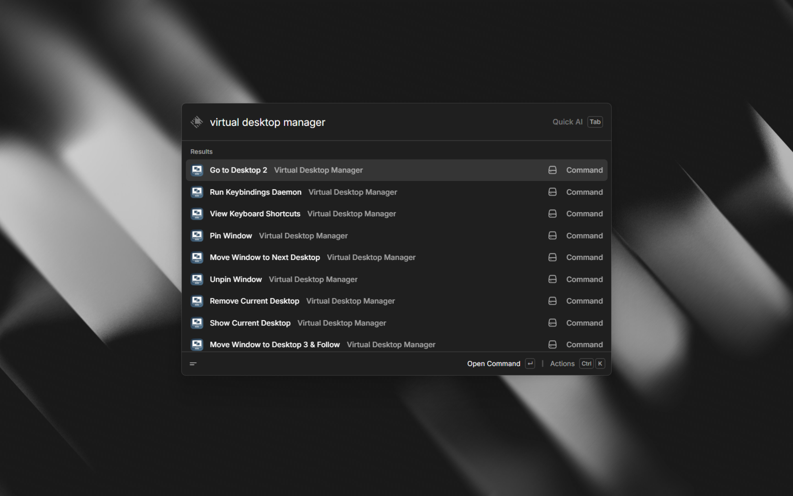
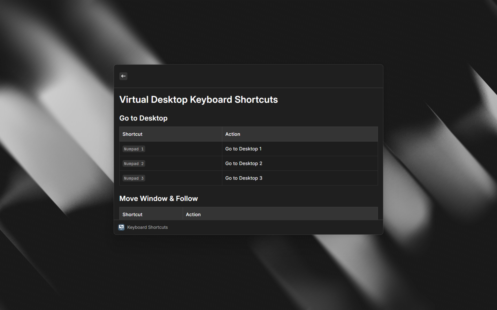

<h1 align="center"> Virtual Desktop Manager</h1>

Manage Windows virtual desktops directly from Raycast using AutoHotkey. Brings a hyprland-like experience to Windows.

## Screenshots





## Requirements

### AutoHotkey v2.1-alpha.5 (Required)

This extension requires **AutoHotkey v2.1-alpha.5** or later. The standard v2.0.x versions will **not** work.

**Install via winget (Recommended):**

```powershell
winget install AutoHotkey.AutoHotkey --version 2.1-alpha.5
```

**Or download manually:** [AutoHotkey v2.1-alpha.5](https://www.autohotkey.com/download/2.1/AutoHotkey_2.1-alpha.5_setup.exe)

## Features

### Raycast Commands

Run these commands directly from Raycast search:

| Command | Description |
|---------|-------------|
| **Go to Desktop 1-5** | Switch to a specific desktop |
| **Go to Next/Previous Desktop** | Navigate between desktops |
| **Move Window to Desktop 1-5** | Move the active window and follow |
| **Move Window (Stay)** | Move window without switching |
| **Create Desktop** | Create a new virtual desktop |
| **Remove Desktop** | Remove the current desktop |
| **Toggle Pin Window** | Pin/unpin window to all desktops |
| **Toggle Pin App** | Pin/unpin app to all desktops |
| **Show Current Desktop** | Display current desktop number |
| **Show Desktop Count** | Display total number of desktops |

### Background Keybindings Daemon

Run the **"Run Keybindings Daemon"** command to enable system-wide keyboard shortcuts:

#### Default Shortcuts (Numpad-based)

| Shortcut | Action |
|----------|--------|
| `Numpad 1-3` | Go to Desktop 1-3 |
| `Numpad 4-6` | Move window to Desktop 1-3 & follow |
| `Numpad 7-9` | Move window to Desktop 1-3 (stay) |
| `Ctrl+Shift+Win+←/→` | Previous/Next desktop |
| `Win+Alt+←/→` | Move window left/right & follow |
| `Alt+Numpad+` | Create desktop & switch |
| `Alt+Numpad-` | Remove current desktop |
| `Numpad 0` | Toggle pin window |
| `Numpad .` | Toggle pin app |
| `F1` | Show current desktop |
| `F2` | Show desktop count |
| `F3` | Exit daemon |

### Customizable Keybindings

Use the **"Edit Keybindings"** command to customize all shortcuts:

1. Select any command from the list
2. Press Enter to edit its hotkey
3. Enter your custom AHK hotkey (e.g., `$#1` for Win+1)
4. Press `Cmd+S` to save and reload the daemon

#### AHK Hotkey Syntax

| Symbol | Key |
|--------|-----|
| `$` | Hook prefix (recommended) |
| `^` | Ctrl |
| `#` | Win |
| `!` | Alt |
| `+` | Shift |

**Examples:**
- `$#1` = Win+1
- `$^#Left` = Ctrl+Win+Left
- `$!+F1` = Alt+Shift+F1

## Installation

1. **Install AutoHotkey v2.1-alpha.5**
   ```powershell
   winget install AutoHotkey.AutoHotkey --version 2.1-alpha.5
   ```
   Or [download manually](https://www.autohotkey.com/download/2.1/AutoHotkey_2.1-alpha.5_setup.exe)

2. **Install the Extension**
   - Open Raycast
   - Search for "Virtual Desktop Manager"
   - Click Install

3. **Start the Daemon**
   - Open Raycast and run "Run Keybindings Daemon"
   - The daemon will run in the background

## Usage Tips

- **Pin frequently used windows** (like chat apps) to all desktops using `Toggle Pin Window`
- **Use the daemon** for quick keyboard navigation, and Raycast commands for less frequent actions
- **Customize your shortcuts** in "Edit Keybindings" to match your workflow
- The daemon **automatically reloads** when you save changes in Edit Keybindings

## Troubleshooting

### "AutoHotkey Not Found" Error

Make sure you have installed **AutoHotkey v2.1-alpha.5** (not v2.0.x):

```powershell
winget install AutoHotkey.AutoHotkey --version 2.1-alpha.5
```

Or [download manually](https://www.autohotkey.com/download/2.1/AutoHotkey_2.1-alpha.5_setup.exe)

### Script Requires v2.1-alpha Error

You have AutoHotkey v2.0.x installed instead of v2.1-alpha. Uninstall the current version and install the alpha:

```powershell
winget install AutoHotkey.AutoHotkey --version 2.1-alpha.5
```

### Shortcuts Not Working

1. Make sure the daemon is running (Run "Run Keybindings Daemon")
2. Check if another application is capturing the same shortcuts
3. Try reloading the daemon

## Credits

This extension is built on top of the amazing [VD.ahk](https://github.com/FuPeiJiang/VD.ahk) library by [@FuPeiJiang](https://github.com/FuPeiJiang).

VD.ahk provides the core virtual desktop functionality for Windows, including:
- Switching between desktops
- Moving windows between desktops
- Pinning windows/apps to all desktops
- Desktop creation and removal
- And much more!

## License

MIT License - See [LICENSE](LICENSE) for details.

## Author

Created by [sameed_majgaonkar](https://github.com/sameedmajgaonkar)
