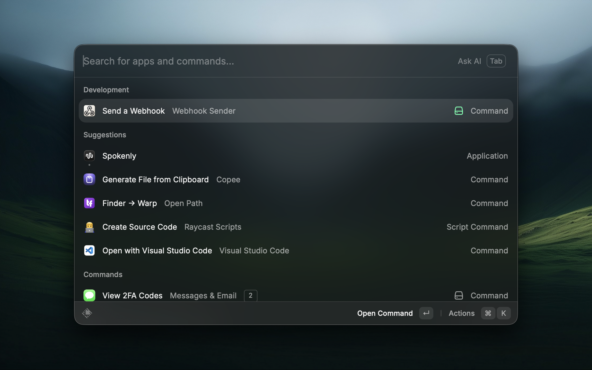
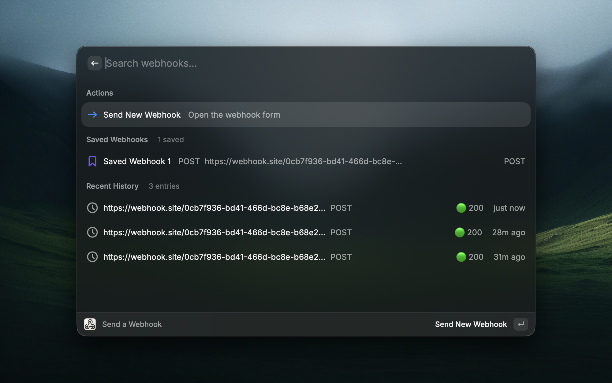
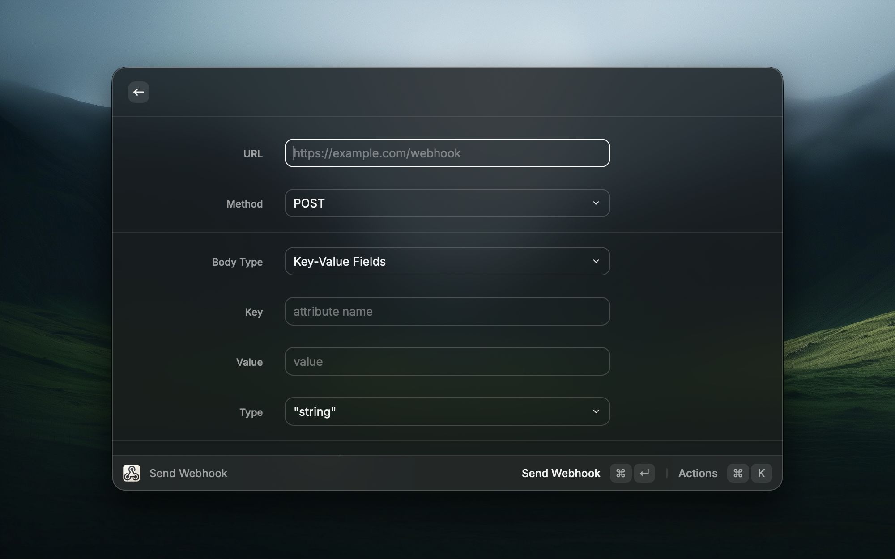

# Webhook Sender

Send HTTP webhooks instantly from Raycast — with full history, saved presets, and rich response inspection.

## Features

### 📤 Send Webhooks

- Support for **GET, POST, PUT, PATCH, DELETE** methods
- Two body modes:
  - **Key-Value Fields** — add fields with a name, value, and type. No JSON knowledge required.
  - **Raw JSON** — paste or write JSON directly, with validation before sending
- Per-field type selector so you can distinguish `true` (boolean) from `"true"` (string), or send `null` and numbers correctly
- Live JSON preview updates as you fill in key-value fields

### 🕓 History

- Every webhook you send is automatically saved to history (up to 50 entries)
- Press **Enter** on any history item to view the full response — status code, response time, and body
- Press **⌘↵** on any history item to open the form pre-filled with that request, ready to edit and resend

### 🔖 Saved Webhooks

- Give any webhook a name and save it with **⌘S** for instant reuse

### 📋 Response View

- Color-coded status: 🟢 2xx Success, 🟡 3xx Redirect, 🔴 4xx/5xx Error
- JSON responses are pretty-printed with syntax highlighting
- Plain text and HTML responses shown cleanly as text
- Response time shown in milliseconds

## Screenshots

