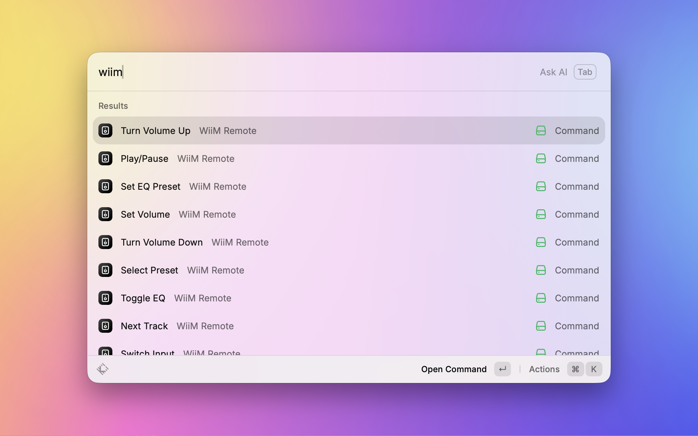

  
  <h1 align="center">WiiM Remote Extension</h1>

WiiM Remote is a Raycast extension to control WiiM devices.

## Installation 🛠️

To install the WiiM Remote extension, follow these steps:

1. Open Raycast.
2. Search for `Store` and navigate to the Raycast Store.
3. Search for `WiiM Remote` and click `Install`.

This extension will automatically try to detect your WiiM device. Make sure this computer is connected to the same local network as the device you are intending to control.

If you have multiple WiiM devices on your network, you can select which one to control using the `Select Device` command in the Raycast command palette. You can also set a default IP address in the extension preferences if you want to always connect to a specific device. Device selection order is prioritized as follows:

1. The IP address specified in the extension preferences.
2. The IP address of the last connected device.
3. The first device detected on the network.

## Usage 🚀

Once installed, simply trigger the Raycast command palette and search for the WiiM Remote commands.

  

## Controls ✨

### Playback

- `Current Track` - Displays the current track information and album art.
- `Play/Pause` - Toggles the playback state.
- `Next Track` - Skips to the next track.
- `Previous Track` - Skips to the previous track.
- `Set Volume` - Sets the volume to a specified level between `0` and `100`.
- `Turn Volume Up` - Increases the volume by a specified step.
- `Turn Volume Down` - Decreases the volume by a specified step.
- `Toggle Mute` - Toggles the mute state.

### Settings

- `Select Device` - Lets you select a WiiM device to control.
- `Select Preset` - Lets you select a preset.
- `Switch Input` - Lets you switch the input source.
- `Toggle EQ` - Toggles the equalizer.
- `Set EQ Preset` - Lets you set the equalizer preset.

## Preferences ⚙️

- `IP Address` - You can set the default IP address to use when connecting to a WiiM device. If this is not set, the extension will try to connect to the last connected device or the first detected device on the network.
- `Volume Step` - You can set the default volume step to use when adjusting the volume on a WiiM device. The default volume step is `5`.
