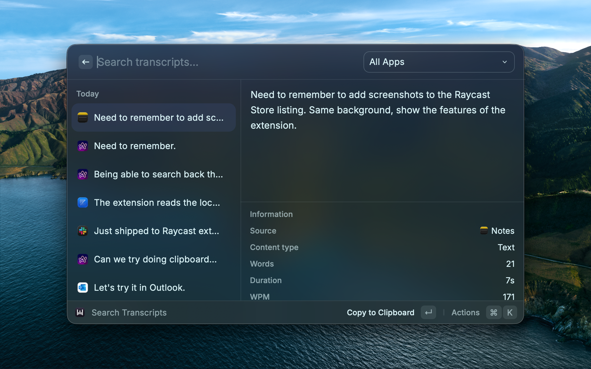
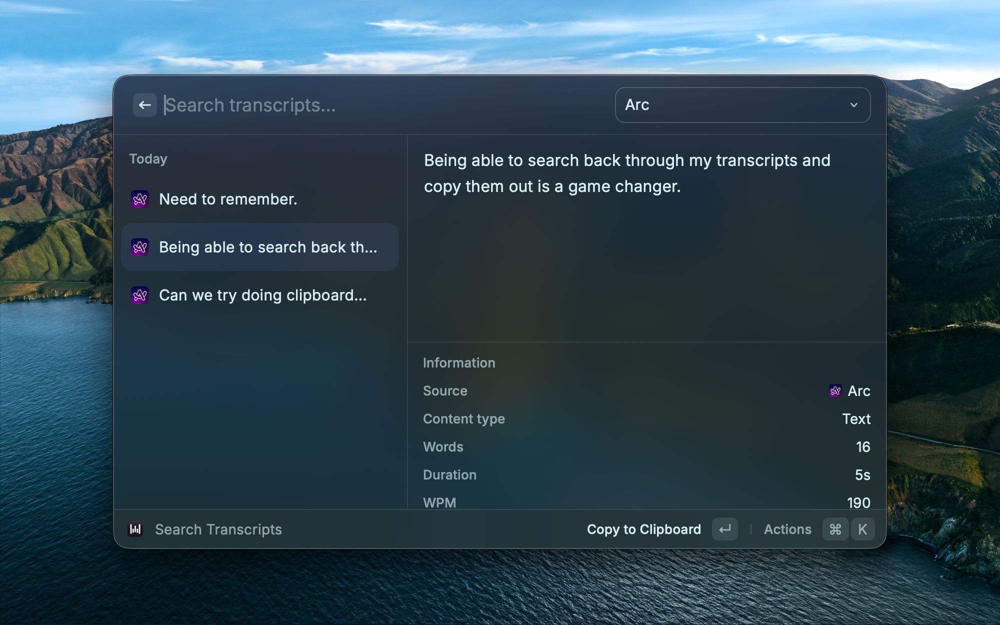
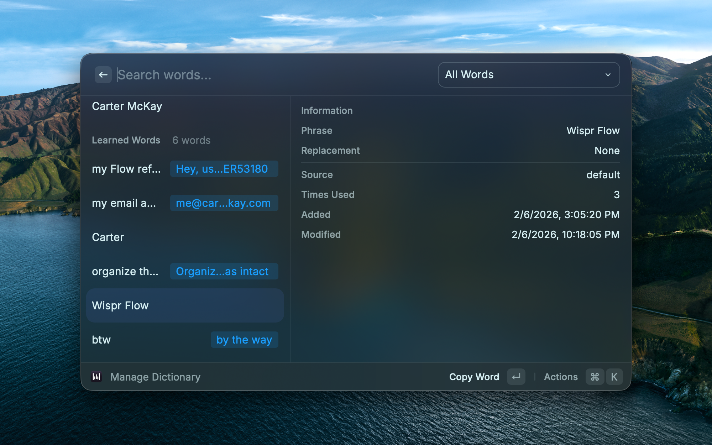
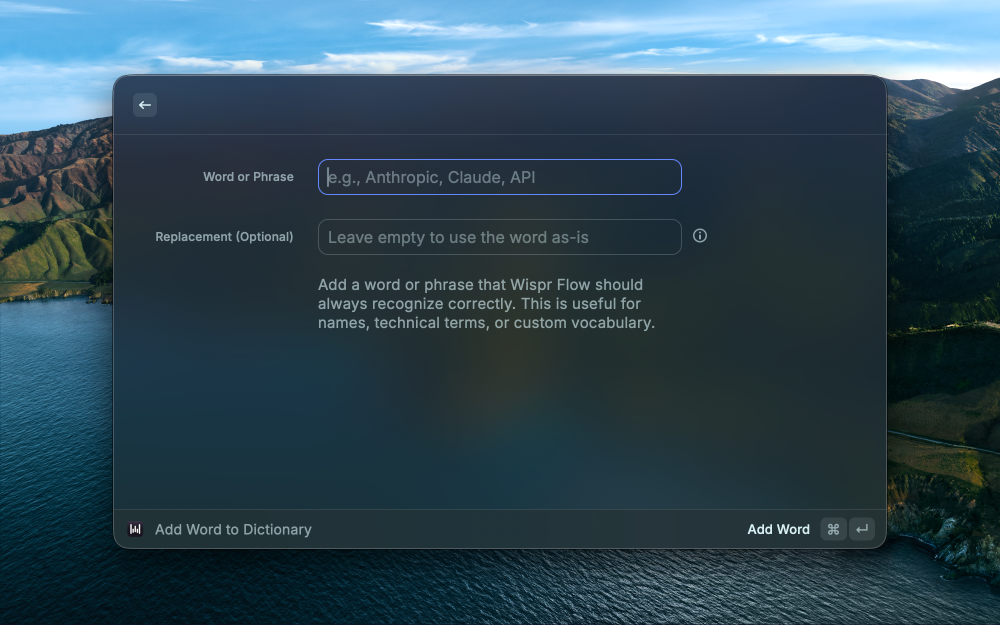

# Wispr Flow

The all-in-one [Wispr Flow](https://wisprflow.ai) companion for Raycast. Search your transcription history, manage your custom dictionary, and control voice recording — all without leaving your keyboard.

## Requirements

- [Wispr Flow](https://wisprflow.ai) must be installed on your Mac.
- macOS Full Disk Access may be required to read the Wispr Flow database.

## Commands

| Command | Description |
|---------|-------------|
| **Search Transcripts** | Browse and search your full voice transcription history |
| **Add Word to Dictionary** | Teach Wispr Flow new words, names, or technical terms |
| **Manage Dictionary** | View, edit, search, and delete dictionary entries |
| **Start Recording** | Begin voice dictation instantly |
| **Stop Recording** | End voice dictation |
| **Paste Last Transcript** | Paste your latest unarchived transcript into the active app |
| **Open Wispr Flow** | Launch the Wispr Flow app |

## Transcription History

- **Infinite scroll** — transcripts load progressively as you scroll
- **Full-text search** — filter across all your dictations
- **Time-grouped list** — organized by Today, Yesterday, This Week, Last Week, and Older
- **App filter** — filter by which app you were dictating into (Slack, VS Code, Chrome, etc.)
- **Sort options** — sort by newest, oldest, longest duration, or most words
- **Detail view** — full transcript text with metadata (source app, dictation time, word count, duration, WPM)
- **View original transcription** — see the raw ASR text before Wispr's formatting
- **Open source app** — launch the app a transcript was dictated in
- **Archive transcripts** — archive with undo via toast
- **Copy or paste** — press Enter to copy, or paste directly into your active app

## Dictionary Management

- **Add custom words** — teach Wispr Flow names, acronyms, and technical terms it should always recognize
- **Replacements** — optionally map a spoken word to different output text
- **Edit entries** — update existing words and replacements inline (⌘E)
- **Filter by source** — view all words, manual entries only, or learned words only
- **Detail view** — phrase, replacement, source, usage frequency, and dates
- **Delete with undo** — remove words with an undo option via toast

## Voice Control

- **Start/Stop Recording** — trigger Wispr Flow dictation via Raycast with no-view commands
- **Install detection** — commands gracefully handle Wispr Flow not being installed

## Preferences

- **Primary Action** — choose Copy to Clipboard or Paste to Active App as the default action
- **Show Archived** — include archived transcripts in the list
- **Minimum Duration** — hide transcripts shorter than a specified duration (filters out accidental triggers)
- **Confirm Before Archive** — toggle the confirmation dialog when archiving
- **Database Path** — custom path to the Wispr Flow database for non-standard installs

## How It Works

Wispr Flow stores your transcription history and dictionary in a local SQLite database on your Mac. This extension reads that database locally — no network requests are made. Modifications are limited to archiving transcripts and managing dictionary entries, mirroring Wispr Flow's own functionality.
