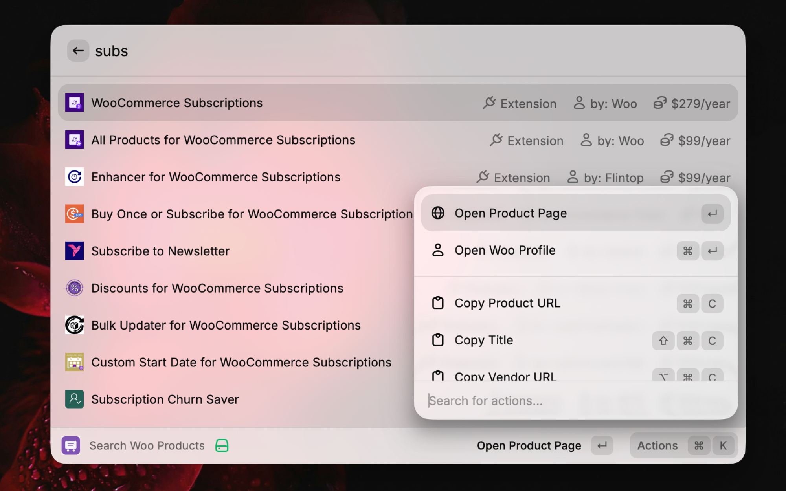
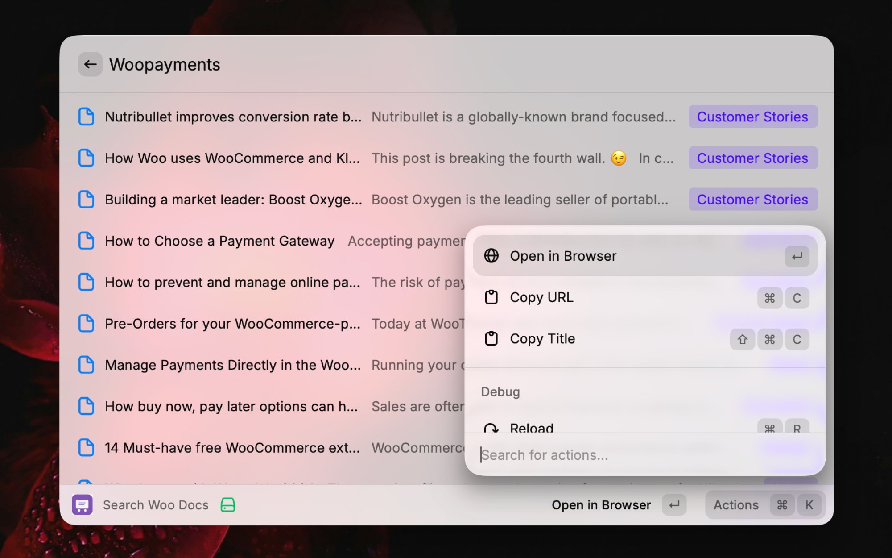
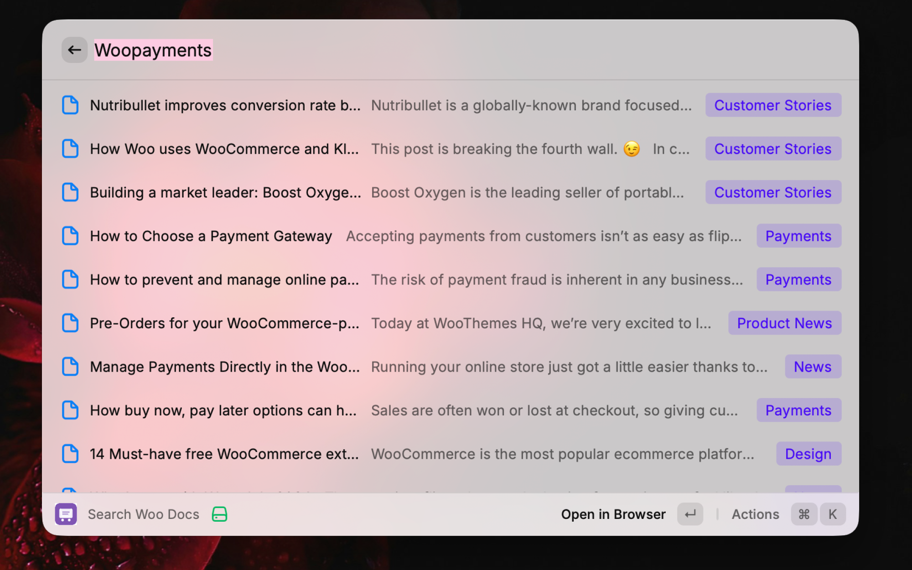
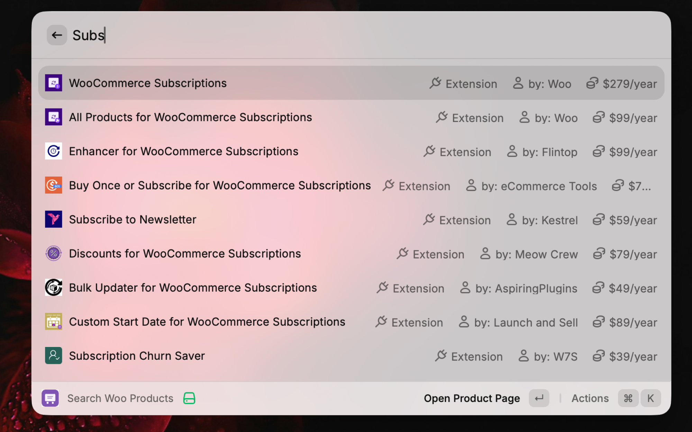

# Woo Marketplace Search

Search WooCommerce.com themes, extensions, and documentation directly from Raycast. Zero configuration required - just install and go.

## Features

- **Search Products:** Find themes, extensions, and services on WooCommerce.com
- **Search Docs:** Search documentation, guides, and blog posts.
- **Instant Results:** Powered by Algolia for fast, real-time search.
- **Vendor Info:** View vendor profiles and details.
- **Quick Actions:** Open in browser, copy URLs, copy titles.

<p align="center">
  
</p>
<p align="center">
  
</p>
<p align="center">
  
</p>
<p align="center">
  
</p>
<p align="center">
  
</p>

## Quick Access

| Command             | Keywords | Description                          |
| ------------------- | -------- | ------------------------------------ |
| Search Woo Products | `wce`    | Search themes, extensions & services |
| Search Woo Docs     | `wcd`    | Search documentation & guides        |

Just type `wce` or `wcd` in Raycast!

## Installation

### Prerequisites

- [Raycast](https://raycast.com/) installed
- [Node.js](https://nodejs.org/) v18 or higher (includes `npm`)

### Setup (Dev Extension)

No API keys or extra configuration needed. The extension uses WooCommerce.com's public search API.

1. **Get the source**

   Download/copy the project folder, or clone the repo:

   ```
   git clone https://github.com/shameemreza/woo-marketplace-search.git
   cd woo-marketplace-search
   ```

2. **Install dependencies**

   ```
   npm install
   ```

3. **Start the extension**

   ```
   npm run dev
   ```

   This registers the extension in Raycast in development mode with hot reload.

4. **Use in Raycast**
   - Open Raycast
   - Type `wce` for products or `wcd` for docs
   - Start searching!

> **Note:** The extension will appear at the top of Raycast's root search while running in dev mode. You only need to run `npm run dev` once -- it stays registered until you stop the dev server or uninstall it.

## Development

```
npm install          # Install dependencies
npm run dev          # Development mode (hot reload)
npm run build        # Build for production
npm run lint         # Lint code
npm run fix-lint     # Auto-fix lint issues
```

## Project Structure

```
woo-marketplace-search/
├── src/
│   ├── api.ts                 # Algolia API integration & utilities
│   ├── types.ts               # TypeScript type definitions
│   ├── search-extensions.tsx   # Products search command
│   └── search-docs.tsx        # Docs search command
├── assets/
│   ├── icon.png               # Extension icon
│   └── command-icon.svg       # Command icon (SVG)
├── media/                     # README screenshots & demo
├── metadata/                  # Store screenshots
├── package.json               # Raycast extension manifest
├── tsconfig.json              # TypeScript configuration
├── CHANGELOG.md               # Version history
└── README.md
```

## How It Works

The extension queries WooCommerce.com's public Algolia search indexes (the same ones that power the site's own search). No authentication or API keys are needed -- it uses publicly available search-only credentials embedded in WooCommerce.com's frontend.

Two indexes are queried:
- **Products** (`search-extensions` command) -- themes, extensions, and business services
- **Posts** (`search-docs` command) -- documentation, guides, and blog posts

## License

MIT License -- see [LICENSE](LICENSE) for details.

## Author

**Shameem Reza** -- [@shameemreza](https://github.com/shameemreza)
