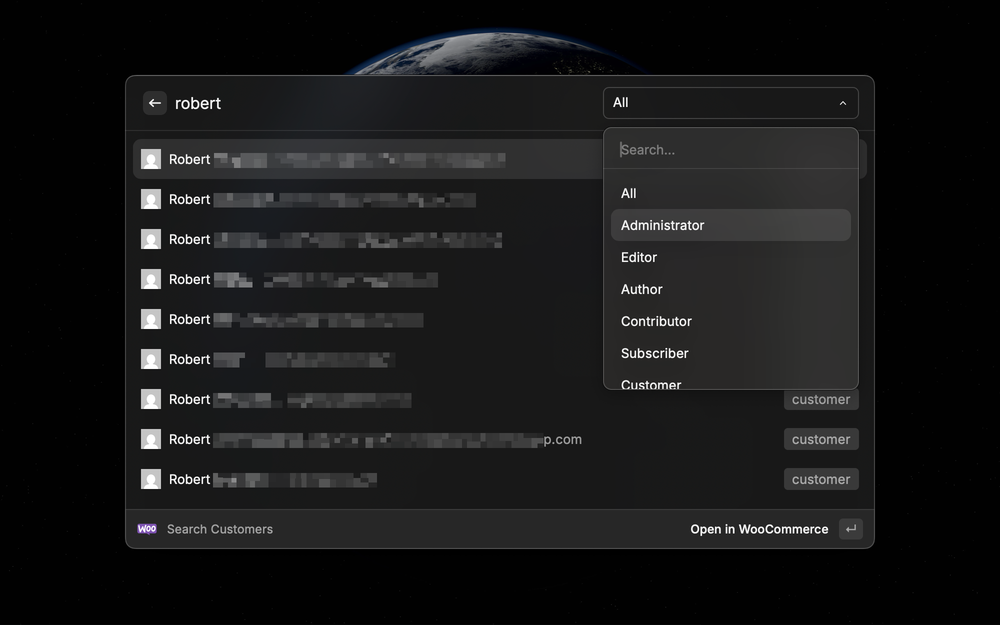
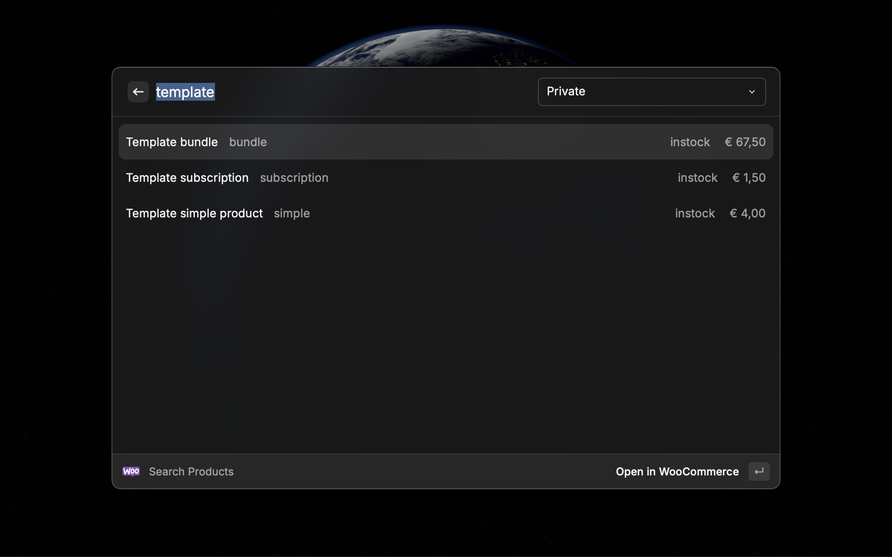
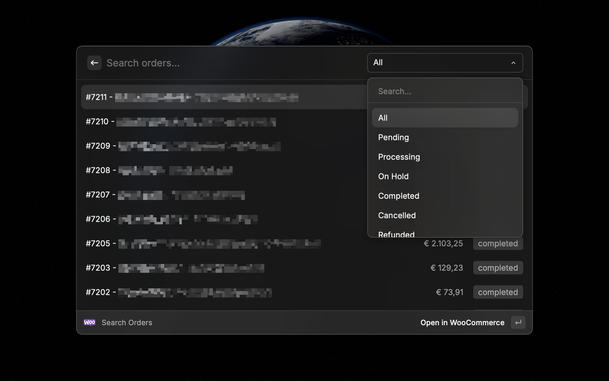
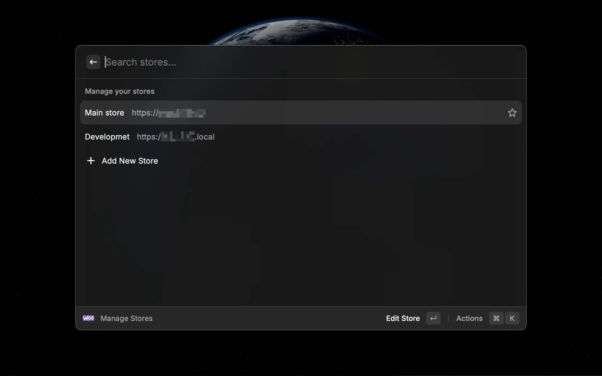

# WooCommerce Quicker

Browse and search WooCommerce orders, customers, and products across multiple stores from Raycast.

## Features

- **Search Orders**: List, search, and filter orders by status (pending, processing, completed, etc.)
- **Search Customers**: Find customers by name, email, or username and filter by role
- **Search Products**: Browse products with status filters and see pricing, stock, and SKU at a glance
- **Manage Stores**: Add, edit, and remove multiple WooCommerce stores with credential validation

Pressing Enter on any search order, customer, or product will open the corresponding WooCommerce admin page in a new tab of your browser.

## Setup

### 1. Generate WooCommerce API Keys

1. In your WordPress admin, go to **WooCommerce → Settings → Advanced → REST API**
2. Click **Add key**
3. Set a description (e.g. "Raycast"), choose a user, and select **Read** permissions
4. Click **Generate API key**
5. Copy the **Consumer Key** and **Consumer Secret**

### 2. Add a Store in Raycast

1. Open Raycast and run the **Manage Stores** command
2. Press **⏎ Enter** to add a new store
3. Enter your store name, URL, consumer key, and consumer secret
4. The extension will validate your credentials before saving

You can add multiple stores. Mark a store as **Favourite** to put it at the top of the stores list.

### Local / Self-Signed SSL Stores

If your WooCommerce store runs locally with a self-signed SSL certificate, and you're having issues connecting to it, try checking the **Local Store** option when adding the store. This disables SSL verification for that store only.

## Commands

| Command          | Description                                   |
| ---------------- | --------------------------------------------- |
| Search Orders    | List and search recent WooCommerce orders     |
| Search Customers | List and search your customers                |
| Search Products  | List and search your products                 |
| Manage Stores    | Add, edit, and remove your WooCommerce stores |

## Screenshots

Search Customers

Search Products

Search Orders

Manage Stores

