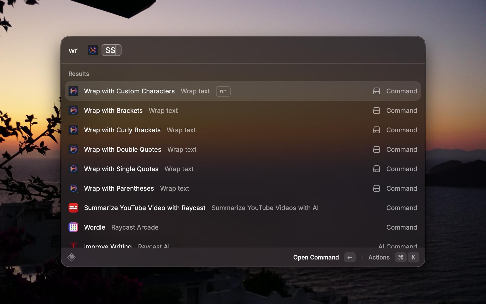
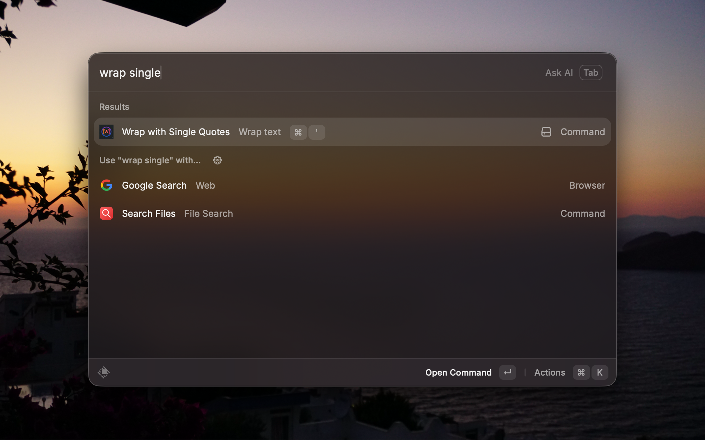

# Wrap Text

> Wrap selected text with brackets, quotes, parentheses, curly braces, or any custom characters — instantly from anywhere on your Mac.

<p align="center">
  
</p>

## Features

- **6 built-in commands** — one for each common wrapper character, ready to use out of the box.
- **Custom wrap** — enter _any_ character(s) and the extension intelligently figures out the left/right pair.
- **Works everywhere** — select text in _any_ app, trigger the command, and the wrapped result replaces your selection.
- **Zero UI** — every command runs in no-view mode; there are no windows to dismiss.
- **Hotkey-friendly** — assign a Raycast hotkey to each command for single-keystroke wrapping.

## Commands

| Command                     | Output          | Description                                        |
| --------------------------- | --------------- | -------------------------------------------------- |
| **Wrap with Brackets**      | `[text]`        | Wraps selection with square brackets               |
| **Wrap with Parentheses**   | `(text)`        | Wraps selection with parentheses                   |
| **Wrap with Curly Brackets**| `{text}`        | Wraps selection with curly braces                  |
| **Wrap with Single Quotes** | `'text'`        | Wraps selection with single quotes                 |
| **Wrap with Double Quotes** | `"text"`        | Wraps selection with double quotes                 |
| **Wrap with Custom Characters** | *(see below)* | Wraps selection with any character(s) you provide |

## Custom Wrap — How It Works

When you run **Wrap with Custom Characters**, you type in one or more characters and the extension resolves them into a left/right pair using these rules:

| Input    | Result           | Rule applied                             |
| -------- | ---------------- | ---------------------------------------- |
| `*`      | `*text*`         | Symmetric — same char on both sides      |
| `<`      | `<text>`         | Known pair detected → opening/closing    |
| `>`      | `<text>`         | Reverse pair detected → opening/closing  |
| `**`     | `**text**`       | All-same symmetric chars repeated        |
| `<<`     | `<<text>>`       | All-same pair chars repeated             |
| `<>`     | `<text>`         | Even-length mixed → split in half        |
| `{{}}`   | `{{text}}`       | Even-length mixed → split in half        |
| `` ` ``  | `` `text` ``     | Symmetric — same char on both sides      |

### Recognized Pairs

The following character pairs are detected automatically — you can enter **either** side:

`( )` · `[ ]` · `{ }` · `< >` · `« »` · `‹ ›` · `" "` · `' '`

## Usage

1. **Select** text in any application.
2. **Open Raycast** and search for a wrap command (e.g. _"Wrap with Brackets"_).
3. The selected text is **instantly replaced** with the wrapped version.

<p align="center">
  
</p>

### Pro Tip 💡

Assign a **Raycast hotkey** to each command for instant, keyboard-only wrapping — no need to open the Raycast bar at all.

> _Raycast → Extensions → Wrap Text → click a command → Record Hotkey_

## Installation

### From the Raycast Store

Search for **"Wrap Text"** in the [Raycast Store](https://www.raycast.com/candemet/wrap-text) and click **Install**.

### Manual / Development

```bash
# Clone the repository
git clone https://github.com/candemet/wrap-text.git
cd wrap-text

# Install dependencies
npm install

# Start the dev server
npm run dev
```

Then open **Raycast → Extensions** and the dev extension will appear automatically.

## Tech Stack

| Tool        | Purpose              |
| ----------- | -------------------- |
| TypeScript  | Language              |
| React       | Raycast runtime       |
| Raycast API | Extension framework   |

## Contributing

Contributions, issues, and feature requests are welcome!

1. Fork the repository.
2. Create your feature branch — `git checkout -b feat/my-feature`.
3. Commit your changes — `git commit -m "feat: add my feature"`.
4. Push to the branch — `git push origin feat/my-feature`.
5. Open a Pull Request.

Please make sure `npm run lint` passes before submitting.

## License

This project is licensed under the **MIT License**.
